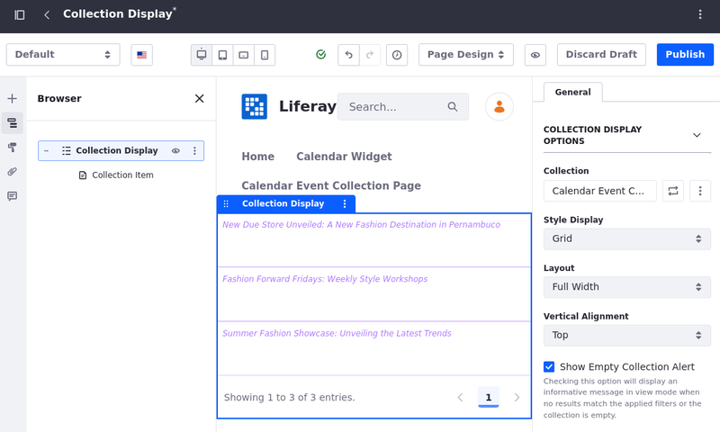

# Mapping Calendar Event Fields to Display Page Templates

With Liferay, you can customize and display calendar event information by mapping calendar fields to [display page templates](../../site-building/displaying-content/using-display-page-templates.md). Highlight certain fields such as title, date, and location, while hiding others that are less relevant.

Additionally, with a [collection display fragment](../../site-building/displaying-content/collections-and-collection-pages/displaying-collections.md) on a content page, you can display a dynamically or manually generated collection of calendar events and redirect users to each collection item's display page template.

To do that, you can create [calendar events](#calendar-events) using a calendar widget, a [collection](#dynamic-collections-to-group-calendar-events) to group events dynamically, a [display page template](#calendar-events-display-page-template) to customize how you want to display the calendar events, a [content page](#content-page-to-display-the-calendar-event-collection) with a Collection Display fragment to show all items in the collection, and a button to redirect users to the display page template.

## Calendar Events

Start by adding the Calendar widget to a page, navigating to the page, and creating an event:

1. [Create a new page](../../site-building/creating-pages/adding-pages/adding-a-page-to-a-site.md) or [start editing](../../site-building/creating-pages/using-content-pages/adding-elements-to-content-pages.md) one.

1. In the Fragments and Widgets sidebar, look for the [*Calendar* widget](./using-the-calendar-widget.md). Drag and drop it into the page and publish the page.

1. Navigate to the page and click *Add Event*. Fill in the information and click *Publish*.

1. Add a few more events.

   

## Dynamic Collections to Group Calendar Events

Create a collection to group the calendar events. You can [display this collection](#content-page-to-display-the-calendar-event-collection) later using a collection display fragment.

1. [Create a dynamic collection](../../site-building/displaying-content/collections-and-collection-pages/creating-collections.md#creating-a-dynamic-collection) and name it `Calendar Event Collection`.

1. In the Item Type dropdown menu, select *Calendar Event* under Single Item Type.

   

1. (Optional) Configure the collection.

1. Click *Save*.

Every calendar event, including new ones, is added to the collection.

## Calendar Events Display Page Template

Create a display page template and map calendar event fields to the elements. For this example, you'll create a simple structure to display the event's information.

1. Create a [display page template](../../site-building/displaying-content/using-display-page-templates/creating-and-managing-display-page-templates.md), name it `Calendar Event Display Page Template`, and select *Calendar Event* as the content type.

   The display page template is now associated with calendar events.

1. In the Fragments and Widgets sidebar, look for the Container fragment. Drag and drop it into the page.

1. Add another container to the existing container. In the Browser, click on the *inner container* once and select the *Styles* tab on the right. Add 14.5 rem right and left margins, a 4.5 rem top margin, and a 7.5 rem bottom margin.

1. Add a heading to the inner container. In the Browser, click on the heading once and select the *Styles* tab on the right. Add a 1.5 rem bottom margin.

1. Click on the heading again (you can use the browser or click on the actual element) and select the *Mapping* tab on the right. Under Field, choose *Title*. Read [Mappable Fields](#mappable-fields) to learn which calendar fields can be mapped.

   This maps the heading content to the title of the calendar event.

1. Repeat the steps to add a paragraph element, add a 1.5 rem bottom margin to it, and map it to the *Description* of the calendar event.

1. Repeat the steps to add a heading element. Under the General tab, set it as an H5 Heading Level. Under the Styles tab, add a 0.5 rem bottom margin to it. Map it to the *Location* of the calendar event.

1. Repeat the steps to add a heading element. Under the General tab, set it as an H5 Heading Level. Map it to the *Start Date* of the calendar event.

1. Repeat the steps to add a heading element. Under the General tab, set it as an H5 Heading Level. Map it to the *End Date* of the calendar event.

1. Click *Publish*

You should now have a simple structure that displays the calendar information: The title of the event at the top, followed by the description, place, and time. You can also add this information mixed with other content and customize it any way you want.

Mark the display page template as the default to use it with the collection display: Once you publish the page, you are redirected to the Page Templates application. Click *Actions* () next to the created template and select *Mark as Default*.

### Mappable Fields

Here's a list of calendar event fields that can be mapped to display page template elements.

| Field         | Description                                                                                      |
|:--------------|:-------------------------------------------------------------------------------------------------|
| Title         | The event's title.                                                                               |
| Description   | The event's description.                                                                         |
| Location      | The event's location.                                                                            |
| Event URL     | The event's URL.                                                                                 |
| Start Date    | The event's start date.                                                                          |
| End Date      | The event's end date.                                                                            |
| All Day       | Returns `True` if the All Day option is selected or `False` otherwise.                           |
| Calendar Name | The name of the calendar where the event is added.                                               |
| Invitations   | Shows Accepted, Declined, Pending, and Maybe statuses and the number of people in each category. |
| Repetitions   | Returns `False` if the event is not repeatable or the repetition's details otherwise.            |

## Content Page to Display the Calendar Event Collection

Create a content page and add a Collection Display fragment to show the calendar events and redirect users to the calendar event display page template.

For this example, you'll create a simple structure to display the event's title and a button that redirects users to the display page template when clicked.

1. [Create a new page](../../site-building/creating-pages/adding-pages/adding-a-page-to-a-site.md) and name it `Calendar Event Collection Page`.

1. In the Fragments and Widgets sidebar, look for the Collection Display fragment. Drag and drop it into the page.

1. Click on the *Collection Display* once, click () next to Collection on the right, and select the *Calendar Event Collection*.

   The titles for the existing events are shown as collection items in the collection display. Once you drop an element inside the collection item area, the same element is added to the other items as well.

   

1. In the Fragments and Widgets sidebar, look for the Container fragment. Drag and drop it into the Collection Item area. In the Browser, click on the *container* once and select the *Styles* tab on the right. Add 14.5 rem right and left margins and a 3.0 rem top margin.

1. Add a heading in the container. In the Browser, click on the *heading* once and select the *Styles* tab on the right. Add a 1 rem bottom margin.

1. Click on the heading again (you can use the browser or click on the actual element) and select the *Mapping* tab on the right. Under Field, choose *Title*.

1. Add a Button to the container. Double-click on the button's content to change it to `Learn More`.

   Click anywhere else or press `ESC` to apply the changes.

1. Click out of the button and double-click on it (the button area, not the text) to see the Mapping and Link tabs on the right. Open the *Link* tab.

   You can use the browser to perform this action. Click the *Button* element to expand it and select the link element inside.

1. Under Link, select *Mapped URL* and, under field, select *Default*.

   <!-- there is a bug here. The DPT should be showing, but they are not. As soon as it's fixed, I have to change this to say select the "DPT's name". Eric -->

   

1. Click *Publish*

Once you are done, check if everything is working. Navigate to the Calendar Event Collection page. Click on any *Learn More* button. You should be redirected to a display page template showing the information about the event.

## Related Topics

- [Using Collections](../../site-building/displaying-content/using-collections.md)
- [Using Display Page Templates](../../site-building/displaying-content/using-display-page-templates.md)
- [Using Multiple Display Page Templates to Create Multi-Step Applications](../../site-building/displaying-content/using-display-page-templates/using-multiple-display-page-templates-to-create-multi-step-applications.md)
- [Using Widgets](../../site-building/creating-pages/page-fragments-and-widgets/using-widgets.md)