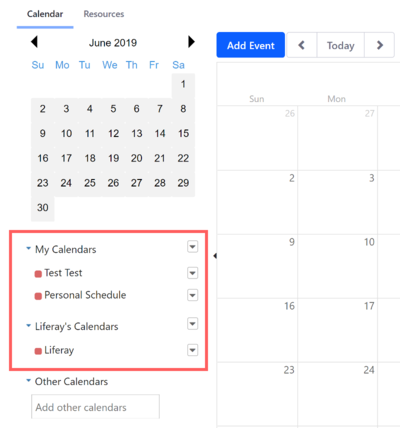
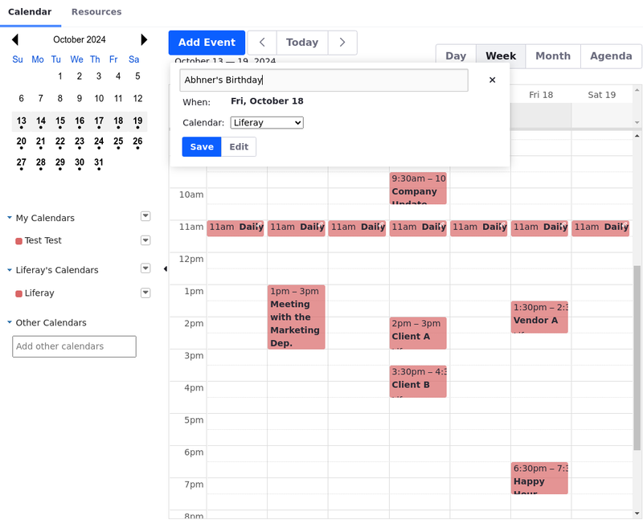
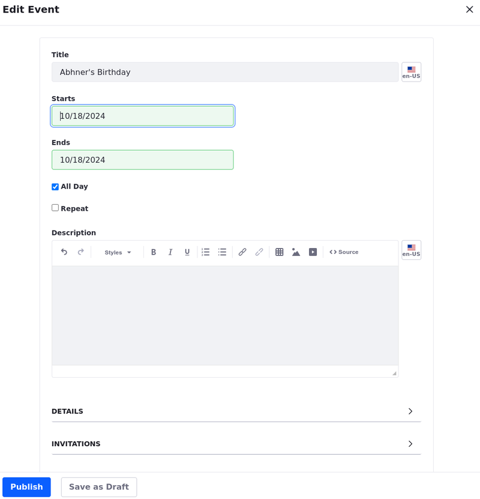
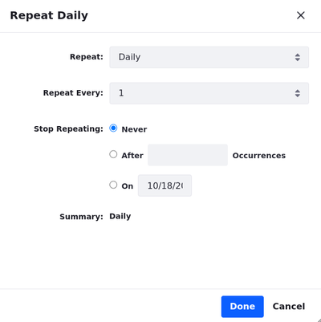
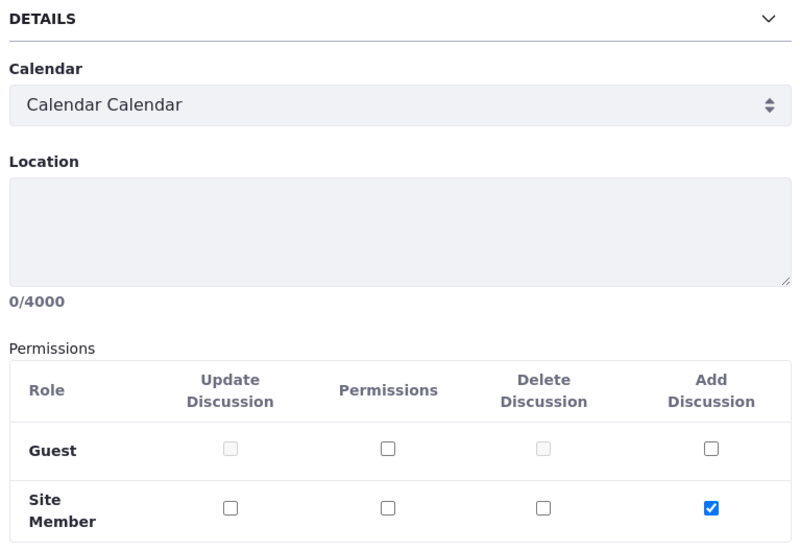
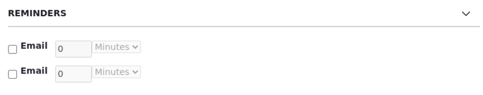
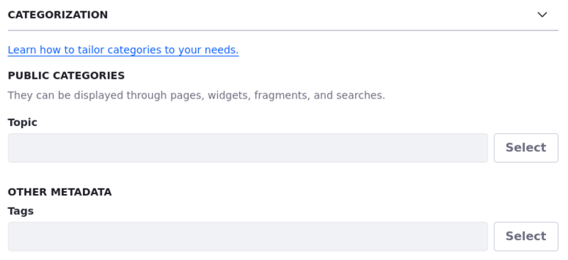
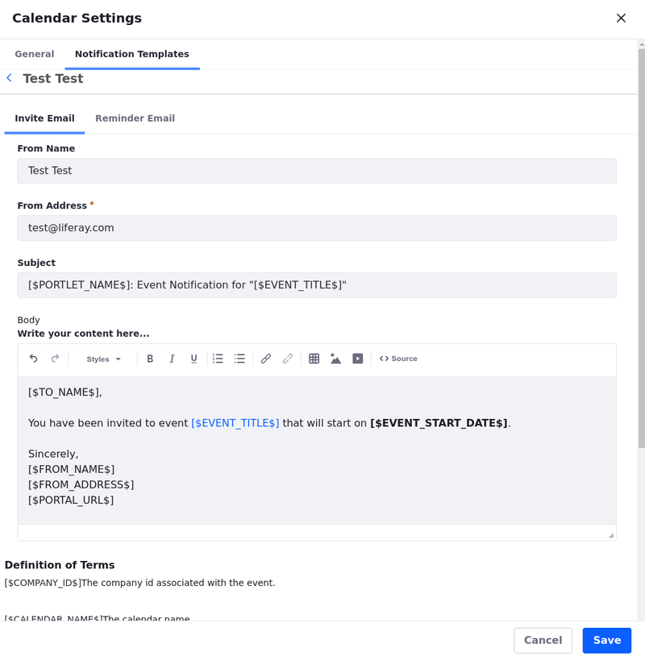

# Using the Calendar Widget

The calendar widget displays a small monthly calendar showing an overview of upcoming events. A larger area shows the Scheduler, a more detailed calendar with several options. You can set it to display a day, week, or month, or choose a more event-oriented agenda setting.

## Adding a Calendar Widget to a Page

1. [Create a new page](../../site-building/creating-pages/adding-pages/adding-a-page-to-a-site.md) or [start editing a content page](../../site-building/creating-pages/using-content-pages/adding-elements-to-content-pages.md).

1. Click *Add* () to open the Fragments and Widgets panel.

1. Under the Collaboration category in the Widgets tab, drag the *Calendar* widget to a place on the page.

Two calendars are included by default when the widget is first added to a page: a personal calendar for the current user and a site calendar for the current site. These are displayed in the widget's lower left.

Next to each calendar is a colored box. Click it to show/hide that calendar's events in the main viewing area.

## Adding New Calendars

1. Click on the arrow to the right of the My Calendars header and select *Add Calendar* from the menu. Fill in the *Add Calendar* form.

1. Give the calendar a name and a description.

1. Set a time zone.

1. Pick a color to color code events whenever multiple calendar events are displayed at once.

1. Decide if it's the user's *default calendar*, which is the one shown automatically whenever the widget is displayed.

1. Decide to enable ratings and comments on the calendar events.

1. Configure visibility and permissions.

   After the calendar is created, you can set permissions by clicking on the arrow to the right of the calendar's name and selecting *Permissions*.

   Read [Calendar Permissions Reference](#calendar-permissions-reference) to learn more about each permission.

## Adding Events to a Calendar

1. Click on any day in the main viewing area to open an event creation pop-up. If you've selected the *Day* or *Week* view, you can click on the specific time when your event begins.

   Alternatively, you can click *Add Event*.

   

1. Name your event and assign it to a calendar. Click *Save* to create the event immediately or *Edit* to enter additional information.

   

1. If you choose to edit the event, complete the edit event form. Enter start and end times and enter a description.

1. To schedule an event that reoccurs, check the *Repeat* box and fill in the *Repeat* pop-up to specify whether an event repeats daily, weekly, monthly, or yearly, how often it repeats, and when (or if) it ends.

   

1. Configure your event further through the options in the collapsed sections: [Details](#details), [Invitations](#invitations), [Reminders](#reminders), [Categorization](#categorization), and [Related Assets](#related-assets).

1. Click *Publish* or *Save as a Draft* to publish your event later.

### Details

In the Details section, you can move the event to another calendar, enter a location, and set permissions for Guests and Site Members.

### Invitations

In the invitations section, add users, sites, or calendar resources to your event.

1. Enter the name of an invitee (user, site, or resource) in the *Invitations* field. Hit *Enter* to add them to the *Pending* column.

   An automated email is sent to invitees who must navigate to the calendar widget to respond. When invitees respond to the invitation, their names move to the Accepted, Declined, or Maybe columns.

   Read [Customize Email Notifications](#customizing-email-notifications) to learn how to customize the content of the invitation email.

1. Check the availability of invitees by clicking the arrow next to their names and selecting *Check Availability*. This displays their calendars (assuming you have permission to view them).

   

### Reminders

Schedule up to two email reminders to send to attendees.

!!! note
    Reminders translate the time of the event into the recipient's time zone.

Read [Customize Email Notifications](#customizing-email-notifications) to learn how to customize the content of the reminder email.

### Categorization

Tag your event or assign it to a category so it appears in relevant search results and gets published by any asset publisher set to publish content assigned to the same category.

Read [Defining Categories and Vocabularies for Content](../../content-authoring-and-management/tags-and-categories/defining-categories-and-vocabularies-for-content.md) to learn more about categories and vocabularies.

### Related Assets

List an asset (e.g., an agenda or supplementary material for a meeting) as related to your event. Links to related assets are displayed in the Event Details window.

## Customizing Email Notifications

Customize email notifications for event invitations and reminders.

1. From the Calendar widget, click on the arrow next to a calendar and select *Calendar Settings*.

   

1. Click on the *Notification Templates* tab. Then select either the *Invite Email* or the *Reminder Email* tab.

1. Edit the email as desired. At the bottom of the screen is a glossary that specifies variables for terms that were set when you created the event. Use these variables to refer to event-specific information, such as the event's name, date or location.

   !!! tip
      It's a good idea to include a link to the event (use the variable `$EVENT_URL$]`) as users must navigate to the calendar widget to respond.

1. Click *Save*. Now your notifications contain the proper text. The next article covers setting up calendar resources and porting data from one installation to another.

## Calendar Permissions Reference

Here's a list of calendar permissions:

Giving a user permission to add, delete, or update discussion allows them to make, edit and remove comments on the event. The *Permissions* permission allows a Role to update permissions for the event.

| Permission         | Description                                                                              |
|:-------------------|:-----------------------------------------------------------------------------------------|
| Delete             | Grants the ability to delete calendars.                                                  |
| Permissions        | Grants the ability to view and modify the calendar's permissions.                        |
| Manage Events      | Grants the ability to manage events. This includes deleting, editing, and updating them. |
| View Event Details | Grants the ability to view event details by using the View Details button.               |
| Update             | Grants the ability to access the calendar settings and update general calendar settings. |
| View               | Grants the ability to view the calendar and calendar events.                             |

## Related Topics

- [Calendar Widget Configuration Reference](./calendar-widget-configuration-reference.md)
- [Exporting/Importing Calendar Data](./exporting-importing-calendar-data.md)