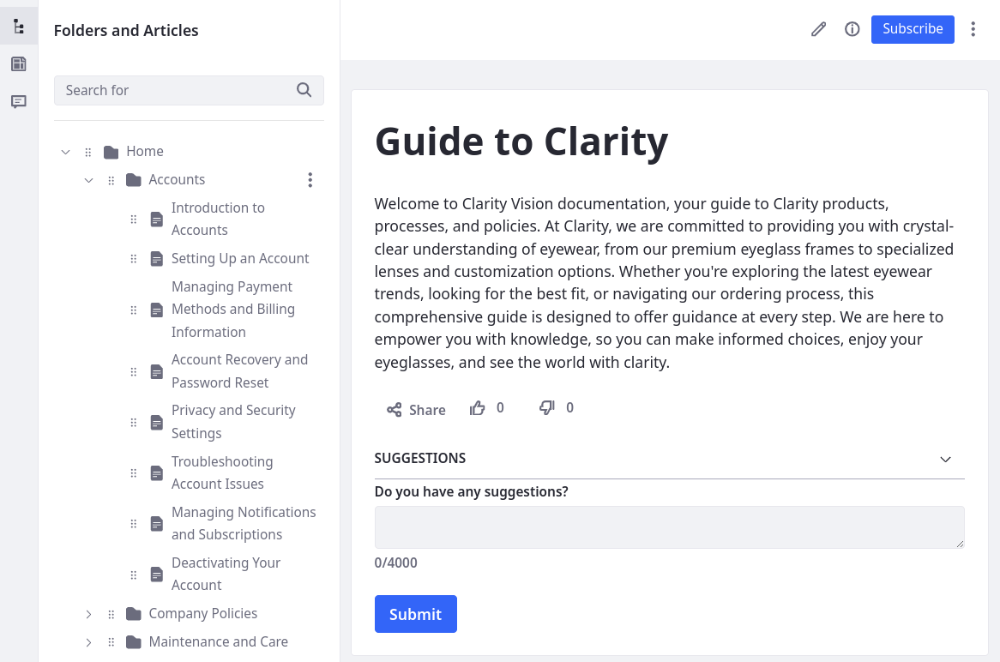

---
toc:
  - ./knowledge-base/importing-knowledge-base-articles.md
  - ./knowledge-base/creating-knowledge-base-articles.md
  - ./knowledge-base/managing-the-knowledge-base.md
  - ./knowledge-base/knowledge-base-templates.md
  - ./knowledge-base/responding-to-knowledge-base-feedback.md
  - ./knowledge-base/knowledge-base-display-widget.md
  - ./knowledge-base/other-knowledge-base-widgets.md
  - ./knowledge-base/knowledge-base-system-settings.md
  - ./knowledge-base/developer-guide.md
uuid: b10af048-9cf9-4b44-8858-2121bfad20ca
taxonomy-category-names:
- Content Management System
- Knowledge Base
- Liferay Self-Hosted
- Liferay PaaS
- Liferay SaaS
---
# Knowledge Base

{bdg-secondary}`Liferay 7.4 U72+/GA72+`

Knowledge Base provides tools for creating and managing product documentation. You can write articles in the Liferay UI or import existing Markdown files. Additionally, you can create [templates](./knowledge-base/knowledge-base-templates.md) to standardize article structures and content. Enabling [workflow](../process-automation/workflow/introduction-to-workflow.md) ensures articles go through an approval process before publishing.

Once published, you can use [Knowledge Base widgets](./knowledge-base/knowledge-base-display-widget.md) to display your documentation hierarchy or individual sections and articles. Alternatively, you can display and style Knowledge Base articles using [display page templates](../site-building/displaying-content/using-display-page-templates.md), [information templates](../site-building/displaying-content/using-information-templates.md), and [fragments](../site-building/creating-pages/page-fragments-and-widgets/using-fragments.md). With built-in comments, users can leave article [feedback](./knowledge-base/responding-to-knowledge-base-feedback.md) that you can manage and track within Knowledge Base.

Additionally, if you're importing Markdown files and hosting them on a service like GitHub, you can enable [source URLs](./knowledge-base/importing-knowledge-base-articles.md#setting-a-source-url) for imported articles. Once configured, Knowledge Base adds an Edit on GitHub button to each article so users can view the article's Markdown in the source repository.

::::{grid} 2
:gutter: 3 3 3 3

:::{grid-item-card} Creating Knowledge Base Articles
:link: ./knowledge-base/creating-knowledge-base-articles.md
:::

:::{grid-item-card} Importing Knowledge Base Articles
:link: ./knowledge-base/importing-knowledge-base-articles.md
:::

:::{grid-item-card} Managing the Knowledge Base
:link: ./knowledge-base/managing-the-knowledge-base.md
:::

:::{grid-item-card} Knowledge Base Templates
:link: ./knowledge-base/knowledge-base-templates.md
:::

:::{grid-item-card} Responding to Knowledge Base Feedback
:link: ./knowledge-base/responding-to-knowledge-base-feedback.md
:::

:::{grid-item-card} Knowledge Base Display Widget
:link: ./knowledge-base/knowledge-base-display-widget.md
:::

:::{grid-item-card} Other Knowledge Base Widgets
:link: ./knowledge-base/other-knowledge-base-widgets.md
:::

:::{grid-item-card} Knowledge Base System Settings
:link: ./knowledge-base/knowledge-base-system-settings.md
:::

:::{grid-item-card} Developer Guide
:link: ./knowledge-base/developer-guide.md
:::
::::
