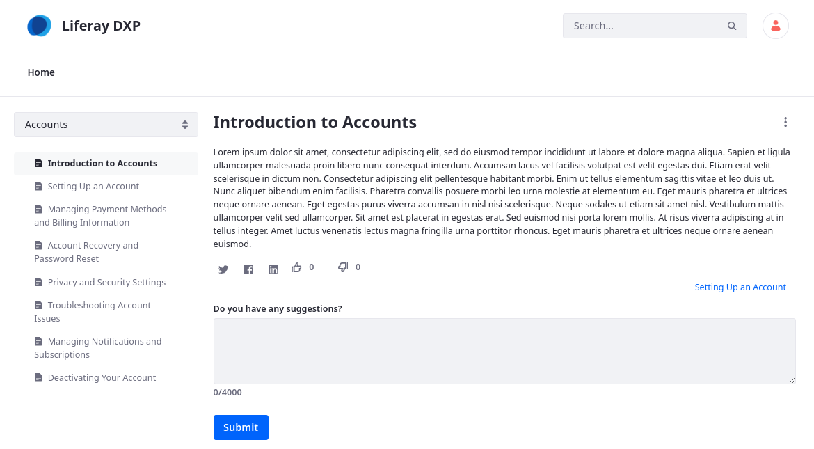
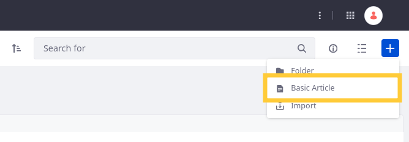
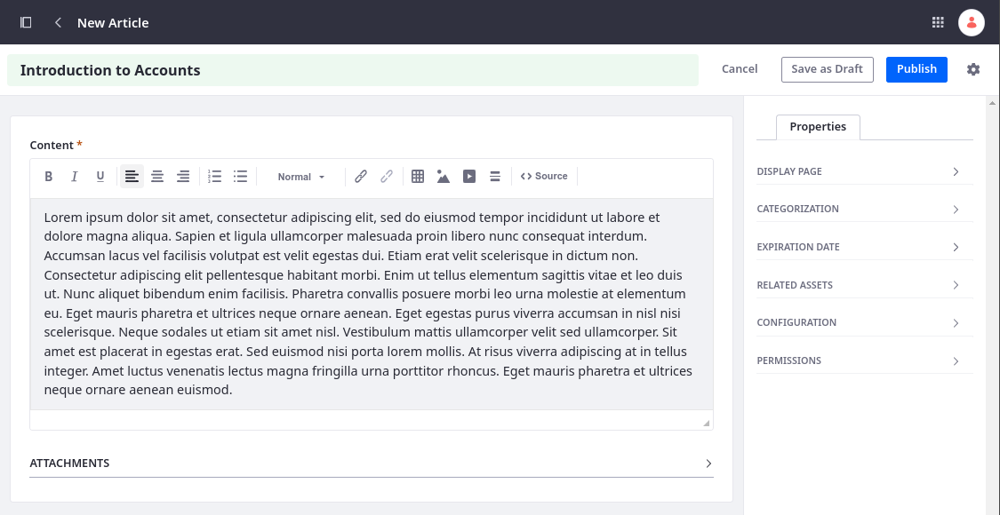

# Creating Knowledge Base Articles

{bdg-secondary}`Liferay 7.4 U72+/GA72+`

Knowledge Base provides tools for creating and managing a repository of articles. You can create articles using the application's WYSIWYG editor or by importing them as Markdown files (`.markdown`, `.md`) in a ZIP archive.



## Authoring Articles in the Editor

1. Open the *Site Menu* () and go to *Content and Data* &rarr; *Knowledge Base*.

1. In the Folders and Articles section (), click *Add* () and select *Basic Article*.

   If you created an [article template](./knowledge-base-templates.md), you can select it instead.

   

1. Enter an article title.

1. Enter content for the article. To view or edit the article's HTML source, click the *Source* button () in the editor.

   

1. (Optional) Add attachments to the article.

1. (Optional) Select a [display page template](../../site-building/displaying-content/using-display-page-templates.md) for the article. This configuration overrides the default display page template for Knowledge Base articles.

1. (Optional) Add [tags](../../content-authoring-and-management/tags-and-categories/tagging-content-and-managing-tags.md) or [categories](../../content-authoring-and-management/tags-and-categories/defining-categories-and-vocabularies-for-content.md) to the article to improve visibility and organization.

1. (Optional) Set expiration and review dates. By default, articles are set never to expire or require review. See [Managing the Knowledge Base](./managing-the-knowledge-base.md) for more information.

1. (Optional) Relate assets to the article.

1. Set the article's friendly URL. By default, the URL matches the title field, but you can change it manually.

   ```{important}
   After saving or publishing an article, you cannot change its friendly URL.
   ```

1. (Optional) Configure the article's permissions. By default, the View permission is assigned to the Guest role, meaning anyone can view the article.

1. Click *Publish* to submit the article for publication or *Save as Draft* to work on it later.

   !!! note
       With the LPS-188058 [release feature flag](../../system-administration/configuring-liferay/feature-flags.md#release-feature-flags) enabled, you can schedule articles for publishing at a specific date and time.

Once saved, the article appears in the Folders and Articles section. If you've enabled workflow for Knowledge Base, the article must go through the approval process before being published.

## Importing Markdown Files

If desired, you can import Knowledge Base articles as Markdown files (`.markdown`, `.md`). To do this, you must ensure each Markdown file is properly formatted and packaged in a ZIP archive. Imported articles are automatically converted to HTML and appear in the Articles and Folders section (). See [Importing Knowledge Base Articles](./importing-knowledge-base-articles.md) for detailed instructions.

## Related Topics

* [Managing the Knowledge Base](./managing-the-knowledge-base.md)
* [Importing Knowledge Base Articles](./importing-knowledge-base-articles.md)
