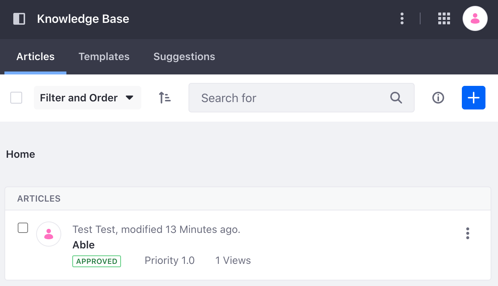

# Knowledge Base API Basics

You can [Create Knowledge Base Articles](../creating-knowledge-base-articles.md) and [Manage the Knowledge Base](../managing-the-knowledge-base.md) with Liferay's Knowledge Base app, but you can also use Liferay's REST APIs. Call these services to create and manage content for your Knowledge Base.

## Adding a Knowledge Base Article

```{include} /_snippets/run-liferay-dxp.md
```

Then follow these steps:

1. Download and unzip [Knowledge Base API Basics](./liferay-t3x7.zip).

   ```bash
   curl https://resources.learn.liferay.com/dxp/latest/en/collaboration-and-social/knowledge-base/developer-guide/liferay-t3x7.zip -O
   ```

   ```bash
   unzip liferay-t3x7.zip
   ```

1. When signed in, [retrieve the site's ID](../../../headless-delivery/consuming-apis/consuming-rest-services.md#identify-the-site-containing-the-data). You'll use this ID in several service calls.

1. Use the cURL script to add a new Knowledge Base article to your site. On the command line, navigate to the `curl` folder. Execute the `KnowledgeBaseArticle_POST_ToSite.sh` script with your site ID as a parameter. For example,

   ```bash
   ./KnowledgeBaseArticle_POST_ToSite.sh 1234
   ```

   The JSON response shows a new Knowledge Base article has been added:

   ```json
   {
     "articleBody" : "Foo",
     "creator" : {
       "additionalName" : "",
       "contentType" : "UserAccount",
       "familyName" : "Test",
       "givenName" : "Test",
       "id" : 20125,
       "name" : "Test Test"
     },
     "customFields" : [ ],
     "dateCreated" : "2022-07-28T21:25:57Z",
     "dateModified" : "2022-07-28T21:25:57Z",
     "description" : "",
     "encodingFormat" : "text/html",
     "externalReferenceCode" : "0bace9ad-39ea-79b5-902e-c873806b8bd7",
     "friendlyUrlPath" : "able",
     "id" : 42447,
     "keywords" : [ ],
     "numberOfAttachments" : 0,
     "numberOfKnowledgeBaseArticles" : 0,
     "parentKnowledgeBaseArticleId" : 0,
     "relatedContents" : [ ],
     "siteId" : 20121,
     "subscribed" : false,
     "taxonomyCategoryBriefs" : [ ],
     "title" : "Able"
   }
   ```

1. Click the *Menu* icon () and navigate to *Content and Data* &rarr; *Knowledge Base*. See that a new Knowledge Base article has been added.

   

1. The REST service can also be called using the Java client. Navigate out of the `curl` folder and into the `java` folder. Compile the source files:

   ```bash
   javac -classpath .:* *.java
   ```

1. Run the `KnowledgeBaseArticle_POST_ToSite.java` class. Replace the `siteId` system property value with your site's ID.

   ```bash
   java -classpath .:* -DsiteId=1234 KnowledgeBaseArticle_POST_ToSite
   ```

   The Java class created a new Knowledge Base article.

## Examine the cURL Command

The `KnowledgeBaseArticle_POST_ToSite.sh` script calls the REST service with a cURL command.

```{literalinclude} ./knowledge-base-api-basics/resources/liferay-t3x7.zip/curl/KnowledgeBaseArticle_POST_ToSite.sh
    :language: bash
```

Here are the command's arguments:

| Arguments | Description |
| :--- | :--- |
| `-H "Content-Type: application/json"` | Indicates that the request body format is JSON. |
| `-X POST` | The HTTP method to invoke at the specified endpoint |
| `"http://localhost:8080/o/headless-delivery/v1.0/sites/${1}/knowledge-base-articles"` | The REST service endpoint |
| `-d "{\"articleBody\": \"Foo\", \"title\": \"Able\"}"` | The data you are requesting to post |
| `-u "test@liferay.com:learn"` | Basic authentication credentials |

```{note}
Basic authentication is used for demonstration purposes. For production, you should authorize users via [OAuth2](../../../headless-delivery/using-oauth2.md). See [Using OAuth2 to Authorize Users](../../../headless-delivery/using-oauth2/using-oauth2-to-authorize-users.md) for a sample React application that uses OAuth2.
```

The other cURL commands use similar JSON arguments.

## Examine the Java Class

The `KnowledgeBaseArticle_POST_ToSite.java` class adds a Knowledge Base article by calling the knowledge-base-related service.

```{literalinclude} ./knowledge-base-api-basics/resources/liferay-t3x7.zip/java/KnowledgeBaseArticle_POST_ToSite.java
   :dedent: 1
   :language: java
   :lines: 9-29
```

This class invokes the REST service using only three lines of code:

| Line (abbreviated) | Description |
| :----------------- | :---------- |
| `KnowledgeBaseArticleResource.Builder builder = ...` | Gets a `Builder` for generating an `KnowledgeBaseArticleResource` service instance. |
| `KnowledgeBaseArticleGroupResource knowledgeBaseArticleGroupResource = builder.authentication(...).build();` | Specifies basic authentication and generates a `KnowledgeBaseArticleResource` service instance. |
| `KnowledgeBaseArticle knowledgeBaseArticle = knowledgeBaseArticleResource.postSiteKnowledgeBaseArticle(...);` | Calls the `knowledgeBaseArticleResource.postSiteKnowledgeBaseArticle` method and passes the data to post. |

Note that the project includes the `com.liferay.headless.delivery.client.jar` file as a dependency. You can find client JAR dependency information for all REST applications in the API explorer in your installation at `/o/api`.

```{note}
The `main` method's comment demonstrates running the class.
```

The other example Java classes are similar to this one, but call different `KnowledgeBaseArticle` methods.

```{important}
See [KnowledgeBaseArticleResource](https://github.com/liferay/liferay-portal/blob/[$LIFERAY_LEARN_PORTAL_GIT_TAG$]/modules/apps/headless/headless-delivery/headless-delivery-client/src/main/java/com/liferay/headless/delivery/client/resource/v1_0/KnowledgeBaseArticleResource.java) for service details.
```

Below are examples of calling other `KnowledgeBaseArticle` REST services using cURL and Java.

## Get Knowledge Base Articles from Site

You can retrieve Knowledge Base articles from any site by executing the following cURL or Java command. Replace `1234` with your site's ID.

### KnowledgeBaseArticles_GET_FromSite.sh

Command:

```bash
./KnowledgeBaseArticles_GET_FromSite.sh 1234
```

Code:

```{literalinclude} ./knowledge-base-api-basics/resources/liferay-t3x7.zip/curl/KnowledgeBaseArticles_GET_FromSite.sh
   :language: bash
```

### KnowledgeBaseArticles_GET_FromSite.java

Command:

```bash
java -classpath .:* -DsiteId=1234 KnowledgeBaseArticles_GET_FromSite
```

Code:

```{literalinclude} ./knowledge-base-api-basics/resources/liferay-t3x7.zip/java/KnowledgeBaseArticles_GET_FromSite.java
   :dedent: 1
   :language: java
   :lines: 11-26
```

The Instance's `KnowledgeBaseArticles` objects appear in JSON.

## Get a Knowledge Base Article

Get a specific Knowledge Base article by its ID with the following cURL or Java command.

```{tip}
Use ``KnowledgeBaseArticles_GET_FromSite.[java|sh]`` to get instance ``Knowledge Base Article`` IDs.
```

### KnowledgeBaseArticle_GET_ById.sh

Command:

```bash
./KnowledgeBaseArticle_GET_ById.sh 1234
```

Code:

```{literalinclude} ./knowledge-base-api-basics/resources/liferay-t3x7.zip/curl/KnowledgeBaseArticle_GET_ById.sh
   :language: bash
```

### KnowledgeBaseArticle_GET_ById.java

Command:

```bash
java -classpath .:* -DknowledgeBaseArticleId=1234 KnowledgeBaseArticle_GET_ById
```

Code:

```{literalinclude} ./knowledge-base-api-basics/resources/liferay-t3x7.zip/java/KnowledgeBaseArticle_GET_ById.java
   :dedent: 1
   :language: java
   :lines: 8-20
```

The `KnowledgeBaseArticle` fields appear in JSON.

## Patch a Knowledge Base Article

Do a partial edit of an existing Knowledge Base article with the following cURL and Java commands. Replace `1234` with your Knowledge Base article's ID. Specify the field you want to modify and its new value. 

### KnowledgeBaseArticle_PATCH_ById.sh

Command:

```bash
./KnowledgeBaseArticle_PATCH_ById.sh 1234
```

Code:

```{literalinclude} ./knowledge-base-api-basics/resources/liferay-t3x7.zip/curl/KnowledgeBaseArticle_PATCH_ById.sh
   :language: bash
```

### KnowledgeBaseArticle_PATCH_ById.java

Command:

```bash
java -classpath .:* -DknowledgeBaseArticleId=1234 KnowledgeBaseArticle_PATCH_ById
```

Code:

```{literalinclude} ./knowledge-base-api-basics/resources/liferay-t3x7.zip/java/KnowledgeBaseArticle_PATCH_ById.java
   :dedent: 1
   :language: java
   :lines: 9-28
```

## Put a Knowledge Base Article

Completely overwrite an existing Knowledge Base article with the following cURL and Java commands. Replace `1234` with your Knowledge Base article's ID.

### KnowledgeBaseArticle_PUT_ById.sh

Command:

```bash
./KnowledgeBaseArticle_PUT_ById.sh 1234
```

Code:

```{literalinclude} ./knowledge-base-api-basics/resources/liferay-t3x7.zip/curl/KnowledgeBaseArticle_PUT_ById.sh
   :language: bash
```

### KnowledgeBaseArticle_PUT_ById.java

Command:

```bash
java -classpath .:* -DknowledgeBaseArticleId=1234 KnowledgeBaseArticle_PUT_ById
```

Code:

```{literalinclude} ./knowledge-base-api-basics/resources/liferay-t3x7.zip/java/KnowledgeBaseArticle_PUT_ById.java
   :dedent: 1
   :language: java
   :lines: 9-29
```

## Delete a Knowledge Base Article

Delete an existing Knowledge Base article with the following cURL and Java commands. Replace `1234` with your Knowledge Base article's ID.

### KnowledgeBaseArticle_DELETE_ById.sh

Command:

```bash
./KnowledgeBaseArticle_DELETE_ById.sh 1234
```

Code:

```{literalinclude} ./knowledge-base-api-basics/resources/liferay-t3x7.zip/curl/KnowledgeBaseArticle_DELETE_ById.sh
   :language: bash
```

### KnowledgeBaseArticle_DELETE_ById.java

Command

```bash
java -classpath .:* -DknowledgeBaseArticleId=1234 KnowledgeBaseArticle_DELETE_ById
```

Code:

```{literalinclude} ./knowledge-base-api-basics/resources/liferay-t3x7.zip/java/KnowledgeBaseArticle_DELETE_ById.java
   :dedent: 1
   :language: java
   :lines: 8-17
```

## Knowledge Base Folder services

The cURL commands and Java classes for Knowledge Base folders works in the same way as Knowledge Base articles.

| Files | Description |
| :---- | :---------- |
| `KnowledgeBaseFolder_DELETE_ById.[java\|sh]` | Deletes a Knowledge Base folder by ID. |
| `KnowledgeBaseFolder_GET_ById.[java\|sh]` | Get a specific Knowledge Base folder by ID. |
| `KnowledgeBaseFolder_PATCH_ById.[java\|sh]` | Patch a Knowledge Base folder by ID. |
| `KnowledgeBaseFolder_POST_ToSite.[java\|sh]` | Post a Knowledge Base folder to a site. |
| `KnowledgeBaseFolder_PUT_ToSite.[java\|sh]` | Put a Knowledge Base folder by ID. |
| `KnowledgeBaseFolders_GET_FromSite.[java\|sh]` | Get a list of Knowledge Base folders from a site. |

The [API Explorer](../../../headless-delivery/consuming-apis/consuming-rest-services.md) shows all of the `KnowledgeBaseArticle` and `KnowledgeBaseFolder` services and schemas and has an interface to try out each service.
