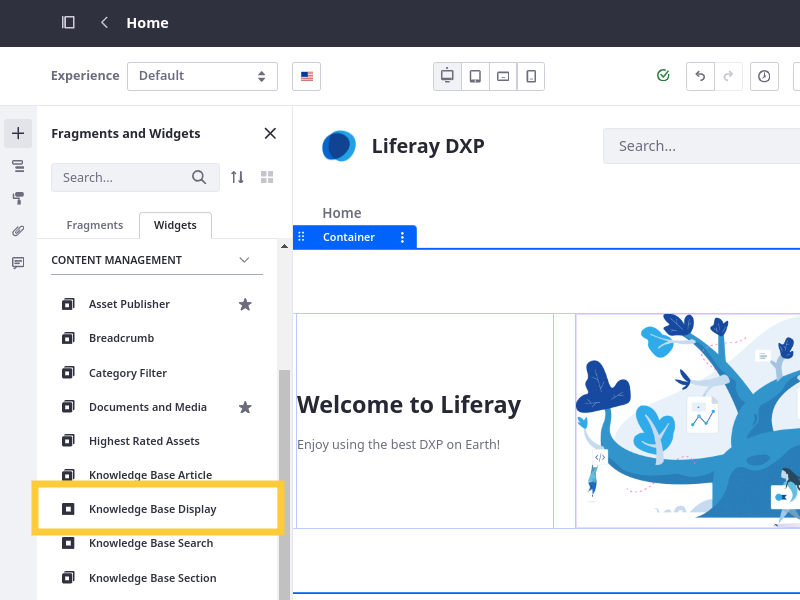
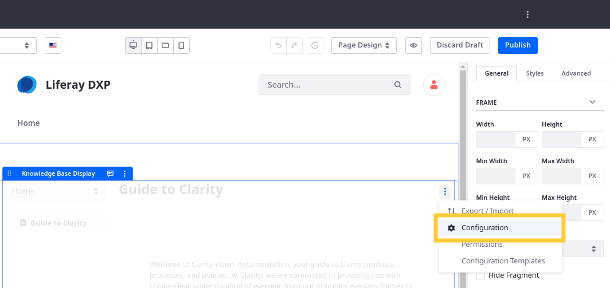
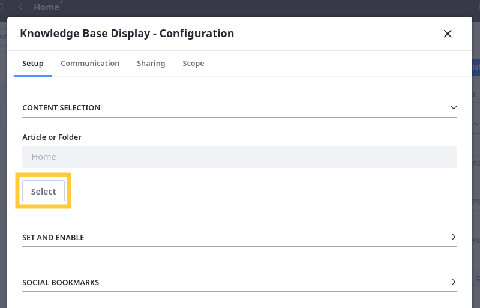
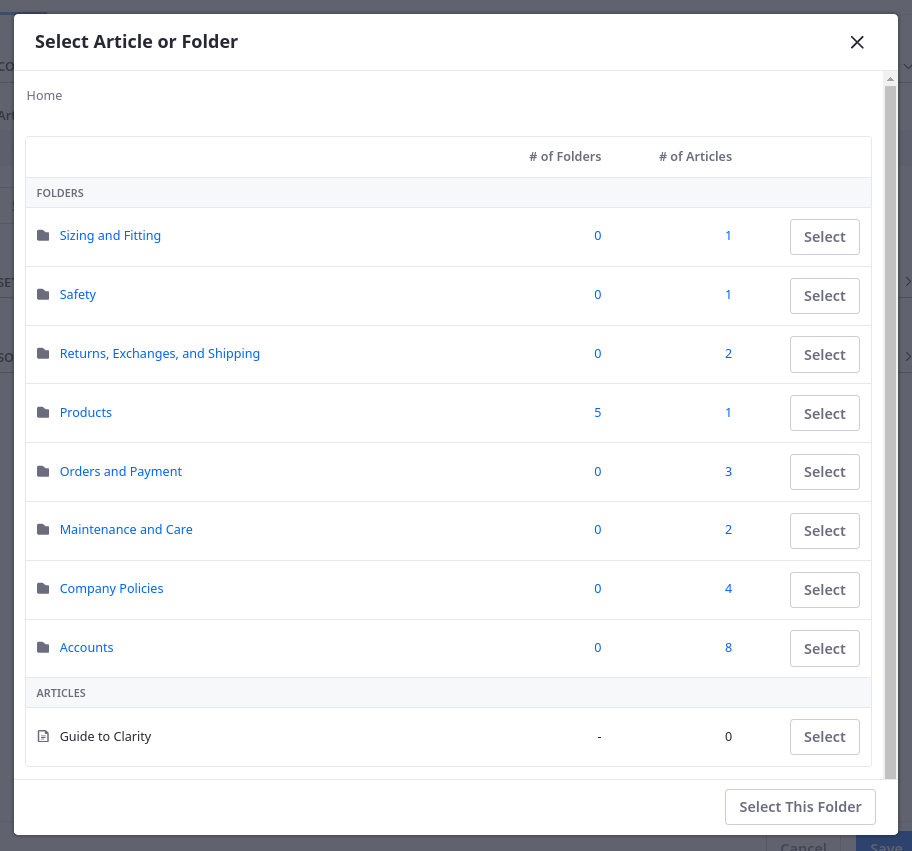
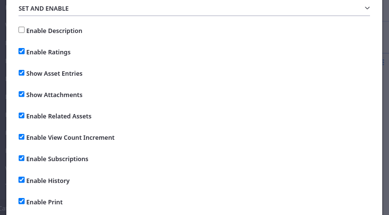
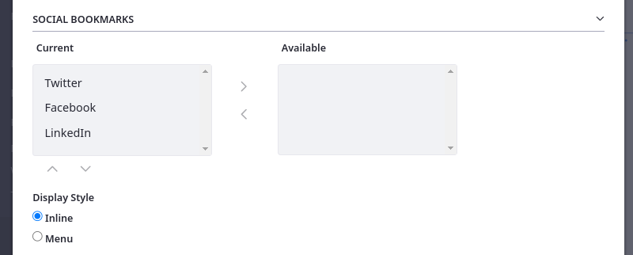
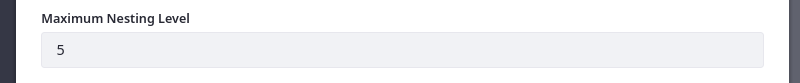
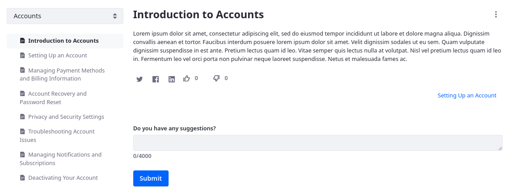

# Knowledge Base Display Widget

{bdg-secondary}`Liferay 7.4 U72+/GA72+`

You can use the Knowledge Base Display widget to display published articles in site pages with built-in navigation, comments, ratings, and social media links. By default, this widget displays articles from the Knowledge Base’s Home folder. You can customize which articles are included.

You can find the widget under *Content Management* in the Fragments and Widgets side panel.



## Configuring the Widget

1. Begin editing a page that includes the Knowledge Base Display widget.

1. Click the *Options* button () for the widget and select *Configuration*.

   

1. In the Setup tab, click *Select* under Content Selection to determine which articles to display.

    

1. Click *Select* for an individual article or folder.

   Alternatively, click *Select This Folder* to display the current folder's articles.

   

1. Under Set and Enable, determine which features to use in the widget. Options include

   * Enable Description
   * Enable Ratings
   * Show Asset Entries
   * Show Attachments
   * Enable Related Assets
   * Enable View Count Increment
   * Enable Subscriptions
   * Enable History
   * Enable Print

   

1. Under Social Bookmarks, determine which social media links to include and how to display them.

   

1. Add a prefix to folders in the section selector.

   

1. Set a maximum nesting level. This determines how a hierarchy of articles is displayed.

   

   Consider a scenario with this hierarchy:

   ```
   Article 1
   ├── Article 1.1
   │   ├── Article 1.1.1
   │   └── Article 1.1.2
   └── Article 1.2
       ├── Article 1.2.1
       └── Article 1.2.2
   ```

   If you set the max nesting level to `3` or higher, then these articles appear nested in three levels. But if you set the max nesting level to `2`, then articles appear in two levels:

   ```
   Article 1
   ├── Article 1.1
   ├── Article 1.1.1
   ├── Article 1.1.2
   ├── Article 1.2
   ├── Article 1.2.1
   └── Article 1.2.2
   ```

1. Click *Save*.

## Exploring the Widget's Features

The Knowledge Base Display’s navigation menu and display options make it a great candidate for a full page widget. If you display a folder of articles, the navigation on the left side of the widget displays links to all the folder’s articles. If your articles are organized into [folders](./managing-the-knowledge-base.md#adding-folders), this widget provides users with a selector for switching between folders.



The viewing area on the right side of the widget displays the folder’s leading article. Click an article in the navigation to display it in the viewing area. The currently displayed article’s link appears in bold in the navigation. You can also move between articles by clicking the links at the bottom of the article before the suggestions section.


Knowledge Base Display can also show article hierarchies. Viewing an article that has child articles expands the navigation tree to show links to the child articles. Expanded nodes collapse when you view a different top level article.

The links at the top of the widget expose these actions on an article:

* Subscribe to an RSS feed of the Knowledge Base
* Subscribe to the current article
* View the current article’s history
* Print the current article

Administrators have access to an additional set of links at the top of the widget:

* Edit the article
* Add a child article
* Move the article
* Delete the article

Below the article’s content is the rating interface, showing thumbs up/down icons. Users can also submit suggestions or comments below the article in the text box labeled *Do you have any suggestions*?. Administrators can view the [suggestions and mark progress on them](./responding-to-knowledge-base-feedback.md).

If the administrator enables the Knowledge Base source URL feature and an article has an assigned source URL, an *Edit on GitHub* button () appears to the right of the article’s title. This button links to the article’s source in GitHub. You can use this feature to encourage people to contribute fixes or improvements to articles. See [Knowledge Base System Settings](./knowledge-base-system-settings.md) for more information.

## Related Topics

* [Creating Knowledge Base Articles](./creating-knowledge-base-articles.md)
* [Managing the Knowledge Base](./managing-the-knowledge-base.md)
* [Other Knowledge Base Widgets](./other-knowledge-base-widgets.md)
