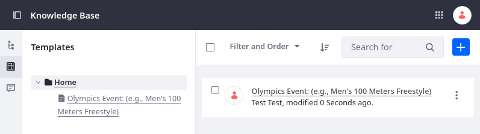
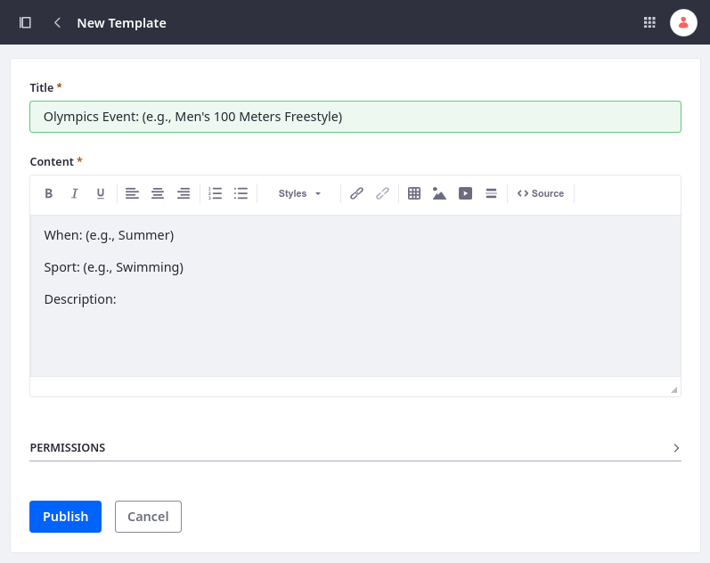
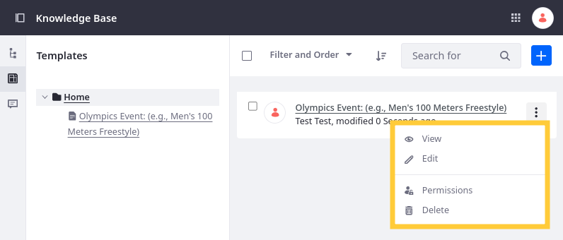

# Knowledge Base Templates

Templates give authors a starting point with default headers or other content for articles. Templates help foster consistent formatting and content organization for articles. You can create and manage templates in the Knowledge Base application.

## Creating Templates

1. Open the *Site Menu* () and go to *Content and Data* &rarr; *Knowledge Base*.

1. Go to *Templates* () and click *Add* ().

1. Enter a title for the template.

1. Use the WYSIWYG editor to design the template. To view or edit the article’s HTML source, click the *Source* button () in the editor. You can also set the template’s permissions via the form’s *Permissions* section.

   

1. Click *Publish* to finish creating the template.

## Managing Templates

Each template appears in a list in the Templates section. You can take the following actions on each template via its Actions icon ():

**View:** Display the template. From here, you can print the template, use it to create an article, edit it, modify its permissions, or delete it.

**Edit:** Change the template’s title and content.

**Permissions:** Configure the template’s permissions. You can choose whether a Role can change permissions, update, view, or delete the template.

**Delete:** Remove the template from the Knowledge Base.

## Related Topics

* [Creating Knowledge Base Articles](./creating-knowledge-base-articles.md)
* [Managing the Knowledge Base](./managing-the-knowledge-base.md)
