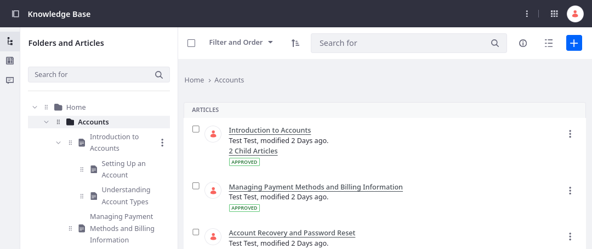
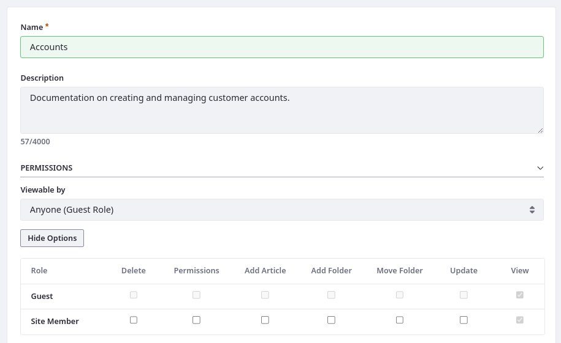
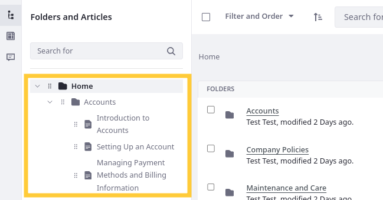
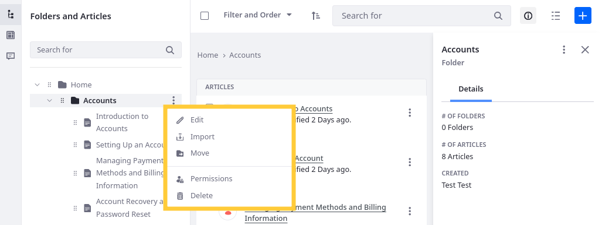
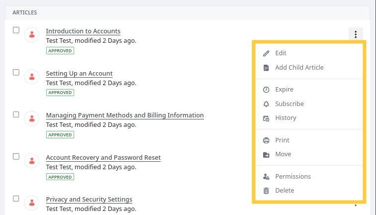
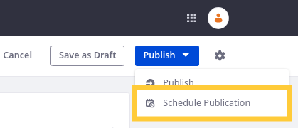
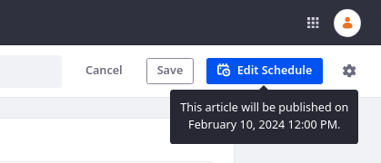
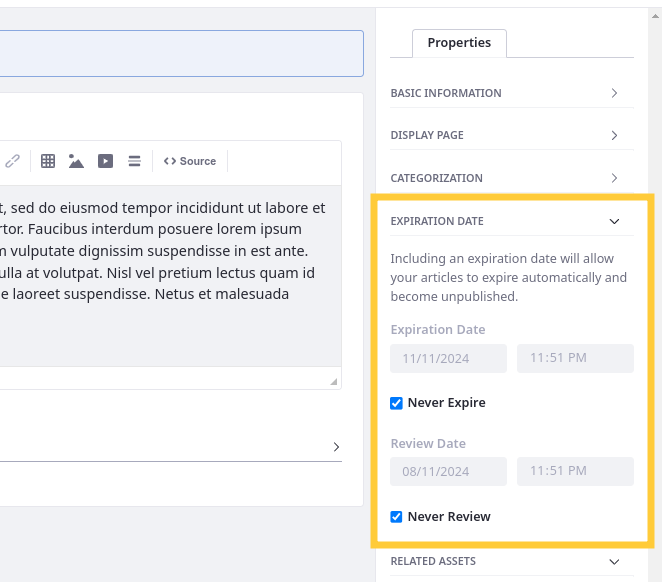
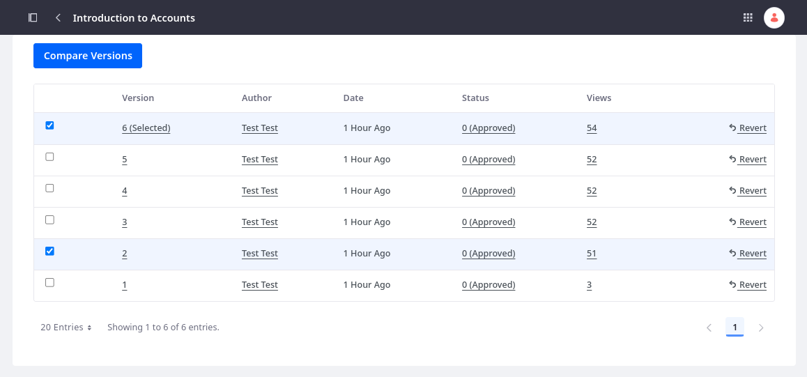

# Managing the Knowledge Base

{bdg-secondary}`Liferay 7.4 U72+/GA72+`

With Knowledge Base, you can draft product documentation quickly and organize it into hierarchies that end users can navigate. Add folders and nested articles to create the desired structure and order. Additionally, manage article and folder permissions to ensure only intended users can access your content.



## Adding Folders

1. Open the *Site Menu* () and go to *Content and Data* &rarr; *Knowledge Base*.

1. In the Folders and Articles section (), click *Add* () and select *Folder*.

1. Enter a name and description.

1. Configure the folder's permissions. By default, the View permission is assigned to the Guest role, meaning anyone can view the folder.

   

1. Click *Save*.

## Managing Folders and Articles

After adding folders and articles, you can drag and drop them in the left side panel to organize and order your documentation. You can also click Actions () to access additional management options.



```{note}
For 7.4 U71/GA71 and earlier versions, Knowledge Base articles include a priority value. This value appears beneath the article’s title and determines its order in the Knowledge Base Display widget. You can configure this behavior via [Knowledge Base System Settings](knowledge-base-system-settings.md).
```

### Folder Options



**Edit** (): Update the article's name and description.

**Import** (): Import a ZIP archive of Markdown files and image attachments. See [Importing Knowledge Base Articles](./importing-knowledge-base-articles.md) for more information.

**Move** (): Relocate the folder.

**Subscribe** (Home folder only): Get notified when Knowledge Base articles are created, updated, or deleted.

**Permissions** (): Assign resource permissions to different roles.

**Delete** (): Immediately delete the folder and its contents. 

!!! note 
    Enable the LPS-188058 [release feature flag](../../system-administration/configuring-liferay/feature-flags.md#release-feature-flags) to add recycle bin support for Knowledge Base folders and articles. While enabled, deleting folders moves them and their contents to the Recycle Bin.

Additionally, you can click *Info* () to toggle the information panel for the current folder.

### Article Options



**Edit** (): Change the folder’s name and description.

**Add Child Article** (): Create a sub-article.

**Expire** (): Mark an article as expired and notify reviewers, owners, and subscribers. Expired articles cannot be displayed in sites. See [Setting Review and Expiration Dates for Articles](#setting-review-and-expiration-dates-for-articles) for more information

**Subscribe** (): Sign up to receive updates to the article. Users receive notifications for the article based on system mail and notification settings.

**History** (): View and compare different versions of the article.

**Print** (): Open a dialogue to print the article.

**Move** (): Relocate an article to a different folder or parent article.

**Permissions** (): Manage permissions for the article.

**Delete** (): Immediately delete the article along with its child articles. 

!!! note 
    Enable the LPS-188058 [release feature flag](../../system-administration/configuring-liferay/feature-flags.md#release-feature-flags) to add recycle bin support for Knowledge Base folders and articles. While enabled, deleting an article moves it and its child articles to the Recycle Bin.

While viewing an article, you can also click *Info* () to view article details and versions.

## Scheduling Articles for Publishing 

{bdg-link-primary}`[Release Feature](../../system-administration/configuring-liferay/feature-flags.md#release-feature-flags)`

When creating or editing an article, you can schedule it for publishing at a specific date and time. While scheduled, the article only appears in the Knowledge Base application and does not appear in site pages. 



If you edit a scheduled article and click *Save*, Liferay saves the article as a draft and cancels the scheduled publication. Alternatively, if you click *Edit Schedule*, you can choose whether to publish the article immediately or schedule it for publishing at a future date and time.



To use this feature, enable the LPS-188058 release feature flag.

## Setting Review and Expiration Dates for Articles

Sometimes Knowledge Base articles are only valid for a period of time. For these situations, you can set expiration and review dates for Knowledge Base articles to help insure the integrity of your documentation. While set, Liferay checks Knowledge Base articles at a set interval for any articles that have reached their expiration or review date. It then sends notifications to the reviewers, owners, and subscribers. When an expiration date is approaching, Liferay notifies users that the article is expiring soon.

By default, articles are set never to expire or require review, but you can change this while creating or editing an article.



The default value is one year in the future, but you can select the desired date and hour. Users receive notifications for the article based on system mail and notification settings.

When an expiration date is reached, the Knowledge Base article cannot be used in sites. Users accessing the Knowledge Base article through a URL receive the 404 HTTP status. Additionally, an expired article cannot be modified unless the expiration date is set to a future value or expiration is disabled.

Reaching the review date does not affect the article. It only reminds users to review the article's content.

### Configuring Review and Expiration Notifications

1. Open the *Global Menu* (), go to the *Control Panel* tab, and click *System Settings*.

1. Under Content and Data, click *Knowledge Base*.

   

1. In the Service tab under System Scope, enter a check interval. This value determines the number of minutes between checks. By default, the value is 15 minutes.

1. Determine the number of weeks before expiration to send notification. Articles within this range are assigned an Expiring Soon label. The default value is 1 week.

1. Click *Save*.

1. Go to the *Service* tab under Site Scope.

1. Enable/Disable review and expiration emails.

1. Determine the content of review and expiration emails.

   

1. Click *Save*.

## Reviewing Article History

When viewing an article's history, you can view version details, compare content, and revert to an earlier version.


To compare version content, select two articles and click *Compare Versions*.


This highlights all additions, deletions, and formatting changes between versions.

## Related Topics

* [Creating Knowledge Base Articles](./creating-knowledge-base-articles.md)
* [Importing Knowledge Base Articles](./importing-knowledge-base-articles.md)
* [Knowledge Base System Settings](./knowledge-base-system-settings.md)
