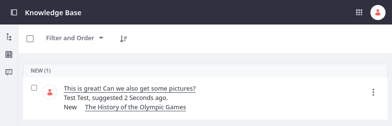
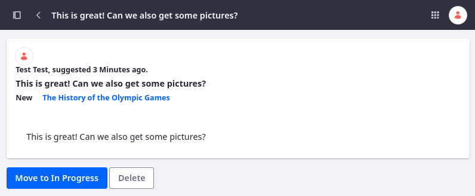
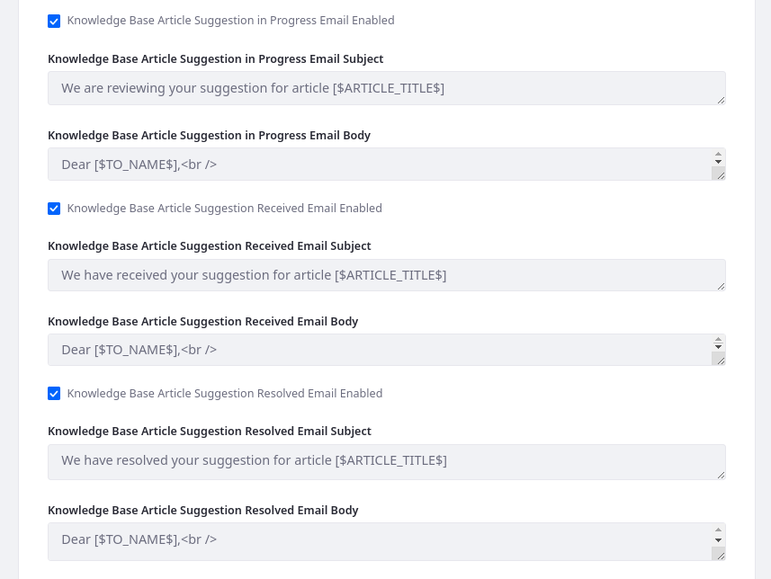

# Responding to Knowledge Base Feedback

You can view and manage article feedback in the Knowledge Base application. To do this,

1. Open the *Site Menu* () and go to *Content and Data* &rarr; *Knowledge Base*.

1. Go to the *Suggestions* section ().

All user comments appear in a table.



```{note}
To view article suggestions, you must have the *Knowledge Base > Knowledge Base: View Suggestions* permission.
```

Each suggestion provides the link to the associated article, the feedback, the User’s name, the feedback’s time stamp, and the status on addressing the suggestion. You can use each entry’s Actions menu () to move the entry between the *New*, *In Progress*, and *Resolved* states.

You can also click on an individual suggestion and mark it to advance the progress.



Feedback first shows a Move to In Progress button, and then a Resolve button. A suggestion can be changed back to new state by clicking the *New* button. Suggestions can also be deleted by clicking on the *Delete* button.

```{note}
To view article suggestions, you must have the *Knowledge Base > Knowledge Base Article: Update* permission. Roles assigned this permission can also view and update the state of article suggestions in all Knowledge Base widgets.
```

When you move the suggestion to a different state, an email is sent notifying the user of the change. To configure automated emails,

1. Open the *Global Menu* (), go to the *Control Panel* tab, and click *System Settings*.

1. Under Content and Data, click *Knowledge Base*.

1. In the Service tab under Site Scope, enable/disable emails and determine their content.

   

1. Click *Save*.

Emails are sent to the appropriate users.

## Related Topics

* [Creating Knowledge Base Articles](./creating-knowledge-base-articles.md)
* [Managing the Knowledge Base](./managing-the-knowledge-base.md)
* [Knowledge Base System Settings](./knowledge-base-system-settings.md)