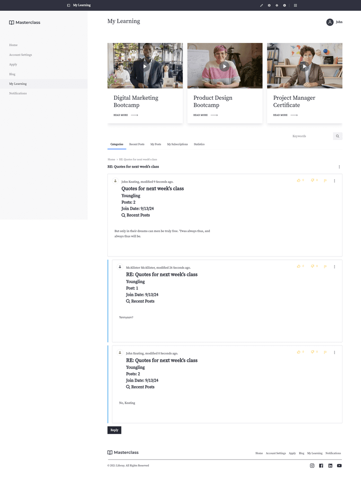

---
toc:
  - ./message-boards/creating-message-boards-categories.md
  - ./message-boards/creating-message-boards-threads.md
  - ./message-boards/moderating-message-boards.md
  - ./message-boards/subscribing-to-a-message-board.md
  - ./message-boards/configuring-a-message-boards-category-mailing-list.md
  - ./message-boards/scoping-your-message-boards.md
  - ./message-boards/message-boards-widget-ui-reference.md
  - ./message-boards/message-boards-configuration-reference.md
  - ./message-boards/message-boards-permissions-reference.md
  - ./message-boards/developer-guide.md
uuid: fcdb1a27-c25a-417d-8a2c-bf4d2a15aa45
taxonomy-category-names:
- Content Management System
- Forums and Message Boards
- Liferay Self-Hosted
- Liferay PaaS
- Liferay SaaS
---

# Message Boards

Liferay DXP's Message Boards application is a forum application that can be added to site pages.

You can organize topics by creating [categories](./message-boards/creating-message-boards-categories.md) and [threads](./message-boards/creating-message-boards-threads.md), making it easier to manage conversations. [Moderation](./message-boards/moderating-message-boards.md) tools help maintain discussions, with options to set [permissions](./message-boards/message-boards-permissions-reference.md) for different user roles.

The application also supports [configuring mailing lists for message board categories](./message-boards/configuring-a-message-boards-category-mailing-list.md), so users can follow and respond to discussions via email.

Each [message board can be scoped](./message-boards/scoping-your-message-boards.md) to different sites, giving administrators flexibility in how forums are managed across various contexts.

The fastest way to begin using the *Message Boards* application is to [add a Message Boards widget to a page](../site-building/creating-pages/using-content-pages/using-widgets-on-a-content-page.md):

1. Open the *Site Menu* (Site Menu), expand *Site Builder*, and go to *Pages*.

1. Start editing the page where you want to place the Message Boards widget.

1. In the Fragments and Widgets sidebar, look for the *Message Boards* widget. Drag and drop it into the page and publish the page.

Now, site members are able to create forum posts using the *Message Boards* widget.

!!! note
    You can only add one *Message Boards* widget per page.
