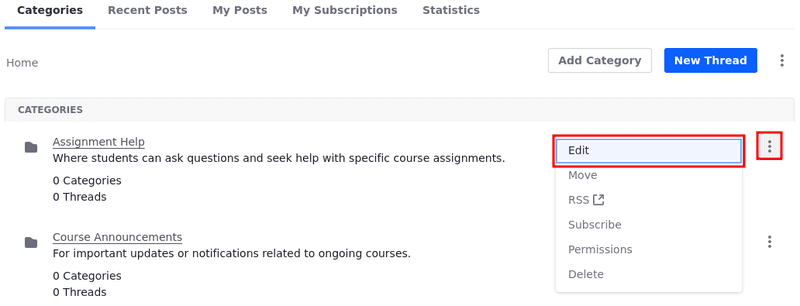
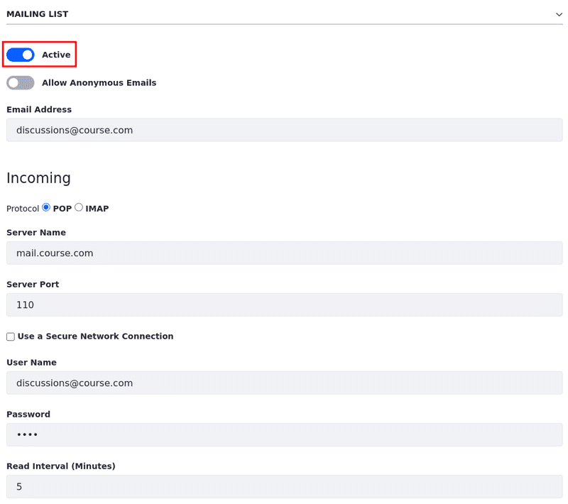

# Configuring a Message Boards Category Mailing List

You can configure a mailing list for a message board category in a [site or page-scoped](./scoping-your-message-boards.md) message board. Globally scoped messages boards don't support subscriptions and mailing lists. Any category in a message board can have its own mailing list.

## Prerequisites

Before configuring the Message Boards app's email lists, [configure a mail server for the entire DXP instance](../../../installation-and-upgrades/setting-up-liferay/configuring-mail.md).

## Adding a Mailing List to a Message Boards Category

1. Access the page where the Message Boards widget is located.

   Alternatively, access the Message Boards application by opening the *Site Menu* (), expanding *Content & Data*, and selecting *Message Boards*.

1. On the *Message Boards* widget, click *Actions* () next to a [category](./creating-message-boards-categories.md) (in this example, *Assignment Help*).

   

1. Click *Edit* to modify an existing category.

1. Expand the *Mailing List* section.

1. Switch the *Active* toggle to *Active*.

1. Disable the *Allow Anonymous Emails* option.

   When the option is enabled, anyone can send an email to the category’s mailing list, even without an account. Disabling it ensures only authenticated users can participate via email, enhancing security and preventing spam.

1. Enter the following information:

| Field         | Example                   | Description                                                                                                                                            |
|:--------------|:--------------------------|:-------------------------------------------------------------------------------------------------------------------------------------------------------|
| Email Address | `discussions@course.com` | The email address or alias dedicated to the message board category. Users can send emails to this address, and it automatically posts to the category. |
| Protocol      | `POP`                     | The email protocol used for receiving messages.                                                                                                        |
| Server Name   | `mail.course.com`         | The hostname of the mail server responsible for handling incoming emails.                                                                              |
Server Port | `110` | The port used by the mail server for the specified protocol (e.g., port 110 for POP). |
| Use a Secure Network Connection | Check if applicable | If selected, this ensures that the connection to the mail server is encrypted. |
| User Name | `discussions@course.com` | The email address used to authenticate to the mail server for receiving emails. |
| Password | `*****` | The password for the email account used to access the mail server. |
| Read Interval (minutes) | `5` | How frequently (in minutes) the system checks the mail server for new emails to post to the category. |
| Email Address (Outgoing) | `discussions@course.com` | The email address used for sending outgoing emails from the message board category to users subscribed to it. This can be the same as the incoming email address. |
| Use Custom Outgoing Server | Leave blank if using the global default mail server. | Specify a different mail server for outgoing emails if the default global server is not used. |

   

1. Click *Save*.

The mailing list is now active. Subscribed users receive email notifications for new threads in the category.

!!! important
    If using the [IMAP](https://support.google.com/mail/answer/7126229?hl=en) protocol for a category’s mailing list, make sure to [configure the IMAP inbox to delete messages](https://support.google.com/mail/answer/78892?hl=en) as they are pulled by the email client that sends messages to the users on the mailing list. Otherwise, each email message retained on the server is sent to the mailing list each time there's a new post or update in the category.

## Related Information

- [Configuring Mail](../../../installation-and-upgrades/setting-up-liferay/configuring-mail.md)
- [Creating Message Board Categories](./creating-message-boards-categories.md)
