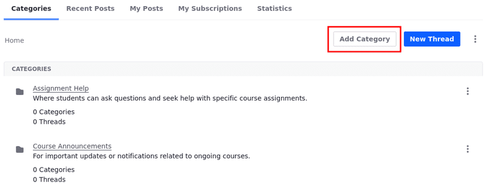
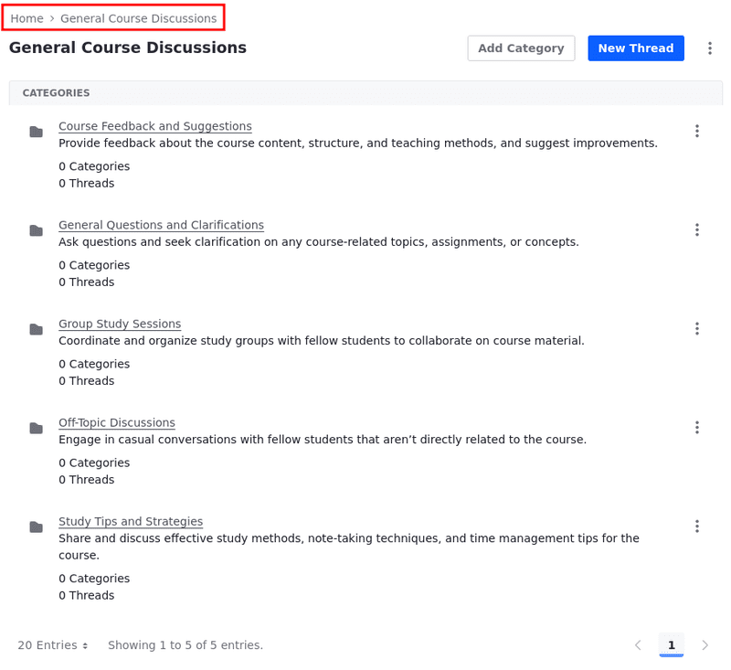
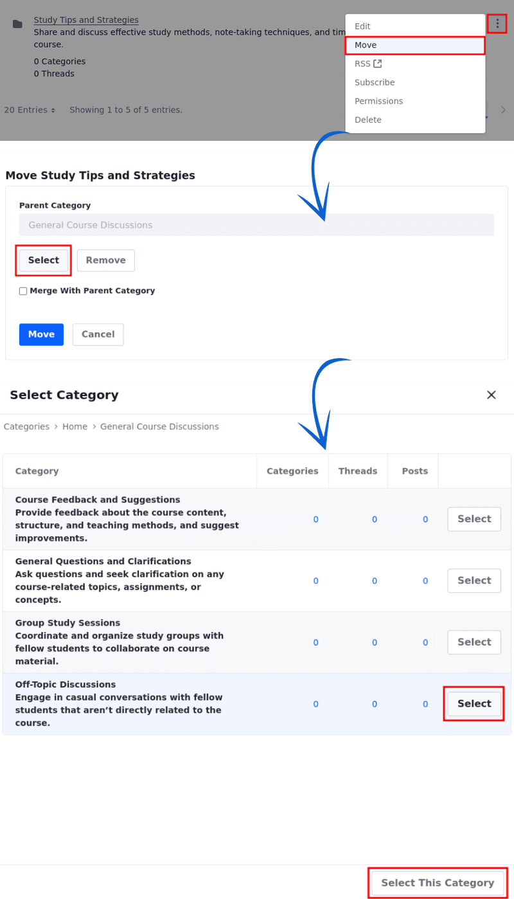

# Creating Message Boards Categories

Message Boards Categories organize threads into specific topics, making it easier for users to find and participate in discussions relevant to their interests.

!!! important
    Only authenticated users with at least the Add Category and Add Subcategory [permissions](./message-boards-permissions-reference.md) can create categories.

## Adding Categories

1. Access the page where the Message Boards widget is located.

   Alternatively, access the Message Boards application by opening the *Site Menu* (), expanding *Content & Data*, and selecting *Message Boards*. In the next step, click *New* &rarr; *Category*.

1. On the Message Boards widget, click *Add Category*.

   

1. Enter a name for the category (for example, General Course Discussions).

1. Enter a description.

1. Select the category's *Display Style*.

   This setting determines how threads appear in the category. The default style uses a classic layout for general discussions. The question style displays threads in a question/answer format.

1. Toggle the *Mailing List* option on to enable and [configure a mailing list for the category](./configuring-a-message-boards-category-mailing-list.md).

1. Disable the *Allow Anonymous Emails* option.

   When the option is enabled, anyone can send an email to the category’s mailing list, even without an account.

1. Leave the *Viewable by* option set to **Anyone (Guest Role)** for now. For more information about the different permissions available, see the [Message Boards Permissions Reference](./message-boards-permissions-reference.md).

1. Click *Save*.

The new category now appears in the table.

New categories appear on the message board's home screen. The list displays the category's names, along with the numbers of subcategories, threads, and posts.

## Modifying Permissions

1. Click *Actions* () next to the *Category* and select *Permissions*.

1. Check the boxes to grant permissions to the desired roles.

   For more information about each permission, see [Message Boards Permissions Reference](./message-boards-permissions-reference.md#general-category-permissions).

1. Click *Save* when finished.

## Adding Subcategories

Categories can contain as many subcategories as you like.

1. Click the category's name in the list (continuing the example above: **General Course Discussions**).

1. Click *Add Category* and fill in the information for the category.

1. The subcategory inherits the parent category's settings, but administrators and content creators can adjust the Display Style and Mailing List options.

1. Click *Save*.

The subcategory now appears on the board.

!!! tip
    Use the breadcrumbs in the top right of the Message Boards widget to navigate between category levels.

## Moving and Merging Categories

Administrators can also move and merge categories.

1. Click *Actions* () for the category you want to move and select *Move*.

   This brings up the Move Category form.

1. Click *Select* to select a new parent category under the *Parent Category* field.

   Note that this field is empty for top-level categories.

1. Click *Select This Category* at the bottom to move the category to the chosen parent category. To move it to a specific subcategory, click *Select* next to the desired subcategory.

1. If you want to merge the category with the selected parent category, select *Merge with Parent Category*.

1. Click *Move*.

   

Regardless of how many categories (and subcategories) there are, a category is just a container to organize a message board's threads. To start creating threads, see [Creating Threads](./creating-message-boards-threads.md).

## Related Topics

- [Message Boards Configuration Reference](./message-boards-configuration-reference.md)
- [Message Boards Permissions Reference](./message-boards-permissions-reference.md#general-category-permissions)
