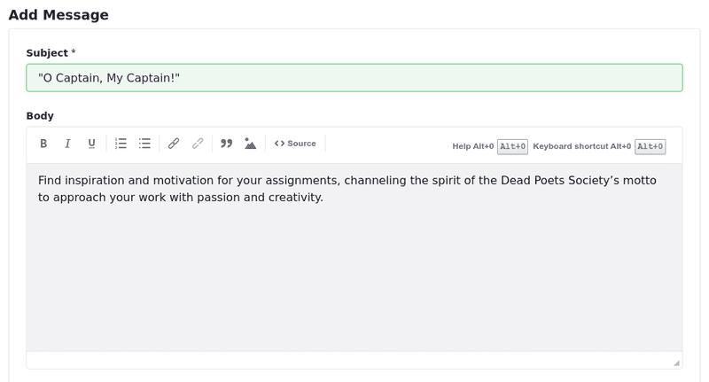
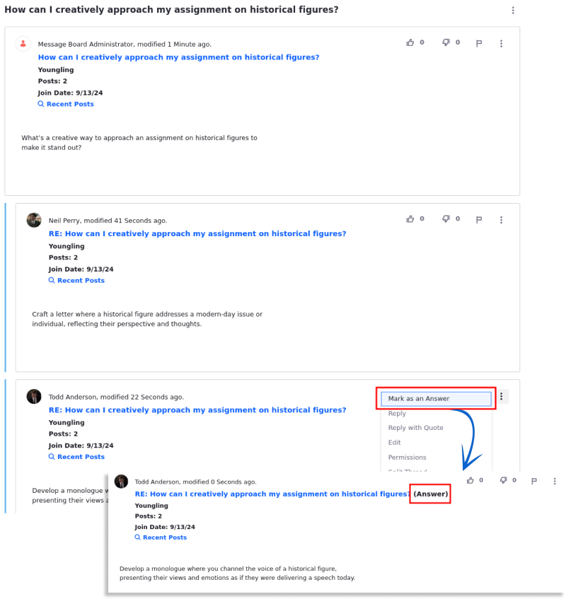

# Creating Message Boards Threads

A thread is a series of messages focused on a specific topic. It starts with an initial post, followed by replies that form a discussion.

!!! important
    Only authenticated users with at least the Add Message, Reply to Message, Add File, and View [permissions](./message-boards-permissions-reference.md) can create threads. Administrators can also enable a setting to allow guests to post threads.

    Set `permissions.propagation.enabled` to `true` in the `portal-ext.properties` file to have message board threads inherit their parent category's permissions. This affects only Wiki pages and message board threads; other assets inherit the default resource permission.

## Posting a New Thread

Threads can be created at the root level of the message board itself and within [categories that have been created](./creating-message-boards-categories.md), helping organize conversations and making it easier for users to follow and participate.

1. Access the page where the Message Boards widget is located.

   Alternatively, access the Message Boards application by opening the *Site Menu* (), expanding *Content & Data*, and selecting *Message Boards*. In the next step, click *New* &rarr; *Thread*.

1. On the Message Boards widget, click *New Thread*. The Add Message form appears.

1. Enter a title in the *Subject* field.

1. Create your thread's content in the Body field.

### Uploading Attachments

Users can attach files to forum posts.

1. Expand the *Attachments* section.

1. Drag and drop a file to upload or use the *Select Files* button to navigate to the file's location.

   !!! important
       You can enable automatic antivirus scanning to scan files on upload. For details, see [Enabling Antivirus Scanning for Uploaded Files](../../../system-administration/file-storage/enabling-antivirus-scanning-for-uploaded-files.md).

### Using Topics, Tags, and Related Assets to Organize Threads

In addition to organizing threads by categories, users can enhance their forum posts with topics, tags, or related assets. For instance, if you tag a post with an *exam* tag, searching for that tag quickly returns all posts associated with it. Read [Organizing Content with Categories and Tags](../../../content-authoring-and-management/tags-and-categories/organizing-content-with-categories-and-tags.md) to learn more.

To add a topic,

1. Expand the *Categorization* section.

1. Click the *Select* button to select an existing Topic. Click *Done* to save the topic.

   Alternatively, type the topic’s name to see available matching options.

The thread post now has a topic.

To add a tag,

1. Click the *Select* button to select an existing tag.

   Alternately, create a new tag by entering the tag name in the *Tags* field and clicking *Add*.

The thread post now has a tag.

Message Boards threads can be linked to other existing assets in DXP.

To select an existing asset in the portal (e.g., a media file, blog post, etc.) to relate to your thread,

1. Expand the *Related Assets* section

1. Use the *Select* button to select an asset category.

1. Select one or more assets and click *Done*.

   You can disconnect the asset from the thread by clicking *Remove* () on the right.

The thread post is linked to an existing asset.

### More Settings

Message Boards Threads offer additional features beyond discussions. The More Settings section provides options to customize the functionality and visibility of your posts.

1. Expand the *More Settings* section.

1. Check the boxes for the settings you want to activate.

   Under More Settings, you can find the Mark as a Question, Anonymous, Subscribe Me, Priority, and Allow Pingback settings.

1. Activate the *Mark as a Question* setting to turn posts into questions for other site members.

   The reply that best answers the question can be marked as the answer.

   To select a reply as the answer, click *Actions* () next to the answer and select *Mark as an Answer*.

   

1. Activate the *Anonymous* setting to post messages anonymously.

   !!! note
       An administrator or a GDPR report can still determine the author of the post.

1. Activate the *Subscribe Me* setting to subscribe to the thread.

1. Activate the *Priority* Setting to prioritized the thread as *Urgent*, *Sticky*, or *Announcement*.

   By default, it is set to "None".

1. Activate the *Allow Pingbacks* option to enable other sites to notify the message board when they link to the thread/post.

   Ensure the post's Guest *View* permission is enabled to use pingbacks.

### Modifying Permissions

Select the roles that can view the thread post and the permissions for existing roles.

1. Expand the *Permissions* section.

1. Set the *Viewable by* option.

1. Click *More Options* to show more permissions. To assign a permission, select the checkbox next to the desired permission and role. For more information about the different permissions available, see the [Message Boards Permissions Reference](./message-boards-permissions-reference.md).

1. Click *Publish* to publish the thread.

The new post has been created. Site administrators can move this post to another category at a later time.

## Message Board Thread Replies

Once the thread is posted, click on it to view it. Messages appear in a threaded view so that replies are aligned under their parent thread. This makes it easy to follow conversations. Thread replies are indented under their parent thread.

To reply to a message in a thread:

1. Click the *Reply* button to open the quick reply form, which only contains a text field for entering your reply.

1. Enter your reply in the text field. To access more options for your reply, click the *Advanced Reply* link.

1. Click *Publish*.

In addition to replying to a message, you can rate it or report it. A message board moderator can evaluate reported messages and decide how to handle the messages and their authors.

## Related Topics

- [Creating Message Boards Categories](./creating-message-boards-categories.md)
- [Message Boards Configuration Reference](./message-boards-configuration-reference.md)
