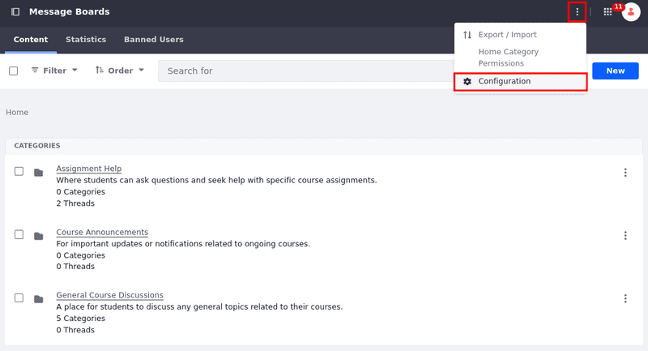
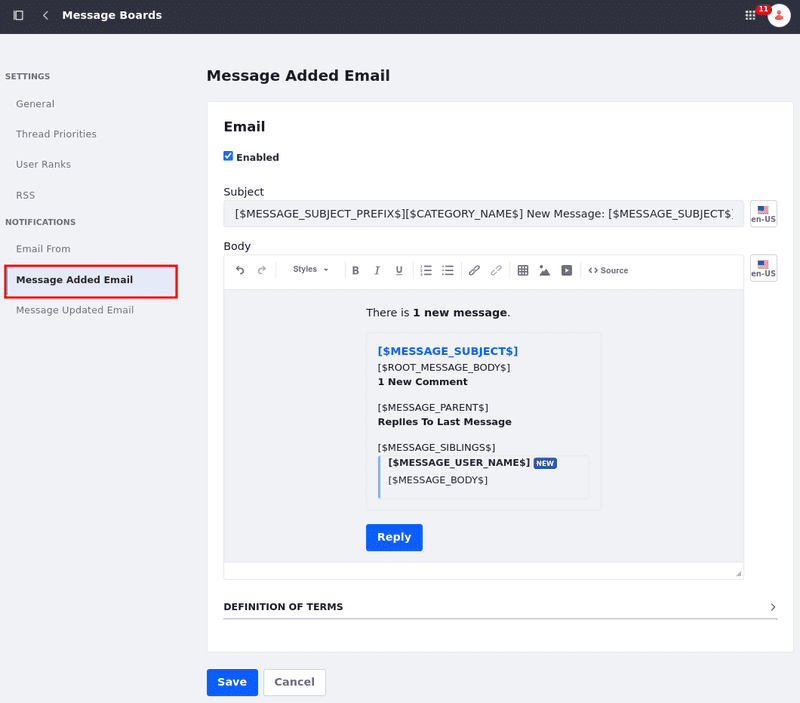
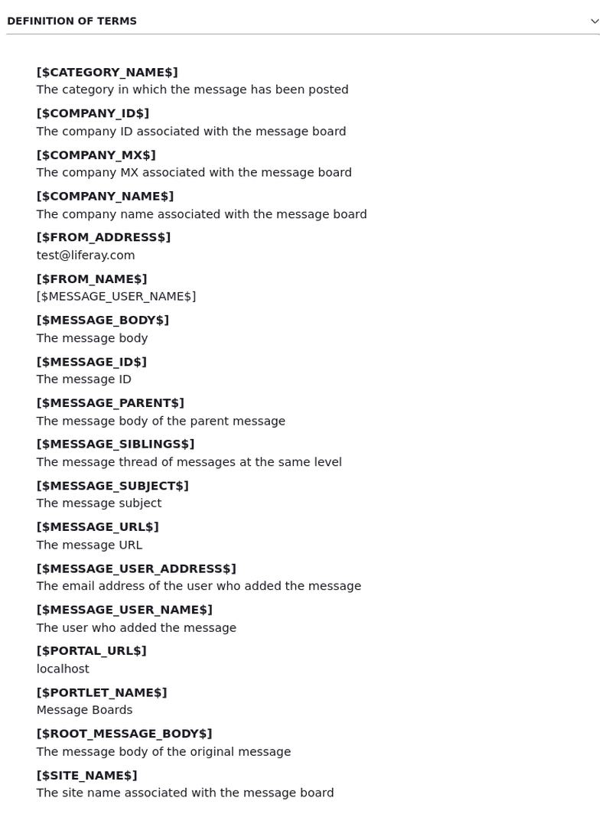

# Message Boards Configuration Reference

Configuration settings for the *Message Boards* app are divided in [Settings](#settings) and [Notifications](#notifications). To access the *Message Boards* app's configuration screen,

1. Open the *Site Menu* (), expand *Content & Data*, and go to *Message Boards*.

1. Click *Options* () in the top right corner &rarr; *Configuration*.

   

## Settings

Configure general preferences for the Message Boards app, including posting permissions, thread formats, user ranks, and RSS feed options.

### General Tab

| Name                                | Description                                                                                                                       |
|:------------------------------------|:----------------------------------------------------------------------------------------------------------------------------------|
| Allow Anonymous Posting             | Allows guest (non-authenticated) users to post threads.                                                                           |
| Subscribe by Default                | Subscribes users by default to threads they participate in.                                                                       |
| Message Format                      | Provides a drop-down menu to select BBCode or HTML as the editor.                                                                 |
| Enable Report Inappropriate Content | Enables users to report threads for Terms of Use violations.                                                                      |
| Enable Ratings                      | Enables users to rate threads.                                                                                                    |
| Thread as Question by Default       | If enabled, the first threads are always questions and subsequent threads can be marked as answers; disabled by default.          |
| Show Recent Posts from Last         | Provides a drop-down menu to select how many previous posts appear based on time: *24 Hours*, *7 Days*, *30 Days*, or *365 Days*. |

### Thread Priorities

| Name               | Description                                                                                             |
|:-------------------|:--------------------------------------------------------------------------------------------------------|
| Default Language   | The instance's default language is set to English and cannot be modified here.                          |
| Localized Language | Select a supported language from a drop-down menu; Administrators can set ranks in different languages. |
| Name               | Enter the priority level's name.                                                                        |
| Image              | Enter the priority level's icon; use a full URL or a relative path to the theme.                        |
| Priority           | Enter the priority level; higher numbers indicate greater importance. List them in descending order.    |

### User Ranks

Message Boards users can configured to have a visible rank based on the number of posts they contribute.

| Name                 | Description                                                                                             |
|:---------------------|:--------------------------------------------------------------------------------------------------------|
| Default Language     | The instance's default language is set to English and cannot be modified here.                          |
| Localized Language   | Select a supported language from a drop-down menu; Administrators can set ranks in different languages. |
| User Ranks Text Area | Enter the user ranks in the text area.                                                                  |

### RSS

| Name                     | Description                                                             |
|:-------------------------|:------------------------------------------------------------------------|
| Enable RSS Subscription  | Toggle RSS subscriptions on or off.                                     |
| Maximum Items to Display | Select the maximum number of items to show in the RSS feed.             |
| Display Style            | Choose how threads appear: as an abstract, full content, or title only. |
| Format                   | Select the feed format: Atom 1.0, RSS 1.0, or RSS 2.0.                  |

## Notifications

Customize email templates and sender details for notifications sent when threads are added or updated.

### Email From

Configure the sender details for automated notifications related to message board activity.

| Name        | Description                                      |
|:------------|:-------------------------------------------------|
| Name        | Enter the forum owner/moderator's name.          |
| Address     | Enter the forum owner/moderator's email address. |
| HTML Format | Select if the email should be in HTML format.    |

### Message Added Email

The Message Added Email tab contains the template for emails sent when a new message board thread is created. Use FreeMarker placeholders to dynamically insert thread-specific information, such as the message subject, user details, and URLs.

Expand the Definition of Terms menu to view available placeholders (e.g., `[$MESSAGE_SUBJECT$]`, `[$MESSAGE_BODY$]`) and learn how they pull data and metadata from each thread to automate email content.

### Message Updated Email

The Message Updated Email tab contains the template for emails that are sent whenever a message board thread is updated.

Expand the *Definition of Terms* menu to learn more about how to create an automated email that import data and metadata from each thread.

## Related Topics

- [Message Boards Permissions Reference](./message-boards-permissions-reference.md)
- [Message Boards Widget UI Reference](./message-boards-widget-ui-reference.md)
