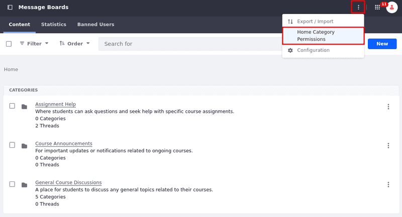
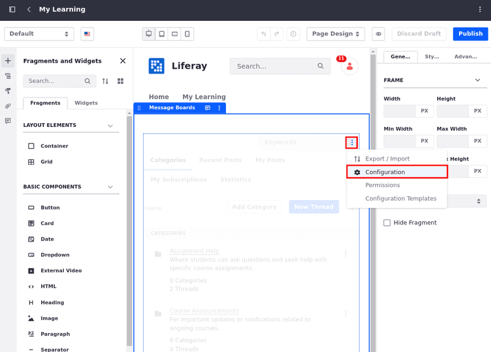
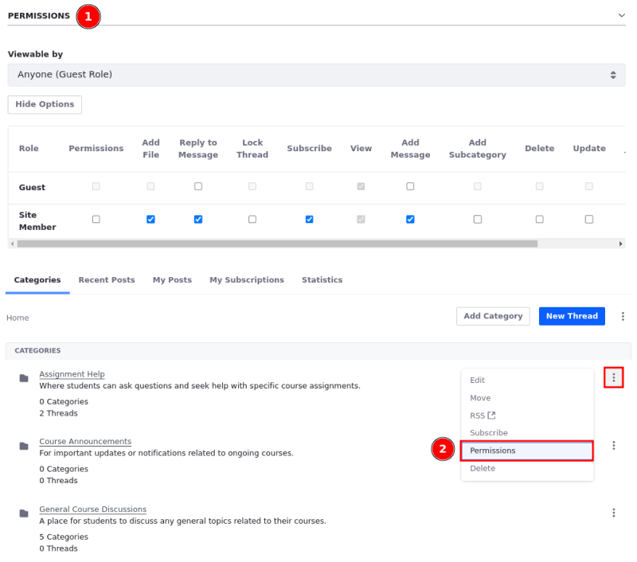

# Message Boards Permissions Reference

Permissions settings for the Message Boards app include Home Category, Widget, General Category, and Thread permissions. Manage these settings to control user access and actions within your message boards. See [Understanding Roles and Permissions](../../../users-and-permissions/roles-and-permissions/understanding-roles-and-permissions.md) to learn more.

## Home Category Permissions

The *Message Boards* permissions screen is for granting and revoking access to *Message Boards* functions. To access the Home Category Permissions,

1. Open the *Site Menu* () for the host site, expand *Content & Data*, and go to *Message Boards*.

1. Click *Options* () in the top right corner &rarr; *Home Category Permissions*.

   

Grant permissions so users with specific roles can perform the following actions:

| Permission Name        | Description                                             |
|:-----------------------|:--------------------------------------------------------|
| Permissions            | View and modify permissions.                            |
| Add File               | Attach a file to a message.                             |
| Ban User               | Forbid a user from participating in the message board.  |
| Add Category           | Add a new category to the message board.                |
| Reply to Message       | Respond to existing messages.                           |
| Lock Thread            | Prevent further additions or modifications to a thread. |
| Subscribe              | Receive notifications on new and updated posts.         |
| View                   | View all contents of message threads.                   |
| Add Message            | Post a new thread.                                      |
| Move Thread            | Move a thread to a different category or subcategory.   |
| Update Thread Priority | Adjust a thread's priority.                             |

## Widget Permissions

After adding a Message Boards widget to a page, administrators can access that widget instance's general permissions by selecting the widget's *Options* menu () and selecting *Permissions*.

| Permission Name | Description                                  |
|:----------------|:---------------------------------------------|
| Permissions     | View and modify the widget's permissions.    |
| Preferences     | View and modify widget's preferences.        |
| Configuration   | View and modify the widget's configurations. |
| View            | View the widget.                             |
| Add to Page     | Add the widget to a site page.               |

## General Category Permissions

This set of permissions determine what changes users can make to a category. They can be set while creating a new category (1) or by clicking Actions () next to the category and selecting *Permissions* (2).

| Permission Name        | Description                                             |
|:-----------------------|:--------------------------------------------------------|
| Permissions            | View and modify permissions.                            |
| Add File               | Attach a file to a message.                             |
| Reply to Message       | Respond to existing messages.                           |
| Lock Thread            | Prevent further additions or modifications to a thread. |
| Subscribe              | Receive notifications on new and updated posts.         |
| View                   | View the category.                                      |
| Add Message            | Post a new thread.                                      |
| Add Subcategory        | Add a new category within this category.                |
| Delete                 | Delete the category.                                    |
| Update                 | Edit the category.                                      |
| Move Thread            | Move a thread to a different category or subcategory.   |
| Update Thread Priority | Adjust a thread's priority.                             |

## Thread Permissions

 This set of permissions determine what changes users can make to a thread. They can be set while creating a new thread or by clicking Actions () next to the thread and selecting *Permissions*.

| Permission Name | Description                                |
|:----------------|:-------------------------------------------|
| Delete          | Remove the thread.                         |
| Permissions     | Grant/revoke thread permissions.           |
| Update          | Edit the thread.                           |
| Subscribe       | Receive notifications for thread activity. |
| View            | View the thread.                           |

## Related Topics

- [Message Boards Configuration Reference](./message-boards-configuration-reference.md)
- [Message Boards Widget UI Reference](./message-boards-widget-ui-reference.md)
