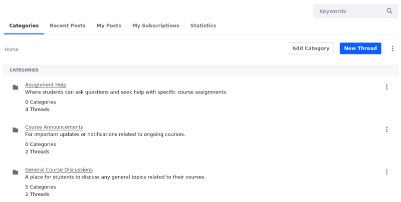
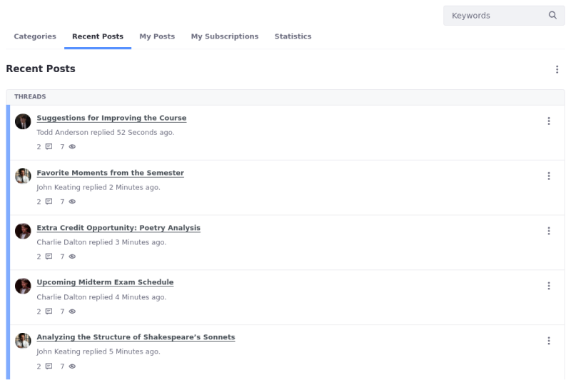
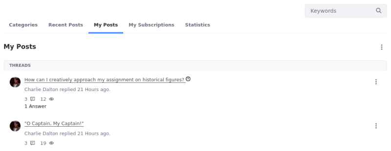
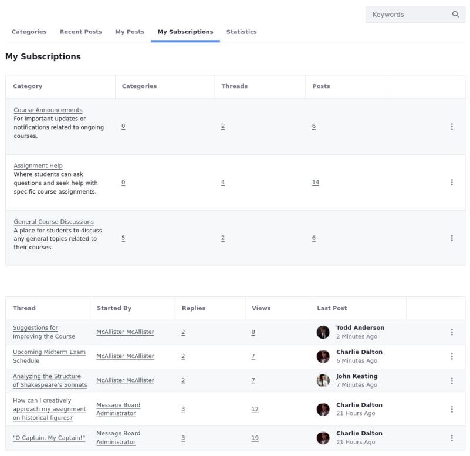
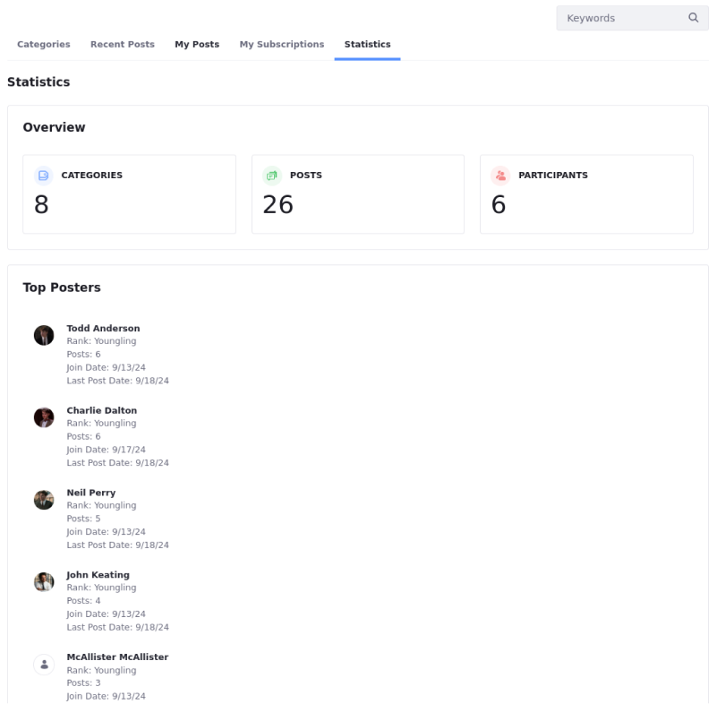

# Message Boards Widget UI Reference

Explore the user interface elements of the Message Boards widget, including the various tabs and their functionalities. Each tab provides access to different aspects of the message boards, helping users navigate and manage their posts and subscriptions effectively.

## Categories

The Categories tab is the default landing page when navigating to the Message Boards widget. All the categories and threads created at the root level appear here.

## Recent Posts tabs

The Recent Posts tab lists all threads, starting with the most recent, regardless of the category in which the thread is posted.

## My Posts

The My Posts tab tracks all the posts authored by the current user (for example, Jane Doe).

## My Subscriptions

Subscribing to a thread causes message boards to send the user an email whenever a new message is posted to the thread. If you have enabled the mailing list feature for the thread's category, users can reply to these messages to post back to the thread without having to visit your site.

The My Subscriptions tab shows all categories and threads to which the current user is subscribed.

## Statistics

The Statistics tab displays information about the number of categories, posts, and participants.

## Related Topics

- [Message Boards Configuration Reference](./message-boards-configuration-reference.md)
- [Message Boards Permissions Reference](./message-boards-permissions-reference.md)
