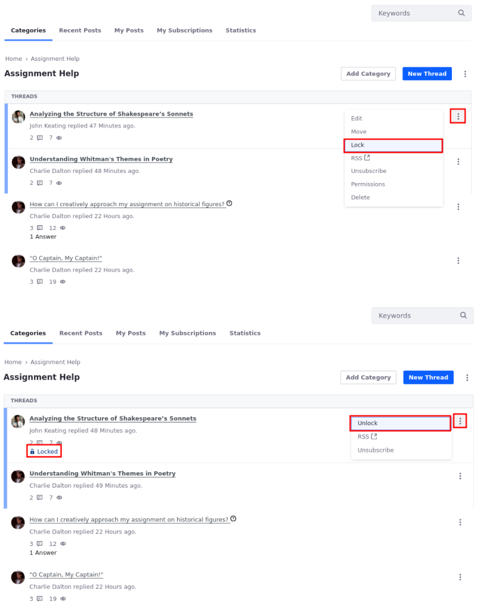
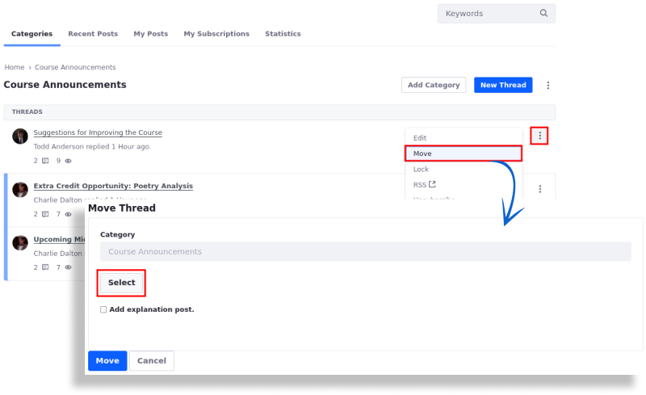
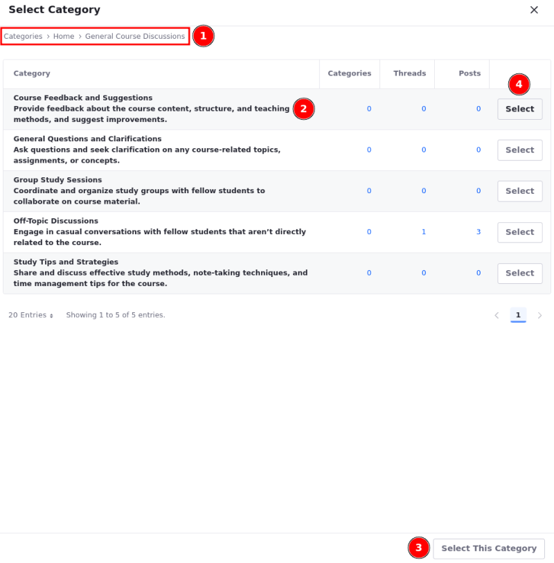
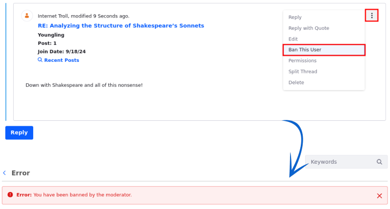
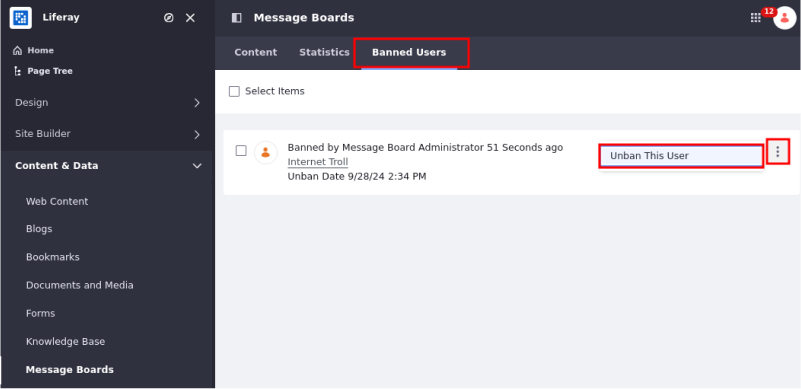
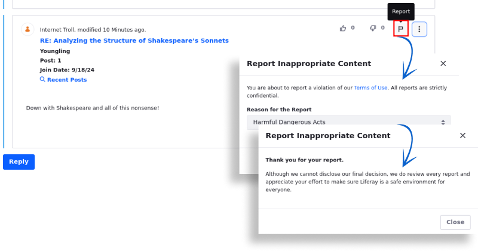

# Moderating Message Boards

Message boards include features that enable effective forum moderation. This includes thread locking, thread moving and merging, user bans, and thread flagging. Users with [appropriate permissions](./message-boards-permissions-reference.md) can use these tools.

## Locking Threads

Site administrators can lock a thread and prevent any further responses.

To lock a thread, click () next to the thread to be locked and select *Lock*.

Locked threads are marked as Locked and users can't reply to them anymore. To unlock a thread, click () next to the thread and select *Unlock*.

## Moving Categories and Threads

Moderators can move categories and threads to different locations including the root level, or merge categories with other categories.

To move a category or thread,

1. Click *Actions* () next to the category/thread you want to move and select *Move*. This opens the Move Category form.

1. In the Parent Category field, click *Select* to choose a new location.

   

1. Use the breadcrumbs at the top (1) to navigate through different category levels. Click on a category to select it (2).

   Click *Select This Category* at the bottom (3) to move the category/thread to the chosen location.

   In this example, clicking Select This Category should move the content to the General Course Discussions category, identified by the last level of the breadcrumbs.

   If you want to move it to a specific subcategory, click *Select* next to the desired subcategory (4).

   

1. (For moving categories) If you want to merge the category with the selected parent category, select *Merge with Parent Category*.

   When unchecked, the entire category moves into the new category without merging.

!!! warning
    When merging categories, only threads are moved. Subcategories are deleted, and any threads in those subcategories are also moved to the new category.

1. (For moving threads) Check *Add explanation post* to add a post explaining the move.

1. Click *Move*.

The category/thread has been moved.

## Banning Users

Manage user access by banning users or reinstating those who have been previously banned.

1. Click the thread containing the user to be banned.

1. Click () next to the user's post and select *Ban this User*.

Banned users get an error message stating they were banned by the moderator if they try to access the message board.

To reinstate a banned user,

1. Open the *Site Menu* (), expand *Content & Data*, and go to *Message Boards*.

   If there is a page scope, select the scope from the *scope selector*.

1. Select the *Banned Users* tab.

1. Click Actions () next to the user and select *Unban This User*.

   

This user has been reinstated.

## Reviewing Flagged Posts

When a post has been reported for possible abuse, the Message Boards app uses the Notifications widget to notify a moderator to review it. A red number appears around the moderator's User Profile Menu icon.

To review flagged threads,

1. Click your *User Profile Menu* and select *Notifications*.

1. Click on the post that has been reported. You are taken to the post.

   

Moderators have the option to delete the flagged reply.

1. Click *Actions* () next to the reply to be deleted and select *Delete*.

1. Click *OK* to confirm the deletion.

The reply is now deleted.

## Related Topics

- [Managing Notifications and Requests](../../notifications-and-requests/user-guide/managing-notifications-and-requests.md)
