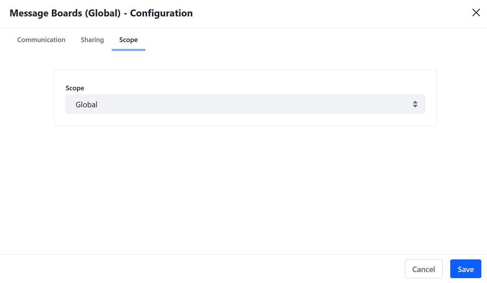
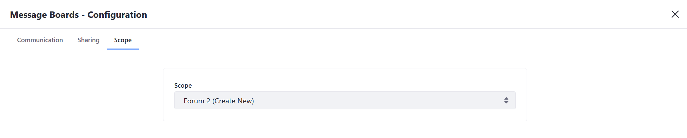
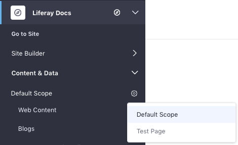

# Scoping Your Message Boards

 Multiple message boards can be created and managed on the same DXP instance at the same time. This can be accomplished by scoping each message board to a particular scope. The [Global, Site, or Page Scope settings](../../site-building/creating-pages/page-fragments-and-widgets/using-widgets/configuring-widgets/setting-widget-scopes.md) are available. The following sections show administrators how to setup *Message Boards* in each of these scopes.

## Global

Content created at the global site scope level is available on all other sites but is not automatically visible on every site page.

### Creating a Globally Scoped Message Board

1. [Start editing](../../site-building/creating-pages/using-content-pages/adding-elements-to-content-pages.md) the page where a *Message Boards* widget has been deployed.

1. Click *Options* () &rarr; *Configuration* and select the *Scope* tab.

1. Select **Global** from the *Scope* drop-down menu.

   

1. Click *Save* and close the window.

The *Message Boards* widget is now configured to display and create threads at the *Global* scope.

## Managing a Globally Scoped Message Board

To centrally manage a globally scoped message board:

1. Open the *Site Menu* () and click the compass icon () on the Site Administration menu. This opens the Select Site dialog.

1. Select the *All Sites* tab, then select *Global*.

1. In the *Site Menu* (), expand *Content & Data*, and go to *Message Boards*.

Any changes made here apply to the global scope.

## Site

By default, the *Message Boards* app is scoped to the current selected site. Message Boards scoped to a particular site are not visible when viewing Messages Boards that may be deployed on another site in the same instance.

## Page

Creating page scoped message boards allows forum members to view different message boards on different pages housed on the same site.

### Creating a Page Scoped Message Board

1. [Start editing](../../site-building/creating-pages/using-content-pages/adding-elements-to-content-pages.md) the page to where you want to scope the message board.

1. Click *Options* () &rarr; *Configuration* and select the *Scope* tab.

1. Select the page's name or *[YOUR-PAGE] (Create New)* if the page scope doesn't exist yet.

   

1. Click *Save* and close the dialog window.

The *Message Boards Categories* and *Threads* added on the selected page appear only on that page.

### Managing Page Scoped Message Board

Note that administrators must still use the *Site Administration* menu to administer a page scoped Message Boards widget by setting the *Site Administration* menu's active scope. Follow these steps to do this:

1. Open the *Product Menu* (), expand the menu for your site, then expand *Content & Data*.

1. The current scope appears below the *Content & Data* heading. *Default Scope* is the current site. To change this, click the gear icon () and then select your desired scope. This changes the Site Menu to reflect the selected scope. To work in a page's scope, for example, select that page from the gear icon. That page's name then becomes the Site Menu's title.

   

1. Select *Message Boards* from the *Content & Data* menu. Any changes you make here apply to the scope that you selected in the previous step.

## Related Information

- [Setting Widget Scopes](../../site-building/creating-pages/page-fragments-and-widgets/using-widgets/configuring-widgets/setting-widget-scopes.md)
