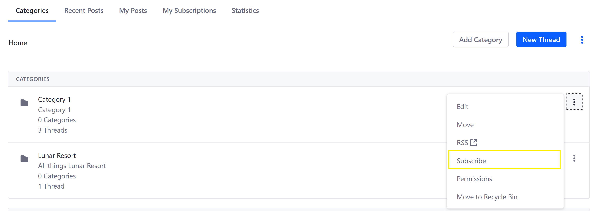
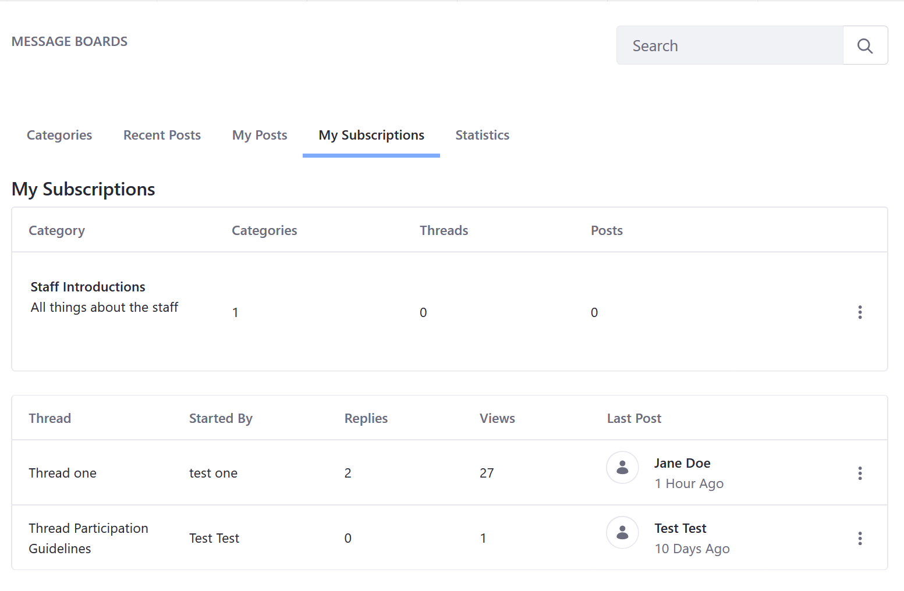

# Subscribing to a Message Board

Users can receive email updates and in-product notifications by subscribing to a message board. By default, users are subscribed automatically to any threads they create and can opt in to subscribe to categories or specific threads via email or RSS feed.

## Subscribing to a Category or Thread

1. On the *Message Boards* widget (on a site page), click *Actions* () next to a category/thread (in this example, *Category 1*).

1. Click *Subscribe*.

   

The user has now subscribed to *Category 1*. The user is notified of any changes, such as new threads and subcategories being created under *Category 1*.

To see which categories and threads you have subscribed to:

1. On the *Message Boards* widget, select the *My Subscriptions* tab.

   

## Subscribing using RSS Feeds

Message Boards can be published as [RSS](https://en.wikipedia.org/wiki/RSS) feeds. RSS for *Message Boards* are enabled by default and Liferay DXP supports RSS 1.0, RSS 2.0, or Atom 1.0.

## Related Topics

- [Configuring a Message Boards Category Mailing List](./configuring-a-message-boards-category-mailing-list.md)
- [Configuring Mail](../../../installation-and-upgrades/setting-up-liferay/configuring-mail.md)
