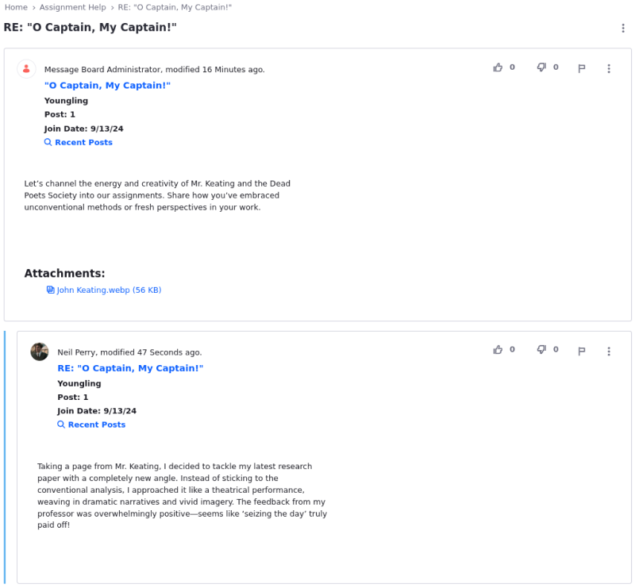
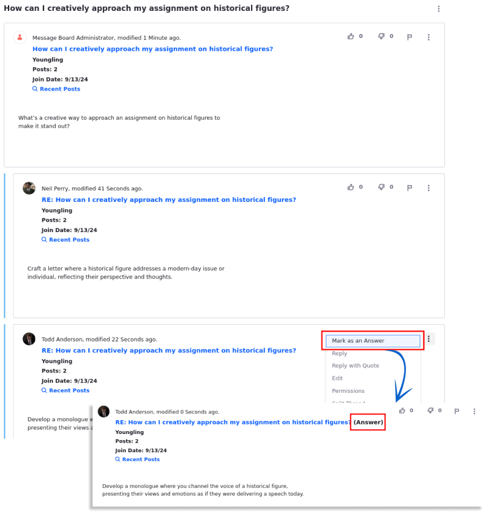

# Creating Message Boards Threads

By default, only authenticated users with the requisite permissions (at minimum, *Add Message*, *Reply to Message*, *Add File*,and *View*) can create threads. See the [Message Boards Permissions Reference](./message-boards-permissions-reference.md) for more information. Administrators can enable the feature to allow guests to post threads.

!!! note
    Set `permissions.propagation.enabled` to `true` in the `portal-ext.properties` file to have Message Board threads inherit their parent category's permissions. This affects only Wiki pages and message board threads; other assets inherit the default resource permission.

## Posting a New Thread

Threads can be created at the root level of the Message Board itself and within [categories that have been created](./creating-message-boards-categories.md).

To create a new thread:

1. Click the Message Boards *New Thread* button. The *Add Message* form appears.

1. Enter a title in the **Subject** field.

1. Create your thread's content in the **Body** field.

   !!! note
       This field uses the same editor as the Blogs app, except that it uses BBCode instead of HTML. For further instructions, see the documentation on [using the editor](https://help.liferay.com/hc/articles/360018173051-Using-the-Blog-Entry-Editor-).

   

### Uploading Attachments

Users can attach files to forum posts.

1. To add attachments, expand the *Attachments* section.

1. Drag and drop a file to upload or use the *Select Files* button to navigate to the file's location.

   

   !!! important
       You can enable automatic antivirus scanning to scan files on upload. For details, see [Enabling Antivirus Scanning for Uploaded Files](https://learn.liferay.com/w/dxp/system-administration/file-storage/enabling-antivirus-scanning-for-uploaded-files).

### Using Tags and Related Assets to Organize Threads

Besides using categories to organize the threads, users can add a tag to a forum post. If searching for content using this tag (for example, *Toyota*), all posts with the *Toyota* are returned faster.

1. Expand the *Categorization* section.

1. Click the *Select* button to select an existing tag. Alternately, create a new tag by entering the tag name in the *Tags* field and clicking *Add*. See [the documentation on tags](https://help.liferay.com/hc/articles/360028820472-Tagging-Content) for more information.

The message board post now has a tag.

Message Boards threads can be linked to other existing assets in DXP.

1. To select an existing asset in the portal (e.g., a media file, blog post, etc.) to relate to your thread, expand the *Related Assets* section and use the *Select* button to select that asset.

   

### Set the Thread's Priority

A Message Boards thread can be prioritized as *Urgent*, *Sticky*, or *Announcement*. By default, it is set to "None".

1. Expand the *More Settings* section.

1. Select the thread's priority.

1. Click *Publish*.

The new post has been created. Site administrators can move this post to another category at a later time.

## Using Threads as Questions

Message Boards Threads can be more than sharing ideas and opinions. Forum members can turn their post into a question for other site members. The reply that best answers the question can be marked as the answer.

To make a thread post a question:

1. Click the *New Thread* button.

1. Expand the *More Settings* section.

1. Check the box for *Mark as a Question*.

   

To select a reply as the answer:

1. Click the 3-dot icon.

1. Click *Mark as an Answer*.

   

1. Click *Publish* to publish the thread.

## Message Board Thread Replies

Click a thread to view it. Messages appear in a threaded view so that replies are aligned under their parent thread. This makes it easy to follow conversations. Thread replies are indented under their parent thread.

To reply to a message in a thread:

1. Click the *Reply* button. This opens the quick reply form, which only contains a text field for entering your reply.

1. Enter your reply in the text field. To access more options for your reply, click the *Advanced Reply* link. This opens the full editor from the add/edit thread form.

1. Click *Publish*.

In addition to replying to a message, you can rate it or flag it as objectionable. A message board moderator can evaluate flagged messages and decide how to handle the messages and their authors.

## Related Topics

- [Creating Message Boards Categories](./creating-message-boards-categories.md)
- [Message Boards Configuration Reference](./message-boards-configuration-reference.md)
