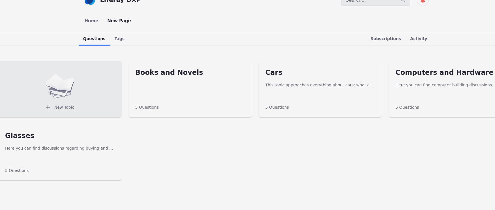

---
toc:
  - ./questions-application/using-the-questions-app.md
  - ./questions-application/configuring-the-questions-app.md
uuid: e576ecee-a1e0-4bd8-ab23-ae2c18295232
taxonomy-category-names:
- Content Management System
- Forums and Message Boards
- Liferay Self-Hosted
- Liferay PaaS
- Liferay SaaS
---

# Questions Application

{bdg-secondary}`Available: Liferay DXP/Portal 7.3+`

The Questions app is a new UI "skin" for the Message Boards application, focused on presenting a question-and-answer format. With the Questions app, you and your users can create

**Topics:** Themes where questions are categorized

**Questions:** A question inside the app

**Answers:** An answer to a specific question

Liferay offers this application to enable knowledge sharing, problem-solving, and community interaction in the platform. Features such as voting, commenting, subscribing to topics/questions, improving search functionality, and motivating user collaboration help communities to collaborate effectively and share knowledge.

Questions can be tagged, which helps others find relevant content. 

Read [Using the Questions App](./questions-application/using-the-questions-app.md) to learn how to get started! 
