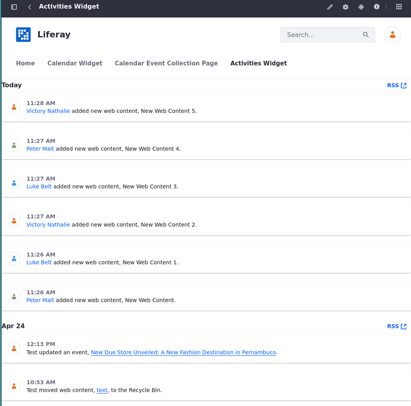

---
toc:
  - ./social-tools/using-the-activities-widget.md
  - ./social-tools/using-the-contacts-center-widget.md
  - ./social-tools/using-the-ratings-system.md
uuid: 2bf5cd10-f1a1-41fc-bbab-8a80b653e8ac
taxonomy-category-names:
- Sites
- Social Tools and User Engagement
- Liferay Self-Hosted
- Liferay PaaS
- Liferay SaaS
---

# Social Tools

Social tools play a vital role in fostering engagement, collaboration, and interaction within digital environments. They are designed to enhance user experiences and facilitate connections. Liferay DXP offers three powerful social tools: the [Activities Widget](./social-tools/using-the-activities-widget.md), [Contacts Center Widget](./social-tools/using-the-contacts-center-widget.md), and [Ratings System](./social-tools/using-the-ratings-system.md).

With the [Activities widget](./social-tools/using-the-activities-widget.md), users can stay informed about recent activities, such as the addition, update, and deletion of items.

The [Contacts Center widget](./social-tools/using-the-contacts-center-widget.md) offers a solution for managing connections within the Liferay platform. By centralizing contact information, users can discover and connect with other users.

With the [Ratings System](./social-tools/using-the-ratings-system.md), users can rate or value content based on their experiences. This way, organizations can drive continuous improvement, foster innovation, and enhance the overall user experience.

Liferay DXP's social tools offer a comprehensive suite of features designed to promote interaction, collaboration, and user engagement, ultimately contributing to a dynamic digital community.