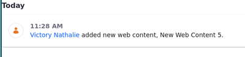
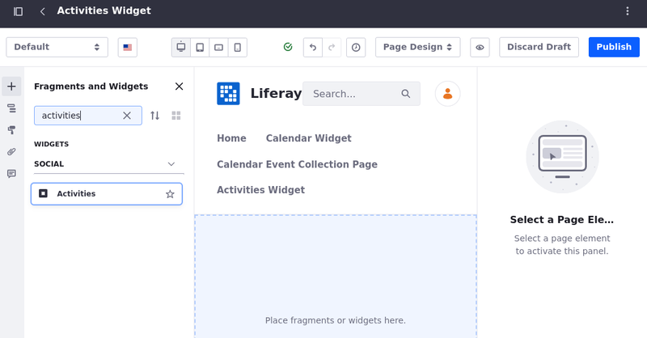
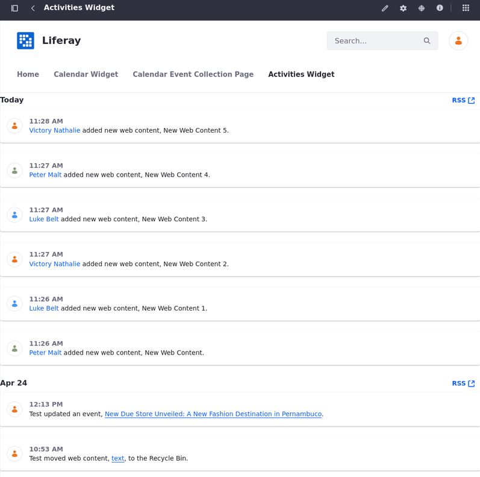
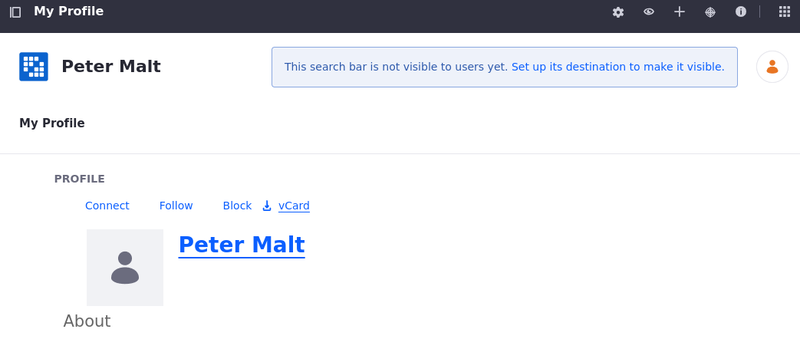

# Using the Activities Widget

The *Activities* widget is used to track user activities on a site.

To use the *Activities* widget,

1. [Create a new page](../../site-building/creating-pages/adding-pages/adding-a-page-to-a-site.md) or [start editing one](../../site-building/creating-pages/using-content-pages/adding-elements-to-content-pages.md).

1. Open the *Fragments and Widget* menu ().

1. Select the *Widgets* tab and expand the *Social* menu.

   You can also use the search bar to find the *Activities* widget.

   

1. Drag and drop the *Activities* widget to the desired position on the page.

   

Each item listed in the widget contains a link to the user and the asset (for example, a *Message Boards* post, or a wiki page). Clicking on the user redirects to the person's profile.

Clicking on the link redirects to the site page where the asset is located.

Lastly, click *RSS* to subscribe to the user activities.

## Related Topics

- [Using the Contacts Center Widget](./using-the-contacts-center-widget.md)
- [Using the Ratings System](./using-the-ratings-system.md)