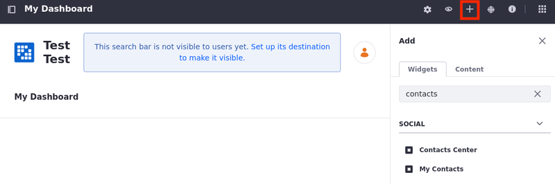
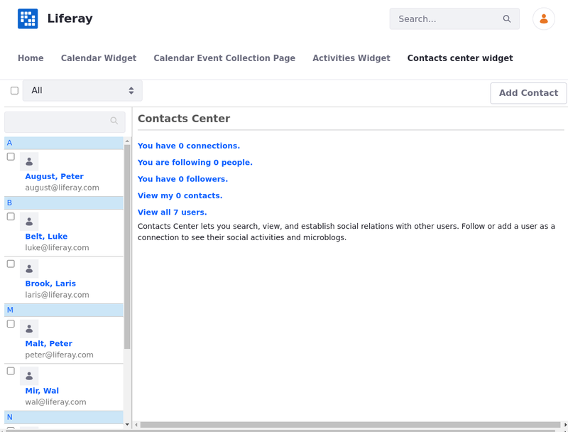
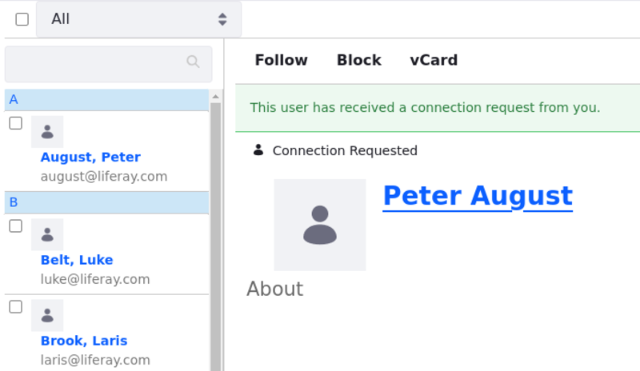

# Using the Contacts Center Widget

 With the Contacts Center widget, users can form two connection types: [Connect](#connecting-with-a-user) and [Follow](#following-a-user).

 Connected users can see each other's activities in their private dashboard displays while followers can see the followed users' activities in their private dashboard.

After the [widget is deployed on a user's private dashboard](#adding-the-contacts-center-to-a-user-dashboard), users can form their own social connections.

## Adding the Contacts Center to a User Dashboard

!!! note
    You can also add the Contacts Center widget to a content page.

1. Click the user avatar &rarr; *My Dashboard*.

1. At the top of the page, click *Add* ().

1. Select the *Widgets* tab and expand the *Social* menu.

   

1. Drag and drop the *Contacts Center* widget to the desired location on the page.

   You can use the links in the Contacts Center widget to filter which users' information cards are shown on the left. View your connections, followed users, followers, contacts, and all users.

   

## Connecting With a User

1. Select the user with whom you want to connect by clicking on their information card.

1. Click *Connect*. The other user receives a request in their Notifications menu and a confirmation message is displayed indicating that the request was sent out.

   

1. On the widget home page, click *You have (x) connection.* to see the list of connected users.

Once users accept the connection request, they appear in the list of connections.

To disconnect, click on the user's information card &rarr; *Disconnect*.

## Following a User

1. Select the user you want to follow by clicking on their information card.

1. Click *Follow*.

1. On the widget home page, click *You are following (x) people.* to see the list of users you are following.

To unfollow a user, click on the user's information card &rarr; *Unfollow*.

## Blocking a User

1. Select the user you want to block by clicking on their information card.

1. Click *Block*.

To unblock a user, click *Unblock*.

## Downloading a vCard

Users can download their connections as [vCards](https://en.wikipedia.org/wiki/VCard) in the `.vcf` format.

1. Select a user by clicking on their information card.

1. Click *vCard*.

The vCard is downloaded.

## Related Topics

- [Using the Activities Widget](./using-the-activities-widget.md)
- [Using the Ratings System](./using-the-ratings-system.md)