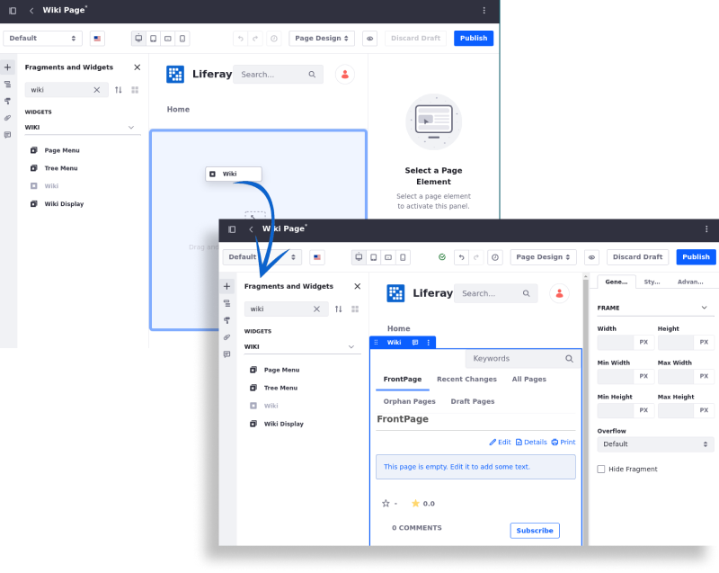

---
toc:
  - ./wiki/creating-wiki-pages.md
  - ./wiki/creating-a-node.md
  - ./wiki/using-the-page-menu-widget.md
  - ./wiki/using-the-tree-menu-widget.md
  - ./wiki/using-the-wiki-display-widget.md
  - ./wiki/scoping-your-wikis.md
  - ./wiki/wiki-permissions.md
  - ./wiki/wiki-widget-ui-reference.md
  - ./wiki/developer-guide.md
uuid: 26f2006e-611d-476d-8df9-1f2b87625cb7
taxonomy-category-names:
- Content Management System
- Wiki
- Liferay Self-Hosted
- Liferay PaaS
- Liferay SaaS
---

# Wiki

!!! note
    Wiki is [deprecated](../installation-and-upgrades/upgrading-liferay/reference/maintenance-mode-and-deprecations-in-7-4.md) as of Liferay 2024.Q4+. For data continuity, consider transitioning to alternative content management solutions like [Liferay Objects](../liferay-development/objects.md) or [Web Content](../content-authoring-and-management/web-content.md).

The Wiki application includes a rich-text WYSIWYG editor, version tracking, and the ability to create multiple wiki nodes. Wikis are integrated with Liferay's users and permissions.

## Adding a Wiki Widget to a Site

The fastest way to begin using the Wiki widget is deploying it on a [site page](../site-building/creating-pages/understanding-pages.md).

1. Navigate to the site page where you want to add the Wiki widget (for example, the DXP Guest site's Wiki page) and start editing it.

1. In the Fragments and Widgets sidebar, look for the *Wiki* widget. Drag and drop it into the page and publish the page.

   

Site members are now able to create and edit wiki pages. Note that there can be only one *Wiki* widget per page.

## Complementary Wiki Widgets

Liferay DXP offers three additional widgets to be used in conjunction with the *Wiki* widget which makes it easier to navigate to and view the other wiki pages on the same DXP instance. This is because the *Wiki* widget displays only the *FrontPage*.

- [Page Menu](./wiki/using-the-page-menu-widget.md)
- [Tree Menu](./wiki/using-the-tree-menu-widget.md)
- [Wiki Display](./wiki/using-the-wiki-display-widget.md)

## What's Next

Learn about the features in the *Wiki* widget:

- [Creating Wiki Pages](wiki/creating-wiki-pages.md)
- [Creating a Wiki Node](wiki/creating-a-node.md)
- [Scoping Your Wikis](wiki/scoping-your-wikis.md)
- [Exporting and Importing a Wiki](../site-building/creating-pages/page-fragments-and-widgets/using-widgets/configuring-widgets/exporting-importing-widget-data.md)
