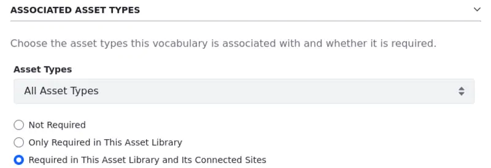

# Asset Library Content

{bdg-secondary}`Liferay DXP/Portal 7.3+`

Asset Libraries provide a convenient way to share content across Liferay Sites while streamlining content collaboration and reducing the risk of data duplication. To add, view, and manage an Asset Library's content, first navigate to the Library's menu page.

1. Open the *Global Menu* (), click on the *Applications* tab, and click on *Asset Libraries*.

1. Click on the *name* of the desired Asset Library.

From here, you can access the Library's active applications to create and manage content. You can also enable Staging, implement custom workflows, categorize content using Tags and Categories, create Collections, and more. <!--TASK: document Collections and Workflow for Asset Libraries-->


## Creating Content

To create content in an Asset Library, first go to the Library's menu page, and click on the desired application. From here, creating content is essentially the same as creating it in a Site. The only differences are its scope and default theme settings.

See [Content Authoring and Management](../../content-authoring-and-management.html) articles for more information about creating each type of content.

```{note}
Only active applications appear on a Library's menu page. To activate or deactivate an application, see [Configuring Asset Libraries](./creating-and-managing-asset-libraries.md#configuring-asset-libraries) for more information.
```

## Using Content in Sites

Once you've added content to an Asset Library, you can access it from [connected Sites](./creating-and-managing-asset-libraries.md#sites) and display it using Display Page Templates, Fragments, Widgets, and more.

```{note}
For Liferay 7.4 U21+ and GA21+, you can use the item selector to browse Web Content, Documents and Media, and Blogs in an Asset Library.
```

When using the item selector in a Site, you can browse content in connected Asset Libraries. To do this, open the item selector window and use the breadcrumb to navigate to *Sites and Libraries*.


From here, you can click the *Asset Library* tab and select a connected Asset Library. Once selected, you can browse its content and select the desired asset.


Alternatively, you can filter the item selector window to include content from *Everywhere*. This displays both Site and available Asset Library content.


When publishing content using the Asset Publisher widget, you must set its scope to include content from a specific Asset Library. Then select the content you want to use.


See [Displaying Content](../../site-building/displaying_content.html) documentation for more information about using content in your Sites.

```{note}
Unlike Sites, Display Page Templates cannot be defined in an Asset Library. Instead, Asset Library content is displayed using each Site's default Display Page template for the respective content type.
```

## Staging Content

Asset Libraries supports both [Local Live](../../site-building/publishing-tools/staging/configuring-local-live-staging.md) and [Remote Live](../../site-building/publishing-tools/staging/configuring-remote-live-staging.md) Staging. This provides a working environment for adding, removing, and editing assets in the Web Content or Documents and Media applications before making those changes live. Staged content options are limited to the applications enabled for the Asset Library. Once enabled, you can then connect the Library to Staging-enabled Sites.

See [Using Staging with Asset Libraries](../../site-building/publishing-tools/staging/using-staging-in-asset-libraries.md) for more information.

## Categorizing Content

The Tags and Categories applications are enabled for all Asset Libraries. To access them, navigate to a Library's menu page and click on *Tags* or *Categories* under Categorization. Tags created in an Asset Library are scoped to that Library and can only be viewed and applied in that context. However, vocabularies and categories defined in an Asset Library are immediately available in all connected Sites.

```{note}
If created in an Asset Library, vocabularies and categories cannot be edited or removed in connected Sites. They can only be modified in the Asset Library in which they were created. 
```

See [Tags and Categories](../tags_and_categories.html) documentation for more information about using these applications.

## Exporting and Importing Content

You can export and import Asset Library content as LAR files. To initiate a new export/import process for a Library, go to its dashboard, and click on *Export* or *Import* at the bottom of the page. Then click the *Add* button () to initiate a new process.

Exporting and importing Library content follows the same process as Site assets. You can also create and use custom export templates by clicking on the *Actions* button (  ) in the Application Bar and selecting *Export Templates*. See [Exporting/Importing Site Pages and Content](../../site-building/sites/exporting-importing-site-pages-and-content.md) for more information.

## Removing Content

Asset Libraries support the [Recycle Bin](../recycle-bin/configuring-the-recycle-bin.md) application. When enabled, any content removed from the Library is temporarily stored in its Recycle Bin. By default, recycled content is retained for 43200 minutes (i.e., 30 days), but you can adjust this period in each Asset Library's settings. Recycled content that has been in the Recycle Bin for more than the allotted time is automatically deleted from your instance.

Alternatively, you can then manually delete recycled content or restore it to your Asset Library via the asset's *Actions* button (  ).



See [Recycle Bin Overview](../recycle-bin/recycle-bin-overview.md) for more information.

## Related Topics

* [Asset Libraries Overview](./asset-libraries-overview.md)
* [Creating and Managing Asset Libraries](./creating-and-managing-asset-libraries.md)
