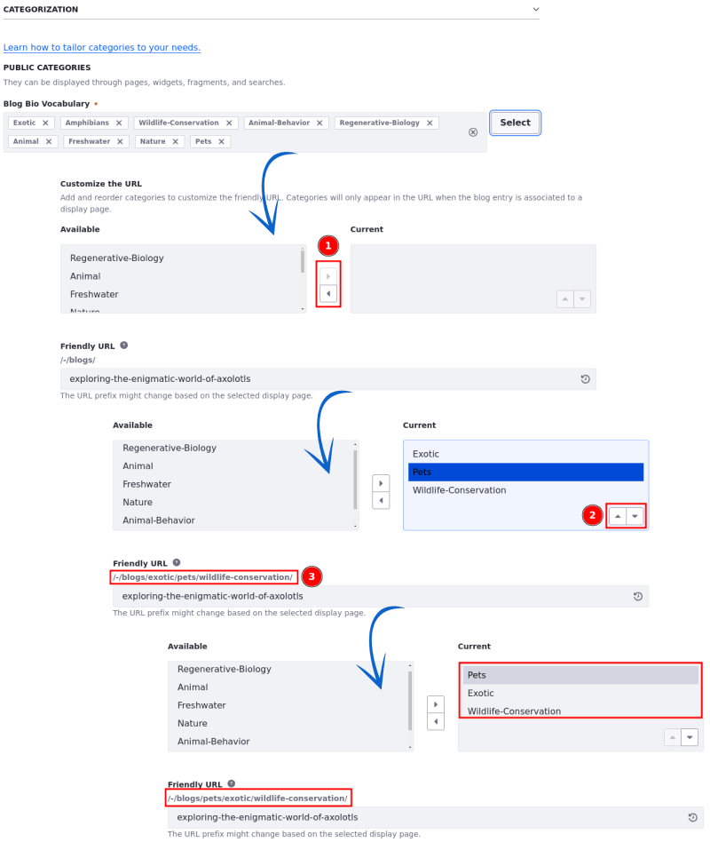

---
taxonomy-category-names:
- Content Management System
- Blogs
- Liferay Self-Hosted
- Liferay PaaS
- Liferay SaaS
uuid: 357d9fa7-1cc8-499a-9770-c6ac607c6444
---

# Adding Blog Entries

Blog entries are scoped to sites. By default, only authenticated users can create blog entries. See the [Blogs Permissions Reference](./blog-permissions-reference.md) for more information.

You can [create a blog entry](#creating-an-entry) and [display it on a page](./displaying-blogs.md).

!!! tip
    Using a Blogs [widget](../../site-building/creating-pages/using-widget-pages/adding-widgets-to-a-page.md) is one of the easiest ways to display blog entries on a page.

## Creating an Entry

1. Open the *Site Menu* () and navigate to *Content & Data* &rarr; *Blogs*.

1. Under the Entries tab, click *Add* () to add a new blog entry.

   

1. Drag and drop or select a file to upload as an optional cover image for the entry. By default, this cover image is published as part of the blog entry's abstract.

1. Enter a title for the blog entry.

1. Enter an optional subtitle for the entry.

1. Enter the entry's content in the *Content* field. To learn more about the different text editing features, see [Blog Entry Editor Reference](./blog-entry-editor-reference.md).

### Categorizing Blog Entries

You can help users find content on your site by categorizing blog entries.

Use categories (public and internal), tags, or relate the entry to an asset to categorize the blog entry. See [Defining Categories and Vocabularies for Content](../tags-and-categories/defining-categories-and-vocabularies-for-content.md) to learn more about categories and vocabulary and [Tagging Content and Managing Tags](../tags-and-categories/tagging-content-and-managing-tags.md) to learn more about using tags.

To categorize an entry using categories and tags,

1. Expand the Categorization section.

1. Click *Select* to choose existing public/internal categories or tags.

   Alternatively, create a new tag by entering the tag name in the Tags field and pressing Return.

To relate an asset to the entry,

1. Expand the Related Assets section and click *Select*

1. Select an asset and link it to the entry.

### Customizing the Blog Entry's Friendly URL

{bdg-secondary}`Liferay DXP 2024.Q2+/Portal 7.4 GA120+`
{bdg-link-primary}`[Beta Feature](../system-administration/configuring-liferay/feature-flags.md#beta-feature-flags)`

!!! important
    Currently, this feature is behind a beta feature flag (LPD-11147). Read [Beta Feature Flags](../../system-administration/configuring-liferay/feature-flags.md#beta-feature-flags) for more information.

1. Expand the Friendly URL section and select *Use a Customized URL*.

   !!! note
       If you select *Use the Default URL* and there's a pre-existing entry with the same title, a numerical suffix is appended to the URL upon publication to ensure its uniqueness.

       For instance, if the URL is `exploring-the-enigmatic-world-of-axolotls` and it's already in use, the new entry's URL will be adjusted automatically to `exploring-the-enigmatic-world-of-axolotls-1` when published.

   Read [Configuring Friendly URL Separators](../../site-building/site-settings/managing-site-urls/configuring-friendly-url-separators.md) to learn how to further configure the URL.

1. To add categories to the URL, click *Select* under Add Categories to URL. In the dialog, select the categories you want to add to the URL.

   A URL preview appears under Friendly URL.

   

1. To customize the friendly URL manually, edit it under Friendly URL.

   !!! warning
      You can't add categories and manually include other elements to the friendly URL using slashes (`/`) at the same time.

      For example, if you attempt to include both the `Appliances` and the `Supplies` categories along with custom elements like `/home/kitchen/blog-entry-title` in the Friendly URL field, you will get an error saying that `The URL title cannot contain slashes and categories.`

      In case of a conflict between URLs, the one using slashes has precedent over the one with categories.

1. Continue configuring the blog entry, publish it, or save it as draft.

Once the blog entry is published, you can display it using a [display page template](#configuring-how-the-entry-is-displayed) and the URL will include the selected categories.

<!-- 1. If you want to use the categories in a different order, you can drag and drop them in the desired order.

This is going to be a feature in the near future. Add it as n.4. Eric -->

When customizing friendly URLs, keep these points in mind:

-  If you change the name of a category, the URL is updated automatically.

   While editing a category that is being used in a friendly URL, a message will warn you that `Changes made to the category will impact the associated friendly URL`.

-  If you delete a category, it's removed automatically from the URL.

   While deleting the category, a confirmation message warns you that the friendly URL may be affected in the process.

- Categories are displayed in the order they were created.

<!-- This will change once the feature that allows users to reorganize categories is on. Then, I can just eliminate this part. Eric. -->

- When a category used in a custom URL has translations available in different languages, those translations are applied to the categories in the URL when the target language is selected.

!!! note
    When you update an entry's friendly URL, Liferay stores the previous value in the entry's friendly URL history. As long as the old URL remains in the history, Liferay redirects users to the latest version of the blog entry, and you cannot use it for other blog entries in the same site. See [Managing the Friendly URL History](./displaying-blogs.md#managing-the-friendly-url-history) to learn more about managing the friendly URL history for blog entries.

### Configuring How the Entry is Displayed

To configure the blog entry and how it is displayed, expand the *Configuration* and the *Display Page* sections and adjust the following settings,

| Configuration            | Description |
| :----------------------- | :------------------------------------------------------------------------------------------------------------------------- |
| Abstract                 | Specify the entry's abstract. By default, the Blogs application uses the first 400 words. *Custom Abstract* prompts for a manual description. |
| Small Image              | Add a small image to be shown as the entry's thumbnail. |
| Display Date             | Configure the display date to be used for the entry. |
| Send Email Entry Updated | Send comments about the entry update. |
| Allow Pingbacks          | When you include a link to another website's content in your post, and if that website supports pingbacks, it receives a notification or "ping" from your site. Pingbacks use XML-RPC requests to the URL you linked. |
| Display Page Template    | Select the default [display page template](../../site-building/displaying-content/using-display-page-templates.md), a specific one, or no display page template to display your blog entry. |

### Publishing the Blog Entry

After you finish editing, categorizing, and configuring your blog entry, click *Publish* to publish it.

Fellow site members can add comments, rate the entry, or share it on other social media sites.

## Related Topics

- [Managing Blog Entries](./managing-blog-entries.md)
- [Configuring the Blogs App](./configuring-the-blogs-app.md)
- [Displaying Blogs](./displaying-blogs.md)
