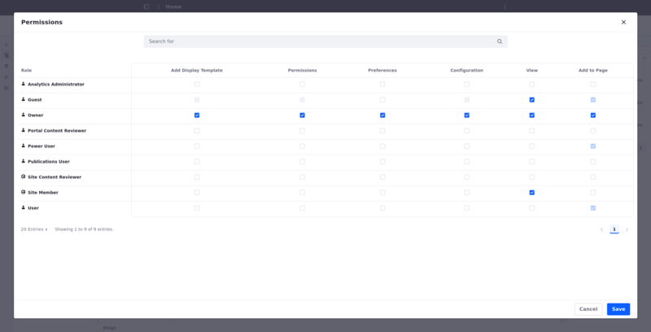

# Blog Permissions Reference

This article serves as a guide for all permissions associated with the Blogs application.

## Blog Entry Permissions

1. Open the Site Menu (  ) and go to Content and Data &rarr; Blogs.

1. Next to a blog entry, click *Actions* ( ) &rarr; *Permissions*.

| Permission        | Description                                                                       |
| :---------------- | :-------------------------------------------------------------------------------- |
| Update Discussion | Edit another user's comment on the blog entry.                                    |
| Delete            | Move the blog entry to the [Recycle Bin](../recycle-bin/recycle-bin-overview.md). |
| Permissions       | View and modify the blog entry's permissions.                                     |
| Delete Discussion | Delete any comments on the blog entry.                                            |
| Update            | Edit and modify the blog entry.                                                   |
| View              | View the blog entry.                                                              |
| Add Discussion    | Comment on the blog entry.                                                        |

## Related Topics

[Adding Blog Entries](./adding-blog-entries.md)

[Configuring the Blogs App](./configuring-the-blogs-app.md)