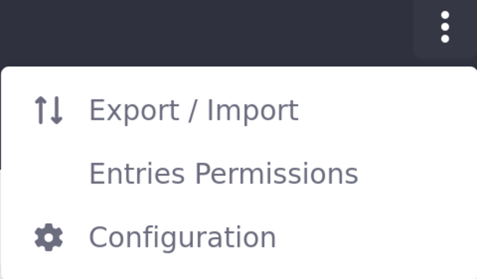
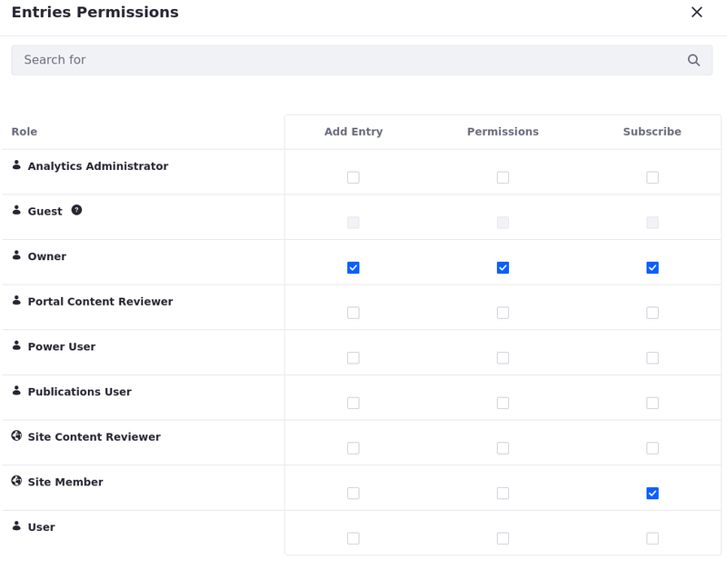
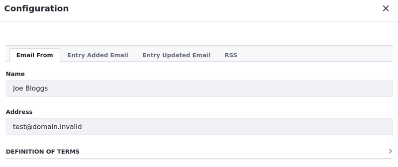

# Configuring the Blogs App

You can control how the app behaves for all blogs in your site.

1. Open the *Site Menu* (  ) and navigate to *Content and Data* &rarr; *Blogs*.

1. Click *Options* () at the top-right of the app.

   

1. Configure the available options below.

**Export/Import:** Export or import a LAR file that contains the blogs app’s content. See [Exporting/Importing Widget Data](../../site-building/creating-pages/page-fragments-and-widgets/using-widgets/configuring-widgets/exporting-importing-widget-data.md) to learn more about the process.

**Entries Permissions:** Configure the permissions for blog entries. You can control which roles can add an entry, configure entry permissions, and subscribe to entries.

**Configuration:** Configure the following options for the blogs app, in these tabs:

**Email From:** Define the *From* field in the email messages sent from blogs.

**Entry Added Email:** Define a subject and body for the emails sent when a new blog entry has been added.

**Entry Updated Email:** Define a subject and body for the emails sent when a new blog entry has been updated.

**RSS:** Enable RSS subscription and choose how blogs are published to RSS readers.

- *Maximum Items to Display:* Choose the total number of RSS feed entries to display on the initial page. You can choose up to 100 to be displayed.

- *Display Style:* Choose between Full Content, Abstract, and Title for the entry display in the RSS feed.

- *Format:* Choose which format the RSS feed uses to deliver the entries: Atom 1.0, RSS 1.0, or RSS 2.0.
