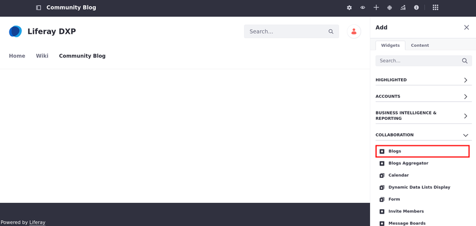

# Getting Started with Blogs

The blogs application's editor has a complete set of WYSIWYG controls that appear when and where you need them. You can also switch to source mode to edit your content's HTML code.

The blogs application contains a powerful set of tools for customizing how your blogs appear. For example, display templates like Abstract or Full Content let you choose how much of a blog post appears on a page. You can leverage the built-in display templates or create your own. You can also add a cover image to each of your blog entries.

The fastest way to begin using the blogs app is to [deploy the widget to a site page](../../site-building/creating-pages/using-content-pages/using-widgets-on-a-content-page.md).

1. Navigate to the site and page desired (e.g. *Community Blog*).

1. Click *Add* (  ) to open the *Fragments and Widgets* panel.

1. Under the Collaboration category in the Widgets tab, drag and drop the *Blogs* widget to the desired location on the page.



Once you add the widget and publish the page, site members can create blog posts using the Blogs widget.


```{note}
There can be only one Blogs widget per page.
```

## What's Next

Learn how to use the features of the Blogs application:

* [Adding Blog Entries](./adding-blog-entries.md)
* [Managing Blog Entries](./managing-blog-entries.md)
* [Configuring the Blogs App](./configuring-the-blogs-app.md)
* [Displaying Blogs](./displaying-blogs.md)
* [Highlighting Recent Bloggers](./highlighting-recent-bloggers.md)

### Reference

* [Blog Entry Editor Reference](./blog-entry-editor-reference.md)
* [Blog Permissions Reference](./blog-permissions-reference.md)
