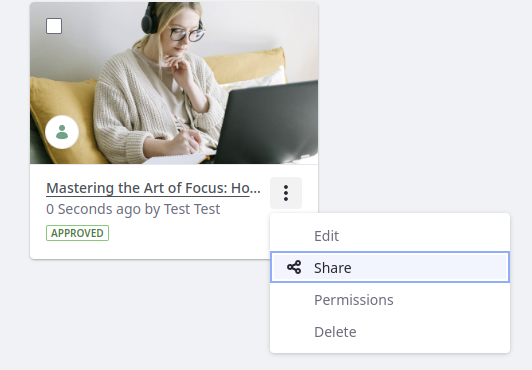

# Managing Blog Entries

Bloggers and blog administrators manage blog entries using the *Blogs* application in the Site Administration menu. To access this app, open the *Product Menu* () and select *Content & Data* &rarr; *Blogs*.

The Entries tab is selected by default, which lists the site's blog entries. Use the management bar to manage your site's blog entries.

## Finding and Arranging Blog Entries

The management bar also contains tools that help you locate and arrange blog entries (e.g. use the search bar to find files by keywords).

To the left of the search bar, the Sort button () arranges entries in ascending or descending order.

Click *Filter and Order* to sort entries using these criteria:

| Filter                      | Description                            |
|:----------------------------|:---------------------------------------|
| (Filter By Navigation) All  | Shows all of the site's entries.       |
| (Filter By Navigation) Mine | Shows only the current user's entries. |
| (Order By) Title            | Orders the entries by title.           |
| (Order By) Display Date     | Orders the entries by display date.    |

### View Types

The View Types button is to the left of the Add button. Users can choose how to display the blog entries in the Blogs app. The View Types button's icon depends on the selected view type:

| View Type | Description                                                                                                                                                                                                                                                                  |
|:----------|:-----------------------------------------------------------------------------------------------------------------------------------------------------------------------------------------------------------------------------------------------------------------------------|
| Cards     | Shows a card-like rendering of the blog entry, with the author's profile picture. Each card also contains the entry's time stamp, title, [workflow](../../process-automation/workflow/introduction-to-workflow.md) status (e.g., Approved, Draft, etc.), and an Actions menu. |
| List      | Shows the same information as the Cards view type, in a list with the author's profile picture instead of the blog entry's cover image.                                                                                                                                      |
| Table     | Shows the same information as the other view types, in a list with no file renderings.                                                                                                                                                                                       |

## Deleting Blog Entries

1. Check the entry or entries you want to delete.

1. Click *Trash* () to move the selected entries to the Recycle Bin.

## Sharing Blog Entries

You can also share blog entries from the Blogs app in Site Administration. When you share a blog entry, you invite a user to collaborate with the blog entry. Sharing is enabled by default.
Sharing blog entries works the same as [sharing files in Documents and Media](../documents-and-media/publishing-and-sharing/managing-document-access/sharing-documents-with-other-users.md).

To share a blog entry,

1. Click *Actions* () for the entry you want to share &rarr; *Share*.

1. Enter the email address of the collaborator. You can enter multiple addresses.

1. To let receiving users share the entry, check *Allow the item to be shared with other users*.

1. Grant users a sharing permission to define what invited collaborators can do with the blog entry: Update (view, comment, and update), comments (view and comment), or view (view only).

1. Click *Share*.

<!-- I think there's missing content here about how sharing blog entries works. What does it really mean to share a blog entry? Also - this section is a prime candidate to move out of this article, depending on how "Sharing" is defined. -->
