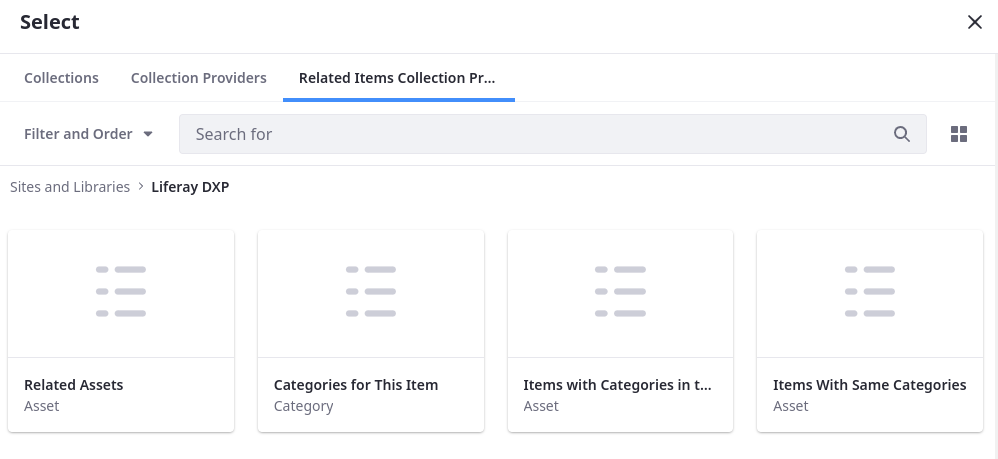
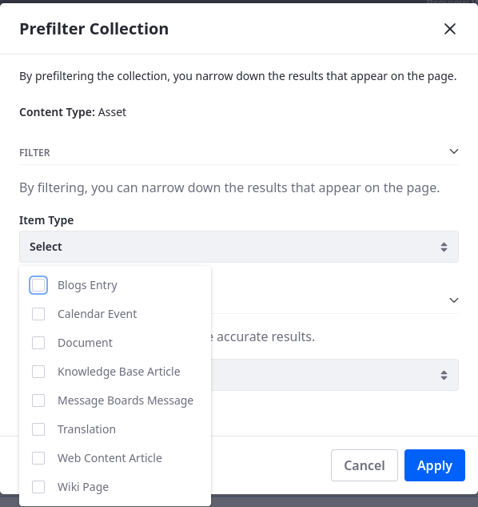
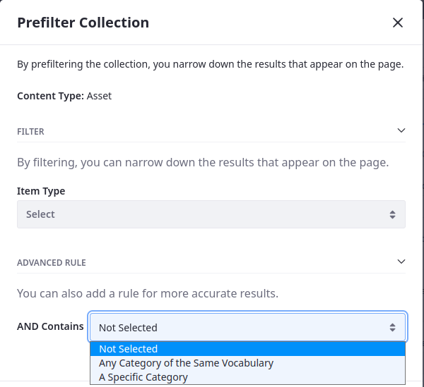

# Collection Provider

Collection providers group items into collections for display on your pages. Several are available out-of-the-box, or you can create them using the Information Framework to group items into the collections you need. 

```{note}
The term _items_ can refer to more than content, such as products and categories, and they can be located outside the current site or Liferay instance.
```

## Default Collection Providers

The following collection providers are available out-of-the-box and function the same as the widgets with the same name:

* Most Viewed Assets: displays the most viewed assets on the current site from most to least.
* Highest Rated Assets: displays rated assets from highest to lowest.
* Recent Content: displays recently modified assets from the most recent to least recent.


## Related Items Collection Providers

Related items collection providers show lists of items related to the main items being displayed. You can access these collection providers in two ways:

1. By adding a collection display fragment to a display page.

1. By nesting collections within a collection display fragment on a content page.



**Related Assets:** shows items related to the main item on display.

**Categories for This Item:** shows the categories of the current item or asset.

**Items with Categories in the Same Vocabularies:** shows items in the same vocabulary as the main asset being viewed. For example, if the main asset has the category *football*, and *football* is part of the *sports* vocabulary, all other categories under the *sports* vocabulary are shown.

**Items with the Same Categories:** shows items with the same category as the main item being viewed. For example, if the main item has the category *football*, items with the same category appear. You can further refine the results by selecting _Any Category of the Same Vocabulary_ or _A Specific Category_ under *Advanced Rule*.



### Advanced Rules for Items with the Same Categories

You can further refine displayed items while filtering them based on their types.



**Any Category of the Same Vocabulary:** shows all items with categories in the same vocabulary as the main asset. For example, if the main asset has the category *football* all other items in the *sports* vocabulary are shown.

**A Specific Category:** shows results from an additional category to further refine the list. For example, you can add an additional category, *breaking news*, to display assets with the category *football* and *breaking news*, which shows assets matching breaking news for football.

```{tip}
By default, selecting a parent category automatically selects its child categories. This can be changed in the Control Panel under *Instance Settings*.
```
