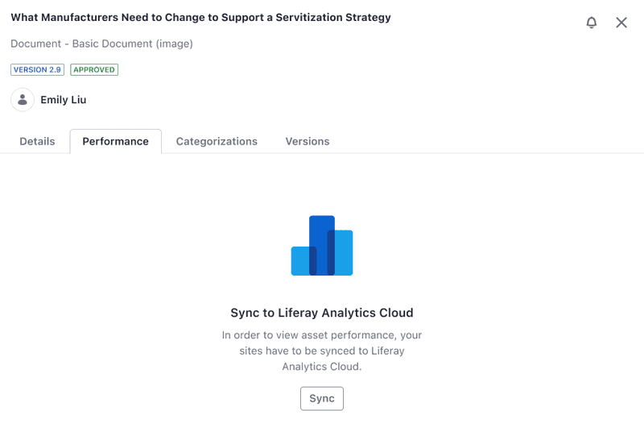

---
taxonomy-category-names:
- Content Management System
- Content Dashboard
- Liferay Self-Hosted
- Liferay PaaS
- Liferay SaaS
uuid: 72fe94c3-4995-4477-82af-756b80871f32
---

# Content Dashboard Interface

{bdg-secondary}`Available 7.3+`

The Content Dashboard user interface has three main sections:

1. [Content Audit Tool](#content-audit-tool)
1. [Contents List](#contents-list)
1. [Content Info Sidebar](#content-info-sidebar)

To access the dashboard, open the *Global Menu* (), go to the *Applications* tab, and click *Content Dashboard*.

Here you can view the [content audit tool](#content-audit-tool) (1) at the top of the page and the [contents list](#contents-list) (2) at the bottom.

From the contents list, you can access the [content info sidebar](#content-info-sidebar) (3) by hovering over a content item and clicking the *Info* button (). Alternatively, you can click the content item's *Actions* button () and select *Info*.

!!! note
    If the instance is connected to Analytics Cloud, you can also select *View Metrics* to open the Content Performance side panel. See [About the Content Performance Tool](../page-performance-and-accessibility/about-the-content-performance-tool.md) for more information.

## Content Audit Tool

The content audit tool displays assets from the [contents list](#contents-list) section in a chart. This chart represents the total number of assets for the selected [vocabularies and categories](#customizing-vocabularies-and-categories-for-the-content-audit-tool) and can include items from all sites and asset libraries. However, the chart only displays data the current user can access. You can also restrict chart results using [contents list filters](#filtering-and-sorting-content-in-the-contents-list).

!!! tip
    If the chart does not display the expected information, [verify your categories](../tags-and-categories/defining-categories-and-vocabularies-for-content.md) for the selected vocabularies and ensure that [your content is categorized](../tags-and-categories/organizing-content-with-categories-and-tags.md).

The content audit tool includes four UI elements: the chart legend, the x-axis categories for the first vocabulary, the y-axis categories for the second vocabulary, and the bar chart.

### Customizing Vocabularies and Categories for the Content Audit Tool

By default, the bar chart shows the total number of assets for each category in the selected vocabularies. To change these vocabularies,

1. Click *Configure* () in the content audit area.

1. Use the *left* and *right* arrows to select which vocabularies to display in the chart.

   You can only use one or two vocabularies at a time. Also, you can only combine vocabularies from the same site. However, you can use global vocabularies with vocabularies from any site.

1. Click *up* and *down* to order the vocabularies.

   The chart uses the top vocabulary for the x-axis and the bottom vocabulary for the y-axis.

   

1. Click *Save*.

!!! tip
    Click *Flip Axes* () to quickly switch the x- and y-axes.

## Contents List

By default, the contents list displays all content you can access across your sites and asset libraries. From here, you can sort and filter this content using built-in or custom filters. The content audit tool chart changes dynamically based on the filters that you set.

The contents list includes four UI elements: a filter and sort selector, a filter editor, a search field, and a list of contents.

In the list of contents are the following columns:

| Column                | Description                                                                                                               |
| :-------------------- | :------------------------------------------------------------------------------------------------------------------------ |
| Title                 | The content's title.                                                                                                      |
| Author                | The content's author.                                                                                                     |
| Type                  | The content type: web content article, {bdg-secondary}`7.4+` document, or {bdg-secondary}`7.4 U23+/GA23+` blogs entry     |
| Subtype               | The content [subtype](../tags-and-categories/defining-categories-and-vocabularies-for-content.md#creating-subcategories). |
| Site or Asset Library | The content item's location in the Liferay instance.                                                                      |
| Status                | The workflow statuses for each content item.                                                                              |
| Vocabulary (x-axis)   | The categories applied to the content item from the content audit tool's [x-axis vocabulary](#content-audit-tool).        |
| Vocabulary (y-axis)   | The categories applied to the content item from the content audit tool's [y-axis vocabulary](#content-audit-tool).        |
| Modified Date         | The content's last modified date                                                                                          |
| Review Date           | The content's review date                                                                                                 |

The content list uses the *Page* icon () to identify assets that have a [display page template](../../site-building/displaying-content/using-display-page-templates.md).

You can hover over content in the list to access these actions:

- **View** (): View the content's display page.

- **Edit** (): Open the content in edit mode.

- **Info** (): Open the [content info](#content-info-sidebar) sidebar.

- **View Metrics** (): Open the [content performance panel](../page-performance-and-accessibility/about-the-content-performance-tool.md).

  

### Filtering and Sorting Content in the Contents List

From the *Filter and Order* drop-down menu, select a [pre-defined filter](#filter-options-reference). You can also sort content by title or modified date.

You can use the search bar to filter content by keyword or click a bar in the [content audit](#content-audit-tool) chart to filter content by the selected category.

See [Understanding Contents List Filters](#understanding-contents-list-filters) for more information on how combining filters works.

!!! note
    When you close the dashboard page, the default filter and sorting option are reset.

### Filter Options Reference

{bdg-secondary}`For 7.4+`

From the *Filter and Order* drop-down menu, you can choose these options:

| Filter                                                         | Description                                                                                                                                                                                                                 |
| :------------------------------------------------------------- | :-------------------------------------------------------------------------------------------------------------------------------------------------------------------------------------------------------------------------- |
| Categories                                                     | Filters using one or more [categories](../tags-and-categories/organizing-content-with-categories-and-tags.md) from your vocabularies.                                                                                       |
| Site or Asset Library                                          | Filters by site or asset library.                                                                                                                                                                                           |
| Type                                                           | Filters by content type and subtype, including out-of-the-box and custom subtypes.                                                                                                                                          |
| Tags                                                           | Filters by content [tags](../tags-and-categories/tagging-content-and-managing-tags.md).                                                                                                                                     |
| (Liferay DXP 2024.Q3+/Portal 7.4 GA125+) Size                  | Filters images and videos by file size: <ul><li>`Small (150KB or less)`</li><li>`Medium (more than 150KB and up to 1MB, inclusive)`</li><li>`Large (more than 1MB)`</li></ul>                                            |
| (Liferay DXP 2024.Q4+/Portal 7.4 GA146+) Filter by Resolution | Filters images by resolution: <ul><li>`Small (up to 400x300)`</li><li>`Medium (from 401x301 to 1024x768)` (Includes images where width exceeds 400 or height exceeds 300)</li><li>`Large (more than 1024x768)` (Includes images where width exceeds 1024 or height exceeds 768)</li></ul> |
| (Liferay DXP 2024.Q4+/Portal 7.4 GA146+) Filter by Aspect Ratio | Filters images by aspect ratio: <ul><li>`Wide` (Width is greater than height)</li><li>`Tall` (Height is greater than width)</li><li>`Square` (Width and height are equal)</li></ul> |
| Extension                                                      | Filters by file extension: <ul><li>`audio`</li><li>`code`</li><li>`compressed`</li><li>`image`</li><li>`presentation`</li><li>`spreadsheet`</li><li>`text`</li><li>`vectorial`</li><li>`video`</li><li>`other`</li></ul> |
| Filter by Status                                               | Filters by the content's [workflow status](../../process-automation/workflow/introduction-to-workflow.md).                                                                                                                  |
| Filter by Author                                               | Filters by content author.                                                                                                                                                                                                  |
| Filter by Review Date                                          | Filters by the content's review date.                                                                                                                                                                                       |
| (Liferay DXP 2024.Q3+/Portal 7.4 GA125+) Filter by Custom Date | Filters by Create, Display, Expiration, Modified, Published, or Review dates. Select a from/to range for your filter.                                                                                                       |
| Order By                                                       | Filters by the content's title, modified date, or review date.                                                                                                                                                              |

### Understanding Contents List Filters

When you use the categories or tags filters with more than one criteria, the results correspond to content that meets all the criteria (see example A.)

When you choose multiple options for the same filter criteria, the contents list shows assets matching at least one option (see example B.)

The criteria from different filters is combined using the `and` operator (see example C.)

| Example | Filter By           | Filter Example                                   | Contents List Results                                                       |
| :------ | :------------------ | :----------------------------------------------- | :-------------------------------------------------------------------------- |
| A       | Categories          | Categories: *Entrepreneur* and *Family*          | Only assets that belong to both the *Entrepreneur* `and` Family Categories. |
| B       | Authors             | Authors: *Peter* and *Linda*                     | Assets authored by *Peter* `or` *Linda* `or` both.                          |
| C       | Categories, Authors | Category is *Entrepreneur* and Author is *Linda* | Only assets under the *Entrepreneur* Category `and` authored by Linda.      |

## Content Info Sidebar

The info sidebar provides access to actions and metadata for your selected asset. To open the sidebar, click *Actions* () for the desired asset and select *Info*. Alternatively, you can hover over the asset and click *Info* ().

The Content Info sidebar is split into four tabs:

- [Details](#asset-details)
- [Performance](#content-performance)
- [Categorizations](#categorizations)
- [Versions](#version-history)

### Asset Details

The Details tab is selected automatically when you open the Content Info sidebar. It contains a list of metadata for the selected asset. The data displayed depends on the type of asset.

**Web Content**

- Title
- Type {bdg-secondary}`7.4 U44+/GA44+`
- Subtype
- Version (current active version)
- Status
- Author
- Preview Image {bdg-secondary}`7.4 U42+/GA42+`
- Languages Translated Into
- Display Date
- Creation Date
- Modified Date
- ID
- Subscribe {bdg-secondary}`7.4 U42+/GA42+`

**Blog Entries**

- Title
- Type
- Version (current active version)
- Status
- Author
- Preview Image {bdg-secondary}`7.4 U42+/GA42+`
- Share {bdg-secondary}`7.4 U42+/GA42+`
- Display Date
- Creation Date
- Modified Date
- ID

**Documents and Media** {bdg-secondary}`7.4 U23+/GA23+`

- Title
- URL
- WebDAV URL {bdg-secondary}`7.4 U42+/GA42+`
- Filename
- Type {bdg-secondary}`7.4 U44+/GA44+`
- Subtype
- MIME Type {bdg-secondary}`7.4 U44+/GA44+`
- Version (current active version)
- Status
- Author
- Preview Image
- Download
- Share {bdg-secondary}`7.4 U42+/GA42+`
- Resolution {bdg-secondary}`7.4 U146+/GA146+`
- Aspect Ratio {bdg-secondary}`7.4 U146+/GA146+`
- Extension
- Size
- Creation Date
- Modified Date
- ID
- Latest Version URL

### Content Performance

{bdg-secondary}`Liferay DXP 2024.Q4+/Portal 7.4 GA137+`

The Performance tab contains various metrics for the selected asset. To view metrics for the desired asset, you must sync the asset's sites to Analytics Cloud.

You can use the buttons on the top-right corner to limit the results with these filters:

**Individual Type**: All individuals (default), known individuals, and anonymous individuals.

**Date Range**: Last 7 days, last 28 days, last 30 days (default), and last 90 days.

The data displayed depends on the type of asset:

**Web Content**

- Views: The number of times the selected web content was viewed through an asset publisher.

- Visitors Behavior: A graph showing the number of users who viewed this web content in a given time period.

- Top Pages Asset Appears On: A graph showing the top three pages with most visitors where this web content is used.

- Views By Technology: A breakdown of the different kinds of devices loading this web content.

**Blog Entries**

- Views: The number of times the selected blog entry was viewed through an asset publisher.

- Comments: The number of comments on the selected blog entry.

- Visitors Behavior: A graph showing the number of users who viewed this blog in a given time period.

- Top Pages Asset Appears On: A graph showing the top three pages with most visitors where this blog is used.

- Views By Technology: A breakdown of the different kinds of devices loading this blog.

**Documents and Media**

- Downloads: The number of times the selected document was downloaded through an asset publisher.

- Previews: The number of times the selected document was previewed through an asset publisher.

- Comments: The number of comments on the selected document.

- Visitors Behavior: A graph showing the number of users who downloaded this document in a given time period.

- Top Pages Asset Appears On: A graph showing the top three pages with most visitors where this document is used.

- Downloads By Technology: A breakdown of the different kinds of devices downloading this document.

### Version History

{bdg-secondary}`Liferay DXP 7.4 U53+/Portal 7.4 GA53+`

The Content Info panel displays the version history for assets from Web Content and Documents and Media. To view the version history, click *Info* () for a content item and go to the *Versions* tab.

This tab lists up to 10 available versions for the item. If there are more versions, you can view them by clicking the View More button.

Each version displays the author of the version, the time of its creation, and a changelog. You can click the Actions button () for a version to access these actions:

**Preview:** Show the rendered web content or document.

**Compare To:**  Show the difference between the selected version and another version. This opens a new page that shows additions, deletions and formatting changes between versions. This action is available only when there are two or more active versions.

**Expire:** Deactivate a version and activate the next available version. For instance, if there are two versions, 1.2 and 1.1, and you expire 1.2, 1.1 becomes the active version.

## Related Topics

- [About the Content Performance Tool](../page-performance-and-accessibility/about-the-content-performance-tool.md)
- [Defining Categories and Vocabularies for Content](../tags-and-categories/defining-categories-and-vocabularies-for-content.md)