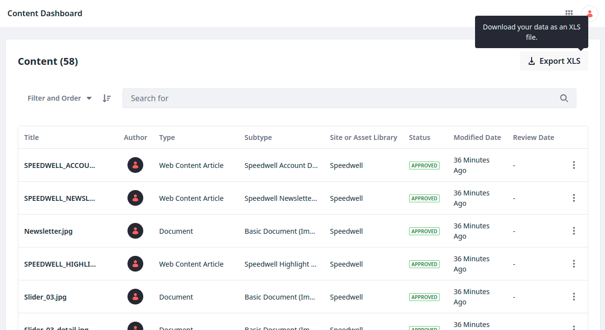
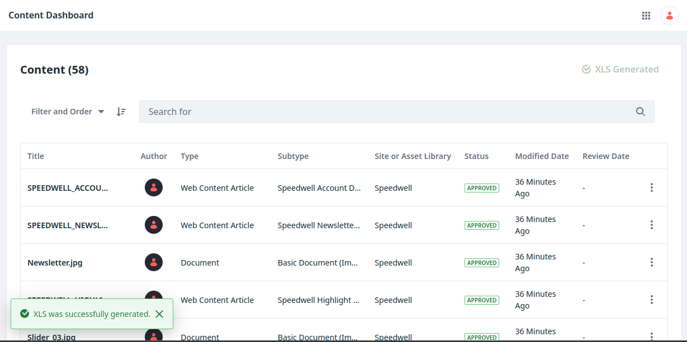

---
taxonomy-category-names:
- Content Management System
- Content Dashboard
- Liferay Self-Hosted
- Liferay PaaS
- Liferay SaaS
uuid: 1553a9b8-a964-40db-abd2-ee882863bfd9
---

# Exporting Assets List To a Spreadsheet

The Content Dashboard can export a spreadsheet (`.xls` file) of content related metadata for further analysis.

To export the asset list to a spreadsheet,

1. Open the *Global Menu* () and navigate to *Applications* &rarr; *Content Dashboard*.

1. Click *Export XLS* to download the asset list.

While generating the file, *Export XLS* is replaced with a status and a cancel button for the export process. If you click *Cancel Export*, the export process stops and shows a message: *XLS generation was canceled*.

When the export process is complete, the status shows the message: *XLS Generated*.

Note that navigating away from the page while the `.xls` file is being generated stops the export process. The system prompts you before leaving the page.

## XLS File Content

All metadata is exported from contents and documents, so the `.xls` file contains the following columns:

- Title
- Author
- Type
- Subtype
- Site or Asset Library
- Status
- Categories
- Tags
- Modified Date
- Review Date
- Description
- Extension
- File Name
- Size
- Display Date
- Creation Date
- Languages Translated Into

!!! note
    The available metadata present in the `.xls` file affects content types. For example, an image will not display anything for *Languages Translated Into*, as an image cannot be translated.

## Related Topics

- [Content Dashboard](../content-dashboard.md)
- [Content Dashboard Interface](./content-dashboard-interface.md)
