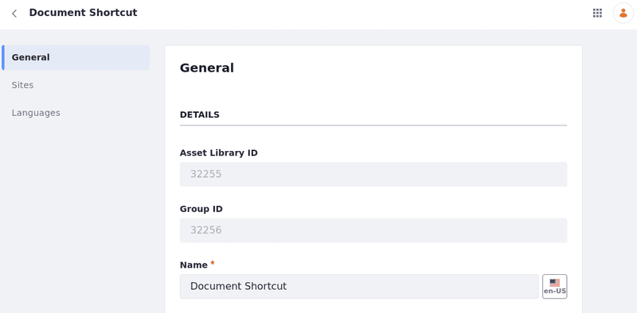
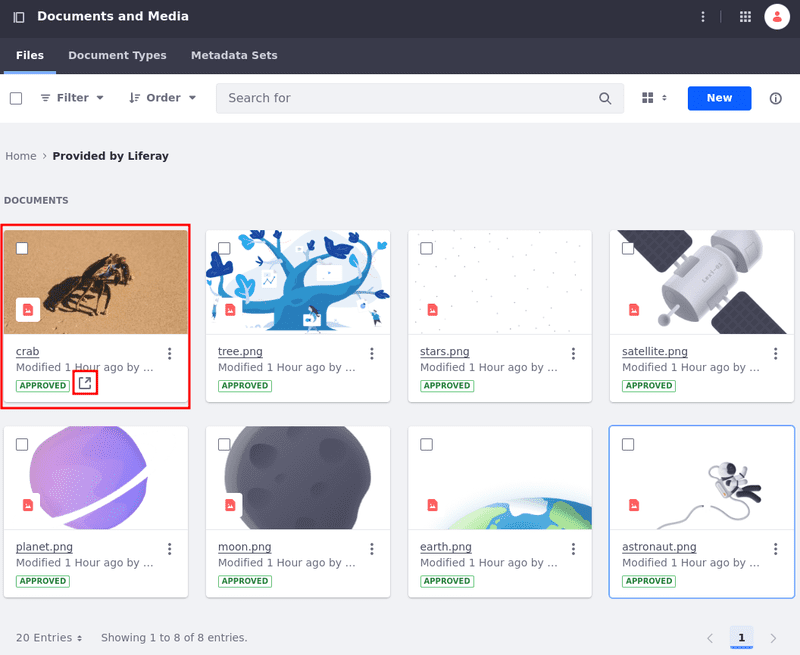
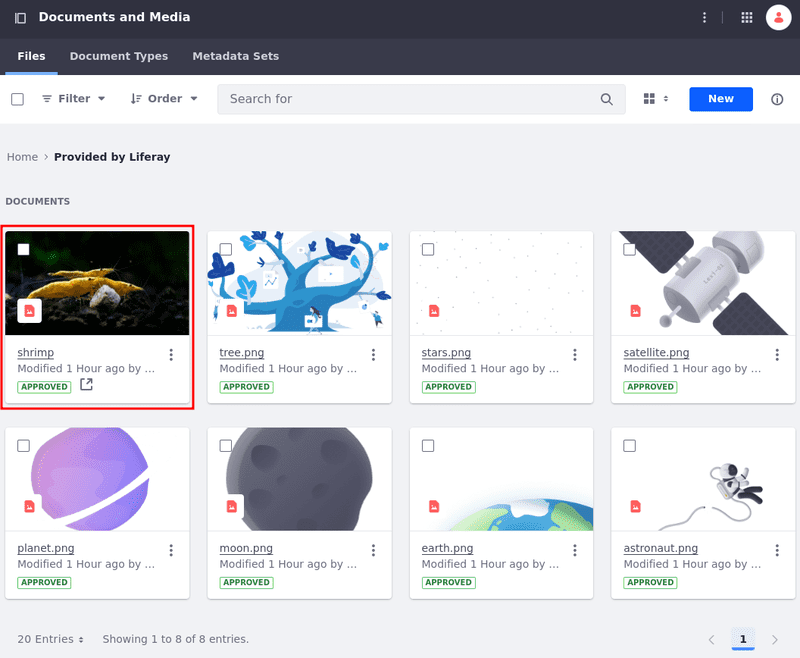
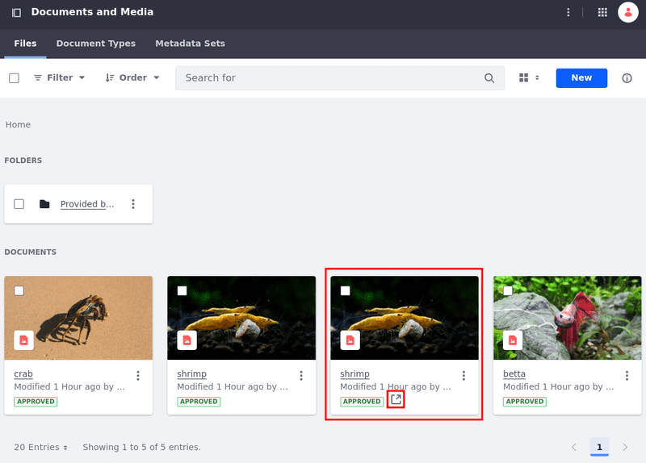
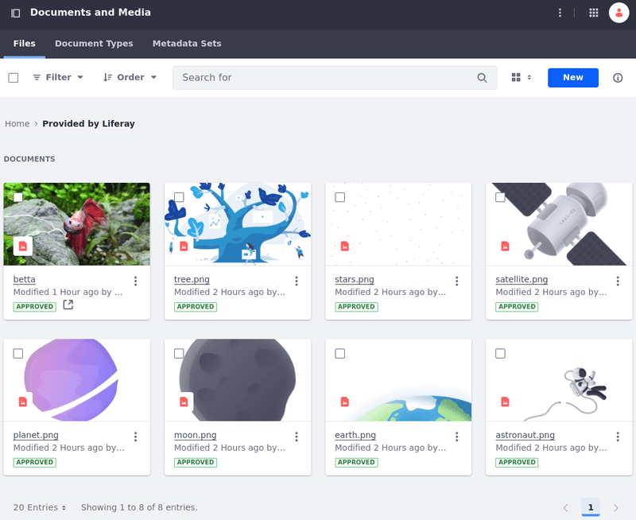

---
taxonomy-category-names:
- Digital Asset Management
- Documents and Media
- API Development
- Liferay Self-Hosted
- Liferay PaaS
- Liferay SaaS
uuid: b5f5c2ee-2ab3-4a4e-a4f9-8a1d54edd4cf
---

# Document Shortcut API Basics

Liferay's headless delivery application provides REST services for [Documents and Media](../../documents-and-media.md) that add document shortcuts to sites or asset libraries, list their information, modify them, delete them, and more. This guide demonstrates how to call those services using cURL commands and Java classes.

Start by setting up the environment and gathering the necessary information.

## Set Up The Environment

```{include} /_snippets/run-liferay-portal.md
```

When signed in, [retrieve the site ID](../../../headless-delivery/consuming-apis/consuming-rest-services.md#identify-the-site-containing-the-data). Use this ID in several service calls. In this example, the ID is `20117`.

Then, follow these steps:

1. Download and unzip the [example project](https://resources.learn.liferay.com/dxp/latest/en/content-authoring-and-management/documents-and-media/developer-guide/liferay-k9e8.zip):

   ```bash
   curl https://resources.learn.liferay.com/dxp/latest/en/content-authoring-and-management/documents-and-media/developer-guide/liferay-k9e8.zip -O
   ```

   ```bash
   unzip liferay-k9e8.zip
   ```

1. [Add three documents to the Documents and Media application](../uploading-and-managing/uploading-files.md). In this example, they're images called `crab.jpg`, `shrimp.jpg`, and `betta.jpg`, and they're included in the `resources/images` folder.

1. Get the documents' IDs.

   You need a document's ID to create shortcuts. To get a list of documents in a site and their IDs, execute the `Documents_GET_FromSite.sh` script in the terminal:

   !!! important
      Ensure the email and password specified in the `--user` option match those used in the scripts.

   ```bash
   Documents_GET_FromSite.sh [site-ID]
   ```

   In the response, find the uploaded document's `ID`. In this example, they're `32078` for `crab.jpg`, `32067` for `shrimp.jpg`, and `32054` for `betta.jpg`.

   ```bash
   ...
   "encodingFormat" : "image/jpeg",
   "externalReferenceCode" : "4581bab6-2186-85f0-e384-dba35a897a95",
   "fileExtension" : "jpg",
   "fileName" : "crab.jpg",
   "friendlyUrlPath" : "crab",
   "id" : 32078,
   "keywords" : [ ],
   "numberOfComments" : 0,
   "relatedContents" : [ ],
   "renderedContents" : [ ],
   "siteId" : 20117,
   "sizeInBytes" : 114486,
   "taxonomyCategoryBriefs" : [ ],
   "title" : "crab"
   ...
   ```

1. Get the folders' IDs

   To post the shortcut to a folder, you need the folder's ID. Get the available folders in the site and their IDs by executing the `DocumentFolder_GET_FromSite.sh` script.

   ```bash
   DocumentFolder_GET_FromSite.sh [site-ID]
   ```

   This returns a list with all folders. If you don't have any, use the "Provided by Liferay" out-of-the-box folder. In this example, the ID is `31637`.

   ```bash
   ...
   "customFields" : [ ],
   "dateCreated" : "2024-06-28T10:28:31Z",
   "dateModified" : "2024-06-28T10:28:31Z",
   "description" : "",
   "externalReferenceCode" : "d67f7b14-c9b4-8a24-872b-18c6c0f64efe",
   "id" : 31637,
   "name" : "Provided by Liferay",
   "numberOfDocumentFolders" : 0,
   "numberOfDocuments" : 7,
   "siteId" : 20117,
   "subscribed" : false
   ...
   ```

1. Get the asset library's ID.

   To post the shortcut to an asset library, you need the asset library's ID.

   If you [create an asset library](../../asset-libraries/creating-and-managing-asset-libraries.md), the ID appears in the General tab after you create it.

   If you already have one, open the *Global Menu* (), go to the *Applications* tab, and click *Asset Libraries* under Content.

   Then, click *Actions* () for the asset library you want and select *Edit*. The ID appears in the General tab.

   

   In this example, the ID is `32098`.

Now you can post a document's shortcut.

## Post a Shortcut to a Site or Asset Library

Post shortcuts to sites or asset libraries. You can also select specific folders or post them into the site/asset library's root folder.

1. In the terminal, run the `DocumentShortcut_POST_ToSite.sh` to post the shortcut to a site. Use the `site-ID`, the `folder-ID`, and the `document-ID `as parameters.

!!! note
    The examples used here are intended for sites. Examples intended for asset libraries are included in the resource's `curl` and `java` folders. Replace the `site-ID` for the `asset-library-ID` to test them.

```bash
DocumentShortcut_POST_ToSite.sh [site-ID] [folder-ID] [document-ID]
```

!!! tip
    Use `0` as the `folder-ID` to add the document to the site/asset library's root folder.

The terminal shows a similar output.

```bash
{
   "actions" : {
      "get" : {
         "method" : "GET",
         "href" : "http://localhost:8080/o/headless-delivery/v1.0/document-shortcuts/32078"
      }
   },
   "dateCreated" : "2024-07-05T12:16:17Z",
   "dateModified" : "2024-07-05T12:16:17Z",
   "folderId" : 31637,
   "id" : 32100,
   "siteId" : 20117,
   "targetDocumentId" : 32078,
   "title" : "crab"
}
```

In this example, the shortcut for `crab.jpg` is posted into the "Provided by Liferay folder". It's identified with the shortcut icon ().



Next, use a Java class to post a shortcut.

1. Go to the `java` folder and compile the Java source files.

   ```bash
   cd ../java
	```

	```bash
   javac -classpath .:* *.java
   ```

1. Post a shortcut to Documents and Media by running the `DocumentShortcut_POST_ToSite` class below, replacing the `siteId` system property value with your site's ID, the `folderId` with the ID for the folder where you want to place the shortcut, and the `targetDocumentId` to indicate the shortcut's target document.

   ```bash
   java -classpath .:* -DsiteId=1234 -DfolderId=1234 -DtargetDocumentId=1234 DocumentShortcut_POST_ToSite
   ```

   !!! note
       If your user and password aren't `test@liferay.com` and `learn`, respectively, replace those values in the `DocumentShortcut_POST_ToSite.java` file and recompile the class before running it.

The class creates a shortcut for the target document in the site's Documents and Media designated folder.

Read on to see how the cURL command and Java class work.

### Examine the cURL Command

The `DocumentShortcut_POST_ToSite.sh` and `DocumentShortcut_POST_ToAssetLibrary.sh` scripts post shortcuts by calling a `headless-delivery` application REST service with cURL.

Here are the command's arguments:

| Arguments                                                                                  | Description                                                                                                           |
| :----------------------------------------------------------------------------------------- | :-------------------------------------------------------------------------------------------------------------------- |
| `"http://localhost:8080/o/headless-delivery/v1.0/sites/${1}/document-shortcuts"`           | The REST service endpoint. Your site ID parameter replaces `${1}`.                                                    |
| `"http://localhost:8080/o/headless-delivery/v1.0/asset-libraries/${1}/document-shortcuts"` | The REST service endpoint. Your asset library ID parameter replaces `${1}`.                                           |
| `--data-raw`                                                                               | The raw JSON data sent in the request body. `${2}` and `${3}` are placeholders for the folder ID and the document ID. |
| `--header "accept: application/json"`                                                      | Specifies that the client expects a response in JSON format.                                                          |
| `--header "Content-type: application/json" \`                                              | The media type ([MIME type](https://en.wikipedia.org/wiki/Media_type)) of the resource sent to the server is JSON.    |
| `--request "POST"`                                                                         | The HTTP method to invoke at the specified endpoint.                                                                  |

| `--user "test@liferay.com:learn"`                                                | Basic authentication credentials.                                                                                   |

!!! note
    Basic authentication is used here for demonstration purposes. For production, you should authorize users via [OAuth 2.0](../../../headless-delivery/using-oauth2.md). See [Using OAuth2 to Authorize Users](../../../headless-delivery/using-oauth2/using-oauth2-to-authorize-users.md) for a sample React application that uses OAuth2.

Other cURL commands for the `DocumentShortcut` REST services use similar arguments.

### Examine the Java Class

The `DocumentShortcut_POST_ToSite.java` and `DocumentShortcut_POST_ToAssetLibrary.java` classes post shortcuts by calling a `headless-delivery` application REST service.

| Line (abbreviated)                                                                                    | Description                                                                                                                                                                      |
| :---------------------------------------------------------------------------------------------------- | :------------------------------------------------------------------------------------------------------------------------------------------------------------------------------- |
| `DocumentShortcutResource.Builder builder = ...`                                                      | Gets a `Builder` for generating a `DocumentShortcutResource` service instance.                                                                                                   |
| `DocumentShortcutResource documentShortcutResource = builder.authentication(...).build();`            | Specifies basic authentication and generates a `DocumentShortcutResource` service instance.                                                                                      |
| `DocumentShortcut documentShortcut = documentShortcutResource.postSiteDocumentShortcut(...);`         | Calls the `DocumentShortcutResource.postSiteDocumentShortcut` method, passing in a site ID and a `DocumentShortcut` object to represent the document shortcut.                   |
| `DocumentShortcut documentShortcut = documentShortcutResource.postAssetLibraryDocumentShortcut(...);` | Calls the `DocumentShortcutResource.postAssetLibraryDocumentShortcut` method, passing in an asset library ID and a `DocumentShortcut` object to represent the document shortcut. |

Note that the project includes the `com.liferay.headless.delivery.client.jar` file as a dependency. You can find client JAR dependency information for all REST applications in the API explorer in your installation at `/o/api`.

!!! note
    The `main` method's comment demonstrates running the class.

The other example Java classes are similar to this one, but call different `DocumentShortcutResource` methods.

!!! important
    See [DocumentShortcutResource](https://github.com/liferay/liferay-portal/blob/[$LIFERAY_LEARN_PORTAL_GIT_TAG$]/modules/apps/headless/headless-delivery/headless-delivery-client/src/main/java/com/liferay/headless/delivery/client/resource/v1_0/DocumentShortcutResource.java) for service details.

Below are examples of calling other `DocumentShortcut` REST services using cURL and Java.

## Get Shortcuts

You can list document shortcuts from a site or an asset library. You can also retrieve information about a specific shortcut using its ID.

## Get Shortcuts From a Site or Asset Library

To list document shortcuts from a site, execute the following cURL command or Java class. As above, replace `[site-ID]/[asset-library-ID]` with your site's/asset library's ID, respectively.

```bash
./DocumentShortcuts_GET_FromSite.sh [site-ID]
```

The terminal shows a similar output.

```bash
{
...
   "facets" : [ ],
   "items" : [ {
      "actions" : {
         "get" : {
         "method" : "GET",
         "href" : "http://localhost:8080/o/headless-delivery/v1.0/document-shortcuts/32078"
         }
      },
      "dateCreated" : "2024-07-05T12:16:17Z",
      "dateModified" : "2024-07-05T12:16:17Z",
      "folderId" : 31637,
      "id" : 32100,
      "siteId" : 20117,
      "targetDocumentId" : 32078,
      "title" : "crab"
   } ],
   "lastPage" : 1,
   "page" : 1,
   "pageSize" : 20,
   "totalCount" : 1
}
```

You can also execute the java class:

```bash
java -classpath .:* -DsiteId=1234 DocumentShortcuts_GET_FromSite
```

You can find information about the shortcut, the site/asset library where it's stored, the document it points to, its ID, title, creation date, modification date, and other details related to the document.

!!! tip
    A shortcut stored in an asset library includes an `assetLibraryKey` field in its response.

### Get a Specific Shortcut

You can get a specific shortcut by executing the following cURL or Java command. Replace `[shortcut-ID]` with the shortcut's ID.

```bash
./DocumentShortcut_GET_ById.sh [shortcut-ID]
```

If there's no `assetLibraryKey` listed, the shortcut is located in a site.

```bash
...
"dateCreated": "2024-07-05T12:16:17Z",
"dateModified": "2024-07-05T12:16:17Z",
"folderId": 31637,
"id": 32100,
"siteId": 20117,
"targetDocumentId": 32078,
"title": "crab"
...
```

Conversely, an `assetLibraryKey` field appears in the output when the shortcut is stored in an asset library.

```bash
...
"assetLibraryKey": "Asset Library",
"dateCreated": "2024-07-05T12:30:58Z",
"dateModified": "2024-07-05T12:30:58Z",
"folderId": 0,
"id": 32102,
"siteId": 32099,
"targetDocumentId": 32078,
"title": "crab"
...
```

You can also execute the java class:

```bash
java -classpath .:* -DdocumentShortcutId=1234 DocumentShortcut_GET_ById
```

## Patch a Shortcut

PATCH services update specific fields in a shortcut. You can update a shortcut by executing the following cURL or Java command.

In this exercise, use the `[shortcut-ID]` from the shortcut added to the Provided by Liferay folder. Replace the `[folder-ID]` with the folder ID and replace the `[target-document-ID]` with the `shrimp.jpg` image ID. This updates the shortcut, changing the image from `crab.jpg` to `shrimp.jgp`.

### DocumentShortcut_PATCH_ById.sh

Command:

```bash
./DocumentShortcut_PATCH_ById.sh [shortcut-ID] [folder-ID] [target-document-ID]
```

```bash
...
	--data-raw '{
      "folderId": '{$2}',
		"targetDocumentId": '{$3}',
		"viewableBy": "Anyone"
	}' \
...
```

The PATCH request updates the target document and now refers to the `shrimp.jpg` image.



Next, execute the script again and try changing the `folderId` field to `0` to move the shortcut to the site's root folder.



### DocumentShortcut_PATCH_ById.java

Command:

```bash
java -classpath .:* -DdocumentShortcutId=1234 -DfolderId=1234 -DtargetDocumentId=1234 DocumentShortcut_PATCH_ById
```

The Java class calls `DocumentShortcutResource`'s `patchDocument` method, passing in the `DocumentShortcut`'s ID, a `DocumentShortcut` object that includes a field to update.

Change the `folderId` and the `targetDocumentId` to change where the shortcut is stored and its reference.

## Put a Shortcut

PUT services replace the shortcut and its fields entirely. You can replace a shortcut by executing the following cURL or Java command.

In this exercise, use the `[shortcut-ID]` from the shortcut moved to the Provided by Liferay folder in the previous PATCH request. Replace the `[folder-ID]` with the Provided by Liferay folder ID and `[target-document-ID]` with the `betta.jpg` image ID. This updates the shortcut, moving it back to the Provided by Liferay folder and changing the image from `shrimp.jpg` to `betta.jgp`.

### DocumentShortcut_PUT_ById.sh

Command:

```bash
./DocumentShortcut_PUT_ById.sh [shortcut-ID] [folder-ID] [target-document-ID]
```

The shortcut is back in the Provided by Liferay folder and it refers to the `betta.jpg` image.



### DocumentShortcut_PUT_ById.java

Command:

```bash
java -classpath .:* -DdocumentShortcutId=1234 -DfolderId=1234 -DtargetDocumentId=1234 DocumentShortcut_PUT_ById
```

The Java class calls `DocumentShortcutResource`'s `putDocument` method, passing in the `DocumentShortcut`'s ID, a `DocumentShortcut` object that includes values for the `DocumentShortcut`'s `folder` and `targetDocument` fields.

The above cURL command and Java class replace `DocumentShortcut` instances with completely new ones.

## Delete a Shortcut

Delete a shortcut by executing the following cURL or Java command. Replace `[shortcut-ID]` with the shortcut's ID.

If the operation is successful, there's a code 204 as response and nothing is returned.

### DocumentShortcut_DELETE_ById.sh

Command:

```bash
./DocumentShortcut_DELETE_ById.sh [shortcut-ID]
```

### DocumentShortcut_DELETE_ById.java

Command

```bash
java -classpath .:* -DdocumentShortcutId=1234 DocumentShortcut_DELETE_ById
```

The `DocumentShortcut`s are removed from Documents and Media.

## Related Topics

- [Documents and Media](../../documents-and-media.md)
- [Consuming REST Services](../../../headless-delivery/consuming-apis/consuming-rest-services.md)
- [API Headers Reference](../../../headless-delivery/consuming-apis/api-headers-reference.md)
- [Consuming GraphQL APIs](../../../headless-delivery/consuming-apis/consuming-graphql-apis.md)
- [Document API Basics](./document-api-basics.md)
