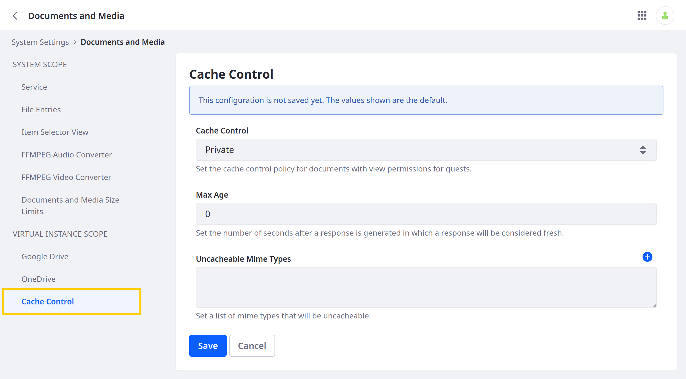

---
taxonomy-category-names:
- Digital Asset Management
- Documents and Media
- DXP Configuration
- Liferay Self-Hosted
- Liferay PaaS
- Liferay SaaS
uuid: c40b20e9-c296-4beb-9f33-62bb0ef39b9f
---

# Configuring Caching for Documents and Media

{bdg-secondary}`Liferay 7.3 U23+, Liferay 7.4 U21+, GA21+`

By default, Documents and Media files are not cached by browsers or servers. This is because file visibility generally depends on dynamic properties and configurations (e.g., permissions). However, you can enable and configure caching if desired.

!!! important
    Caching configurations only apply to documents that are visible to the Guest role.

Follow these steps to configure caching for your Liferay system or instance:

1. Open the *Global Menu* (), go to the *Control Panel* tab, and click *System Settings* or *Instance Settings*. See [Understanding Configuration Scope](../../../system-administration/configuring-liferay/understanding-configuration-scope.md) to learn more about scoping configurations.

1. Go to *Documents and Media* &rarr; *Cache Control*.

   

1. Select a *Cache Control* policy.

   - Private: Allows caching by a user's browser

   - Public: Allows caching by a CDN or proxy server

1. Set the *Max Age* for cached documents. This value determines the number of seconds a response is considered fresh. After the set time, the cached document version expires and requires refreshing. Leaving the value at `0` is equivalent to not specifying a value.

1. (Optional) Enter a list of MIME types to exclude from caching (e.g., `application/pdf`, `image/jpeg`, `video/mp4`).

   !!! tip
       If you have MIME types that are frequently updated, you can disable caching for that type to ensure the latest version of the file is displayed to users.

1. Click *Save*.

## Related Topics

- [Setting Storage Quotas for Documents and Media](./setting-storage-quotas-for-documents-and-media.md)
- [Configuring Documents and Media Preview](./configuring-documents-and-media-previews.md)
- [Cache](../../../liferay-development/building-applications/data-frameworks/cache.md)
