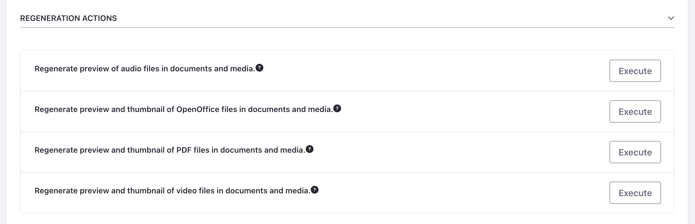

---
taxonomy-category-names:
- Digital Asset Management
- Documents and Media
- DXP Configuration
- Data Integration
- Liferay Self-Hosted
- Liferay PaaS
uuid: e1c9c81a-e2a8-492a-b61e-f3eb7b4c6d52
---

# Configuring Documents and Media Previews

{bdg-secondary}`Liferay 7.4 U84+/GA84+`

By default, Liferay uses [PDFBox](https://pdfbox.apache.org) to generate previews for files added to the document library. This is because PDFBox is the only 100% Java-based tool that can be distributed with DXP.

However, since PDFBox only supports a limited number of file types, Liferay also provides integration with third-party services to support additional file types. These services can be used to generate high quality file previews more quickly for more of your files.

!!! important
    To use third-party services to generate previews, you must first install them on the server running your Liferay instance.

Liferay currently supports integration with these services:

- [LibreOffice](http://www.libreoffice.org) or [OpenOffice](http://www.openoffice.org): These programs can be used in server mode to generate thumbnails and previews for supported file types (`.docx`, `.odt`, `.ppt`, `.odp`, etc.). You can also use them to convert documents and view them in your browser. See [Enabling OpenOffice/LibreOffice Integration](./enabling-openoffice-libreoffice-integration.md) to learn more.

- [ImageMagick](http://www.imagemagick.org) (also requires [Ghostscript](http://www.ghostscript.com)): These programs provide fast, high-quality previews and conversions for image files. See [Enabling ImageMagick and Ghostscript](../../../system-administration/using-the-server-administration-panel/configuring-external-services.md#enabling-imagemagick-and-ghostscript) for more information.

- [FFmpeg](http://ffmpeg.org/): This program provides support for audio and video files. In addition to generating file previews, you can play multimedia in your browser's native HTML 5 player. See [Enabling FFmpeg for Audio and Video Previews](./enabling-ffmpeg-for-audio-and-video-previews.md) for more information.

   !!! note
       Liferay 7.3.x and earlier versions use [Xuggler](http://www.xuggle.com/xuggler) for generating audio and video previews. See [Enabling Xuggler](../../../system-administration/using-the-server-administration-panel/configuring-external-services.md#enabling-xuggler) for more information.

With these services installed and configured, Documents and Media can provide in-application previews of most file types.

## Configuring Supported Media Types for ImageMagick

If you've installed ImageMagick, Adaptive Media can use it to generate alternative resolutions for images stored in the document library. By default, ImageMagick supports `avif`, `gif`, `heic`, `tiff`, and `webp` files, but you can add additional media types if needed. See [Adaptive Media Configuration Reference](../publishing-and-sharing/using-adaptive-media/adaptive-media-configuration-reference.md#imagemagick) for more information.

## Manually Generating Previews and Thumbnails

Once you've enabled third-party services, Liferay automatically uses them to generate previews and thumbnails for supported media types. However, if you've uploaded assets before enabling these services, you must generate the thumbnails and previews manually.

To generate them for image files, you can use Adaptive Media. See [Managing Image Resolutions](../publishing-and-sharing/using-adaptive-media/managing-image-resolutions.md) for more information.

For audio, video, PDF, and OpenOffice files, you can regenerate previews and thumbnails via the Server Administration application:

1. Open the *Global Menu* (  ), go to the *Control Panel* tab, and click *Server Administration*.

1. Go to the *Resources* tab.

1. Under Regeneration Options, click *Execute* for the desired media type.

   

This begins generating missing images for the documents. Running this process does not affect existing previews and thumbnails. If you want to regenerate all previews and thumbnails, first execute this clean-up action: *Reset preview and thumbnail files for documents and media*.

This process does not affect Adaptive Media previews and thumbnails for image files. To manage them, use [Adaptive Media](../publishing-and-sharing/using-adaptive-media.md).

## Related Topics

- [Managing Files](../uploading-and-managing/managing-files.md)
- [Documents and Media UI Reference](../documents-and-media-ui-reference.md)
- [Enabling OpenOffice/LibreOffice Integration](./enabling-openoffice-libreoffice-integration.md)
