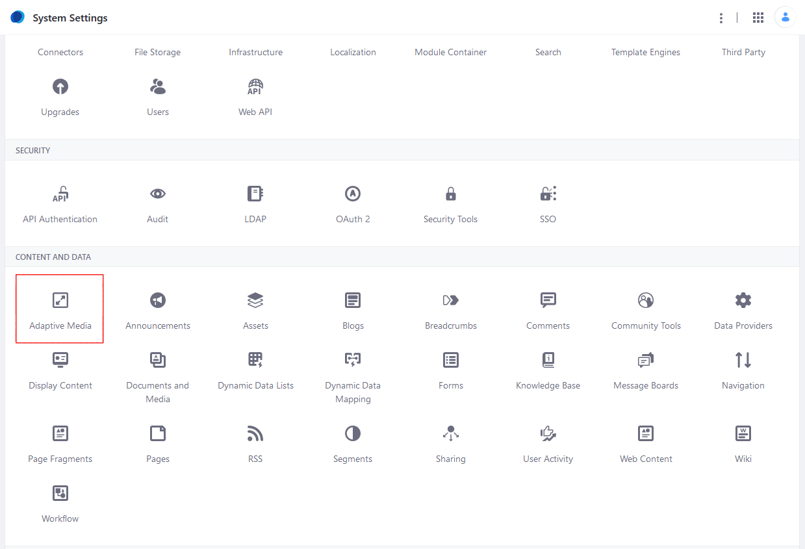
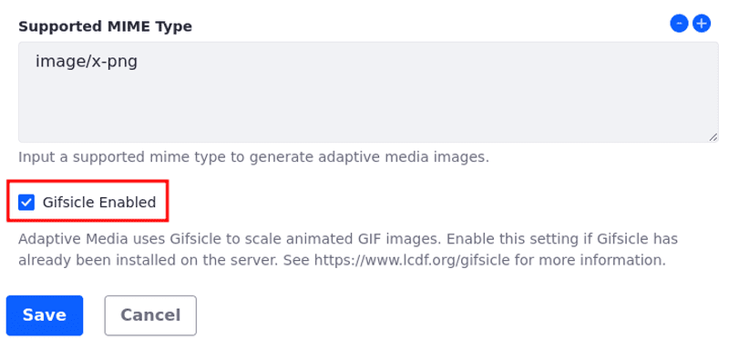

---
taxonomy-category-names:
- Digital Asset Management
- Documents and Media
- DXP Configuration
- Data Integration
- Liferay Self-Hosted
- Liferay PaaS
uuid: d94161ac-2456-4c2c-814b-1211ff270f94
---

# Enabling Optimization of Animated GIFs
<!--TASK: Relocate to Adaptive Media section. -->
To scale animated GIFs, Adaptive Media uses an external tool called [Gifsicle](https://www.lcdf.org/gifsicle/). If Gifsicle isn't installed and `image/gif` is included as a supported MIME type, Adaptive Media scales only one frame of the GIF, making a static GIF.

Optimizing animated GIFs using Adaptive Media requires three steps: installing Gifsicle on your local server where DXP is running, setting the `PATH` environment variable, and then enabling Gifsicle in DXP's *System Settings*.

1. Install [Gifsicle](https://www.lcdf.org/gifsicle/) and add it to path of the server environment.

1. Navigate to the *Global Menu* &rarr; *Control Panel*.

1. Click *System Settings*.

1. Click *Adaptive Media*.

   

1. Click *Images* in the left navigation under *System Scope*.

1. Scroll down and then click the box next to *Gifsicle Enabled*.

   

   <!-- If you tell people to click the box next to Gifsicle Enabled, your screenshot should show the box checked, and even possibly highlight that. -Rich -->

1. Click *Save* when finished.

## Related Topics

- [Using Adaptive Media](../publishing-and-sharing/using-adaptive-media.md)
- [Using Adapted Images in Site Content](../publishing-and-sharing/using-adaptive-media/using-adapted-images-in-site-content.md)
