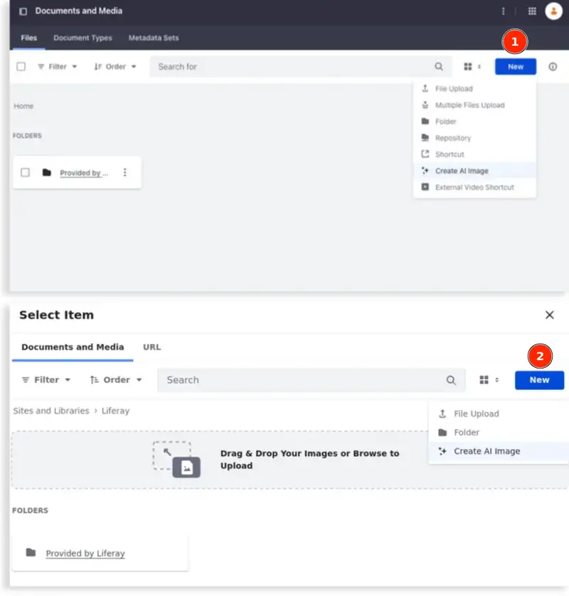
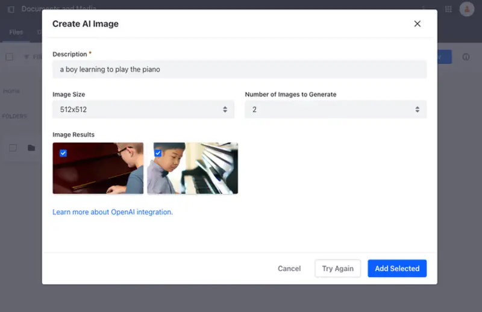

---
taxonomy-category-names:
- Digital Asset Management
- Documents and Media
- Liferay Self-Hosted
- Liferay PaaS
- Liferay SaaS
uuid: 61c12f13-b84c-4d35-80a4-cc58f2289cba
---

# Generating Images Using AI

{bdg-secondary}`Liferay DXP 2024.Q2+/Portal 7.4 GA126+`

!!! important
    ChatGPT integration for Documents and Media is currently behind a release feature flag (LPD-10793). Read [Release Feature Flags](../../system-administration/configuring-liferay/feature-flags.md#release-feature-flags) for more information.

The Documents and Media application provides integration with OpenAI's ChatGPT engine using the AI Creator tool. With an OpenAI API key configured for your instance or site, you can use the AI Creator tool and generate images throughout the portal.

## Enabling AI Creator

To begin, you must add an API key to authenticate your access to ChatGPT. You can [add it to a Liferay instance](#adding-an-api-key-to-a-liferay-instance) through *Instance Settings* or add it [to a specific site](#adding-an-api-key-to-a-specific-site).

### Adding an API Key to a Liferay Instance

1. Open the *Global Menu* () and navigate to the *Control Panel* tab &rarr; *Instance Settings* under Configuration.

1. Click *AI Creator* under Content and Data.

1. Paste your OpenAI API key into the *API Key* field.

1. Select *Enable DALL-E to Create Images*.

1. Click *Save*.

### Adding an API Key to a Specific Site

By adding an API key in the scope of a specific site, you can use different keys for each site or disable a key in a specific site.

1. Open the *Product Menu* () and select *Configuration* &rarr; *Site Settings*.

1. Click *AI Creator* under Content and Data.

1. Paste your OpenAI API key into the *API Key* field.

1. Select *Enable DALL-E to Create Images*.

1. Click *Save*.

!!! note
    You can enable or disable the Create AI Image button by toggling the Enable DALL-E to Create Images checkbox. If you choose to disable the feature, the Create AI Image button does not appear when creating a new document.

## Using The AI Creator

After [enabling the feature flag and configuring the API Key](#enabling-ai-creator), the Create AI Image button becomes available wherever you can add a new image whether it's in your Documents and Media application (1) or through the item selector on the Documents and Media tab (e.g., when adding an image in your WYSIWYG editors) (2).

To begin generating images in your Documents and Media application,

1. Open the *Site Menu* () and navigate to *Content & Data* &rarr; *Documents and Media*.

1. Click *New* and select *Create AI Image*.

1. In the modal window, fill in these three fields:

   - **Description**: The prompt or textual description that outlines the desired content, theme, or concept for the generated image.
   - **Image Size**: Choose an image size: 256x256, 512x512, or 1024x1024.
   - **Number of Images to Generate**: Determine how many images you want to create per request, up to a maximum of four images.

   !!! important
       Each request to generate content consumes [OpenAI API tokens](https://help.openai.com/en/articles/4936856-what-are-tokens-and-how-to-count-them). When your limit is reached, a generic error message will appear.

   

1. Click *Add Selected*.

1. (Optional) If you don't like any of the AI-generated content, click *Try Again* to regenerate it.

   Note that regenerating the images replaces existing ones. If you wish to keep any of the current images, be sure to save them before starting the image generation process again.

You can now begin using your generated images.

## Related Topics

- [Generating Text Content Using AI](../web-content/web-content-articles/generating-text-content-using-ai.md)
- [Uploading and Managing Documents and Media](./uploading-and-managing.md)