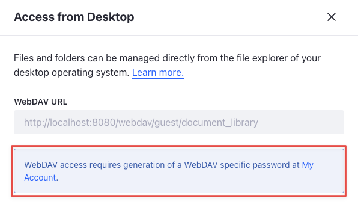
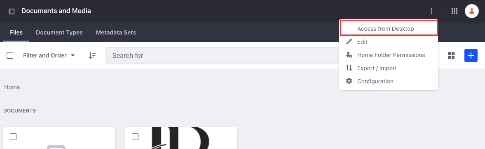
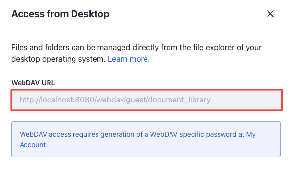

---
taxonomy-category-names:
- Digital Asset Management
- Documents and Media
- Liferay Self-Hosted
- Liferay PaaS
- Liferay SaaS
uuid: 5d20bacf-bf93-4c17-86b7-fc55128da63d
---
# Accessing Documents with WebDAV

You can access the Document Library from your desktop file manager via [WebDAV](https://en.wikipedia.org/wiki/WebDAV). WebDAV is a protocol based on HTTP for managing files stored on web servers. WebDAV is supported by most major operating systems and desktop environments, including Linux, macOS, and Windows.

To access the Document Library folder from a file browser, you must use your log-in credentials and the WebDAV URL of the folder you want to access.

## Generating WebDAV Password 

{bdg-secondary}`Liferay DXP 2023.Q4+/Portal 7.4 GA98+`

In the latest Liferay versions, you must generate a WebDAV password from your account settings to use in your WebDAV client. This is to avoid storing weak hashes used in digest authentication by WebDAV. Digest authentication is insecure and deprecated in Liferay. When trying to access a document through WebDAV for the first time, you're prompted to generate a WebDAV password. 

To generate a WebDAV password,

1. Click on the user-icon from your site's home page and select *Account Settings*.

1. Select *Password* from the left-menu.

1. Scroll down to the *WEBDAV PASSWORD* section and click *Generate WebDAV Password*.

   

   This displays your WebDAV username and an auto-generated password. This is a read-only field, so you must copy it for future use. If you click the button to generate the WebDAV password again, it generates a new one, rendering the existing one useless. 

Now, [follow the instructions below](#using-the-webdav-client-to-access-documents) and use the WebDAV username and password when prompted. 

## Using the WebDAV Client to Access Documents

1. Open the Documents and Media application in the desired Site or Asset Library.

1. Click the *Actions* button for the desired folder () and select *Access from Desktop*.

   

1. Copy the folder's unique *WebDAV URL*.

   

1. Follow the instructions for your operating system.

   * **Windows:** Map a network drive to the WebDAV URL. Enter your credentials when prompted. Once authenticated, the Document Library folder appears as a network drive.

   * **macOS:** Open Finder and select *Go* &rarr; *Connect to Server*. In the Server Address field, enter the WebDAV URL of the folder you want to access, then click *Connect* and enter your credentials when prompted.

   * **Linux:** For Linux, you must slightly modify the folder's WebDAV URL. For KDE Dolphin, change the URL's protocol to `webdav://` instead of `http://`. For GNOME Files, change the URL's protocol to `dav://` instead of `http://`. Paste the modified URL in your file manager, press *Enter*, and enter your credentials when prompted.

Once set up, you can use your operating system's file browser to add, edit, and delete files in the connected Documents and Media folder. If you edit a file in this folder on your file system, all changes appear in Liferay and the file's minor version is incremented.

## Related Topics

* [Enabling and Configuring Document Sharing](./managing-document-access/enabling-and-configuring-sharing.md)
* [Sharing Documents with Other Users](./managing-document-access/sharing-documents-with-other-users.md)
* [Using Folders](../uploading-and-managing/using-folders.md)
* [Documents and Media UI Reference](../documents-and-media-ui-reference.md)
