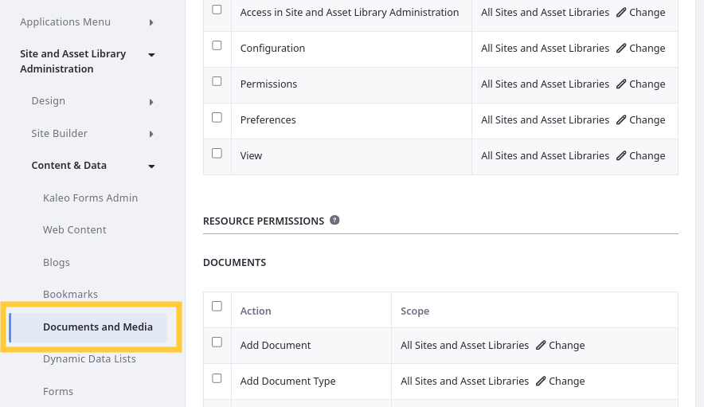
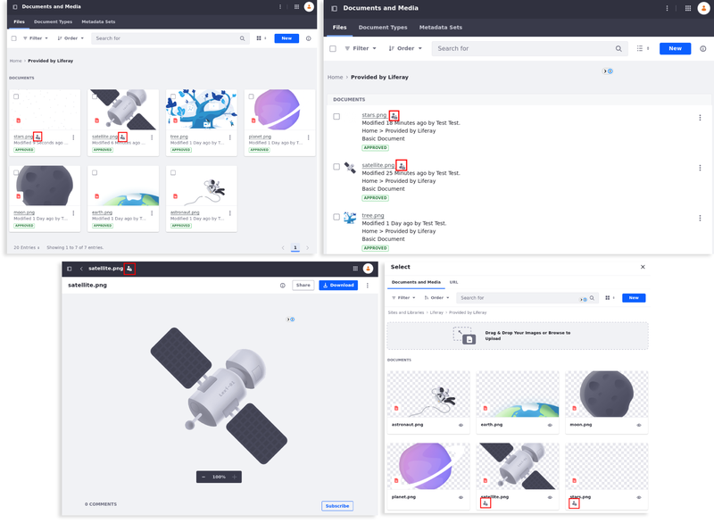

---
taxonomy-category-names:
- Digital Asset Management
- Documents and Media
- Liferay Self-Hosted
- Liferay PaaS
- Liferay SaaS
uuid: 0c78ca39-eaf4-43a3-86e2-9a9fabdfc640
---

# Documents and Media Permissions Reference

{bdg-secondary}`Liferay 7.4 U76+/GA76+`

Manage access to Documents and Media assets using [application](#general-permissions) and [resource](#resource-permissions) permissions. With role-based access control, you can ensure only the intended users can create, view, download, and manage documents.

You can grant these permissions in the Roles application under Content & Data in the permissions side panel.

Alternatively, you can assign individual resource permissions in the Documents and Media application.

See [Defining Role Permissions](../../../../users-and-permissions/roles-and-permissions/defining-role-permissions.md) for more information.

## General Permissions

General permissions grant access to the Documents and Media application itself and do not grant [resource-related permissions](#resource-permissions).

| Permission                                      | Description                                                                                                                              |
|:------------------------------------------------|:-----------------------------------------------------------------------------------------------------------------------------------------|
| Access in Site and Asset Library Administration | Access the Documents and Media application in the Site Menu (  ) or Asset Library. |
| Configuration                                   | View and modify configuration options for Documents and Media.                                                                           |
| Permissions                                     | View and modify application permissions for Documents and Media.                                                                         |
| Preferences                                     | N/A                                                                                                                                      |
| View                                            | View the Documents and Media application page.                                                                                           |

{bdg-secondary}`{bdg-secondary}Liferay DXP 2024.Q3+/Portal 7.4 GA132+` When a document has restricted visibility, the Not Visible to Guest Users icon () is displayed next to the document's name in various situations, such as in the Documents and Media application while in List, Table, or Cards view modes,  when editing the document, or when selecting a document to display it on a page.

!!! tip
    If the Not Visible to Guest Users icon does not appear after managing the view permission for documents in the Documents and Media application, try refreshing your page.

## Resource Permissions

Resource permissions grant access to view and act on resources in the Documents and Media application. Some of these permissions are for [creating entities](#documents), while others are for acting on existing entities (e.g., [folders](#documents-folder), [documents](#document)).

### Documents

| Permission        | Description                                                                                    |
|:------------------|:-----------------------------------------------------------------------------------------------|
| Add Document      | Add documents in Documents and Media.                                                          |
| Add Document Type | Add document types in Documents and Media.                                                     |
| Add Folder        | Add folders in Documents and Media.                                                            |
| Add Repository    | Add repositories in Documents and Media.                                                       |
| Add Shortcut      | Add shortcuts (links) to files and external videos in Documents and Media.                     |
| Add Metadata Set  | Add metadata sets in Documents and Media.                                                      |
| Permissions       | View and modify permissions related to creating and managing resources (e.g., folders, files). |
| Subscribe         | Subscribe to receive email notifications for resource events.                                  |
| Update            | Edit resources in Documents and Media.                                                         |
| View              | View resources in Documents and Media.                                                         |

### Documents Folder

| Permission    | Description                                                                              |
|:--------------|:-----------------------------------------------------------------------------------------|
| Access        | Access folder contents.                                                                  |
| Add Document  | Add documents to folders.                                                                |
| Add Shortcut  | Add shortcuts (links) to any file in folders that the role is authorized to view.        |
| Add Subfolder | Add sub-folders to folders.                                                              |
| Delete        | Move folders to the recycle bin.                                                         |
| Permissions   | View and modify folder permissions.                                                      |
| Subscribe     | Subscribe to receive email notifications when files are added to or modified in folders. |
| Update        | Edit or move folders.                                                                    |
| View          | View folders.                                                                            |

### Document

| Permission        | Description                                                                                                                                                                                                          |
|:------------------|:---------------------------------------------------------------------------------------------------------------------------------------------------------------------------------------------------------------------|
| Add Discussion    | Add comments to documents.                                                                                                                                                                                           |
| Delete            | Move documents to the recycle bin.                                                                                                                                                                                   |
| Delete Discussion | Delete comments from documents.                                                                                                                                                                                      |
| Download          | Download documents.                                                                                                                                                                                                  |
| Override Checkout | Make changes to documents even when checked out by another user.                                                                                                                                               |
| Permissions       | View and modify document permissions.                                                                                                                                                                                |
| Update            | Edit or move documents.                                                                                                                                                                                              |
| Update Discussion | Edit document comments.                                                                                                                                                                                              |
| View              | View documents. Users with this permission can view all document metadata (e.g., title, description, adaptive media images, previews, thumbnails) and anything defined in attached document types and metadata sets. |

!!! important
    For Liferay 7.4 U75/GA75 and earlier versions, the view permission grants users permission to download assets. For 7.4 U76+/GA76+, Documents and Media includes a separate download permission, so you can manage view and download access separately. When upgrading, Liferay automatically assigns the download permission to all roles with the view permission. By default all users, including unauthenticated users, can download files. If you want to limit download access, you must remove this permission from roles that should not be able to download files.

### Shortcut

| Permission  | Description                           |
|:------------|:--------------------------------------|
| Delete      | Move shortcuts to the recycle bin.    |
| Permissions | View and modify shortcut permissions. |
| Update      | Edit or move shortcuts.               |
| View        | View shortcuts.                       |

### Document Type

| Permission  | Description                                     |
|:------------|:------------------------------------------------|
| Delete      | Permanently remove document types.              |
| Permissions | View and modify permissions for document types. |
| Update      | Edit document types.                            |
| View        | View document types.                            |

### Document Metadata

| Permission  | Description                                    |
|:------------|:-----------------------------------------------|
| Delete      | Permanently remove metadata sets.              |
| Permissions | View and modify permissions for metadata sets. |
| Update      | Edit metadata sets.                            |
| View        | View metadata sets.                            |

## Related Topics

- [Managing Document Access](./permissions-and-documents.md)
- [Defining Role Permissions](../../../../users-and-permissions/roles-and-permissions/defining-role-permissions.md)
