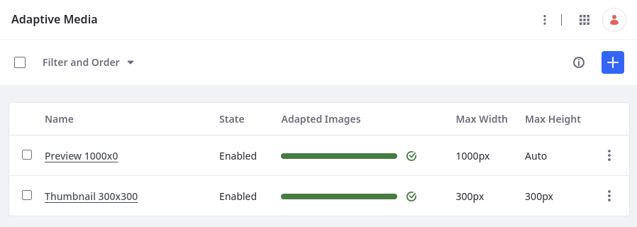

---
taxonomy-category-names:
- Digital Asset Management
- Documents and Media
- Liferay Self-Hosted
- Liferay PaaS
- Liferay SaaS
uuid: 6a806e17-5e0c-4a78-a022-2bf7f8b4a532
---

# Adding Image Resolutions

By default, Adaptive Media includes two image resolutions: preview and thumbnail. You can define additional image resolutions to help optimize site performance for common devices (e.g., desktops, laptops, tablets, mobile phones). When you upload an image, Adaptive Media uses the existing resolutions to generate each version of the image automatically.

All generated images maintain the original aspect ratio. If images are uploaded before you add custom resolutions, you must [manually generate](./managing-image-resolutions.md#manually-generating-adapted-images) the resolution version for those images.

!!! important
    Generating additional resolutions requires more computational resources and storage space. To optimize performance, you can configure the max number of asynchronous processes and available core processes. See [Adaptive Media Configuration Reference](./adaptive-media-configuration-reference.md#processes) for more information.

## Adding a New Image Resolution

1. Open the *Global Menu* (), go to the *Control Panel* tab, and click *Adaptive Media*.

1. Click *Add* ().

1. Enter a unique name and description.

1. Enter a *Max Width* and/or *Max Height* in pixels.

   If you leave a measurement blank, its value is set to `auto`.

1. Determine whether to add a resolution for high pixel density displays (HiDPI).

   Selecting this option creates an additional resolution that doubles the set size. This resolution uses the same name as the current resolution and adds the `-2x` suffix to it.

1. Determine the resolution's identifier:

   **Automatic** (Default): Uses a kebab-case value based on the name field.

   **Custom**: Enter a custom value.

   Third party applications can use this ID to obtain images for the resolution via Adaptive Media's APIs.

   

1. Click *Save*.

While the resolution is enabled, Adaptive Media uses it to generates images for all new uploads. You can also [manually generate](./managing-image-resolutions.md#manually-generating-adapted-images) adapted images for previously uploaded images.

!!! important
    Image resolutions and their identifiers cannot be updated if the resolution has been used to adapt images. This prevents inconsistencies in generated images.

## Related Topics

- [Managing Image Resolutions](./managing-image-resolutions.md)
- [Adaptive Media Configuration Reference](./adaptive-media-configuration-reference.md)
