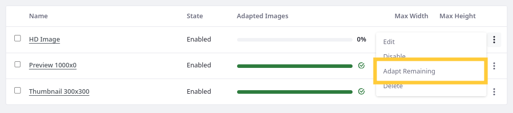
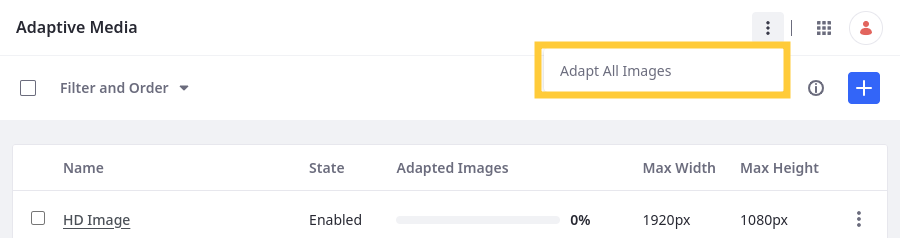
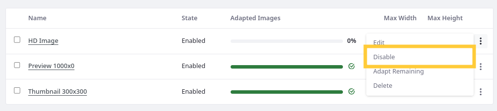
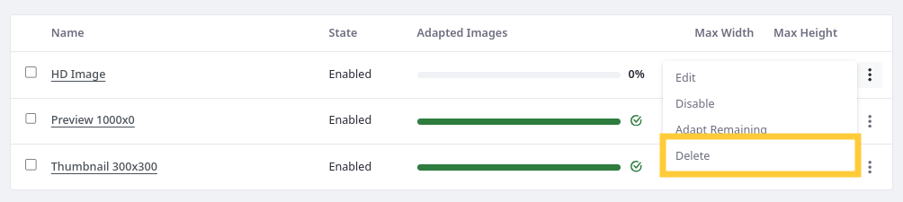

---
taxonomy-category-names:
- Digital Asset Management
- Documents and Media
- Liferay Self-Hosted
- Liferay PaaS
- Liferay SaaS
uuid: 2246ec82-1b99-4c94-a3ba-8a73f1c9ab46
---

# Managing Image Resolutions

You can manage adapted image resolutions via the Adaptive Media application. This includes manually generating adapted images, disabling/enabling resolutions, as well as deleting resolutions with their images.

## Editing Image Resolutions

You cannot edit a resolution's size and identifier if Adaptive Media has used it to generate adapted images. This prevents inconsistencies in generated images. If you must change the values of a resolution with adapted images, you must [delete](#deleting-image-resolutions) the resolution and [create](./adding-image-resolutions.md) a new one.

## Manually Generating Adapted Images

If you've uploaded images before adding or enabling resolutions, you must manually generate adapted images for each one. The percentage of adapted images appears in the application table.

To manually generate images for a resolution,

1. Open the *Global Menu* (), go to the *Control Panel* tab, and click *Adaptive Media*.

1. Click *Actions* () for the desired resolution and select *Adapt Remaining*.

   

   Alternatively, you can click *Actions* () in the Application Bar and select *Adapt All Images* to begin generating images for all enabled resolutions.

   

Adaptive Media begins generating the images for each resolution asynchronously according to your [processing configuration](./adaptive-media-configuration-reference.md#processes).

## Disabling and Enabling Image Resolutions

Image resolutions are enabled by default, but you can disable them at any time. Disabling a resolution prevents Adaptive Media from using it to generate images, but images previously generated for the resolution remain available.

To disable/re-enable a resolution,

1. Click *Actions* () for the desired resolution.

1. Select *Disable*/*Enable*.

   

While disabled, Adaptive Media doesn't use the resolution to generate adapted images.

If you upload images and later re-enable a resolution, you must [manually generate](#manually-generating-adapted-images) adapted images for them.

## Deleting Image Resolutions

If you must delete an Image Resolution, you must first disable it. You cannot delete enabled resolutions. This prevents the accidental deletion of image resolutions.

!!! warning
    Be careful when deleting image resolutions. Once deleted, the resolution's adapted images are irretrievably lost and are not replaced automatically by new image resolutions you create.

To delete an image resolution,

1. Click *Actions* () for a disabled resolution.

1. Select *Delete*.

   

The resolution has been permanently removed along with its adapted images.

## The Recycle Bin and Adapted Images

You can't move adapted images directly to the [Recycle Bin](../../../recycle-bin/recycle-bin-overview.md). But if the original image is in the Recycle Bin, the corresponding adapted images behave as if they are in the Recycle Bin and users can't view them. URLs pointing to these adapted images return a `404` error code.

If the original image is restored from the Recycle Bin, the adapted images are accessible again.

## Related Topics

- [Adding Image Resolutions](./adding-image-resolutions.md)
- [Adaptive Media Configuration Reference](./adaptive-media-configuration-reference.md)
- [Migrating Documents and Media Thumbnails](./migrating-documents-and-media-thumbnails.md)
