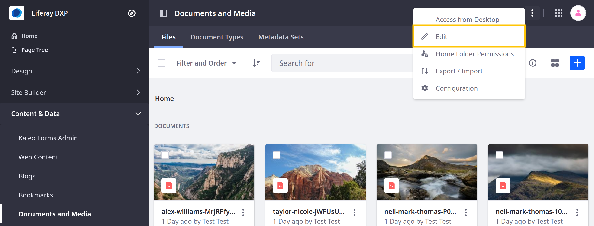
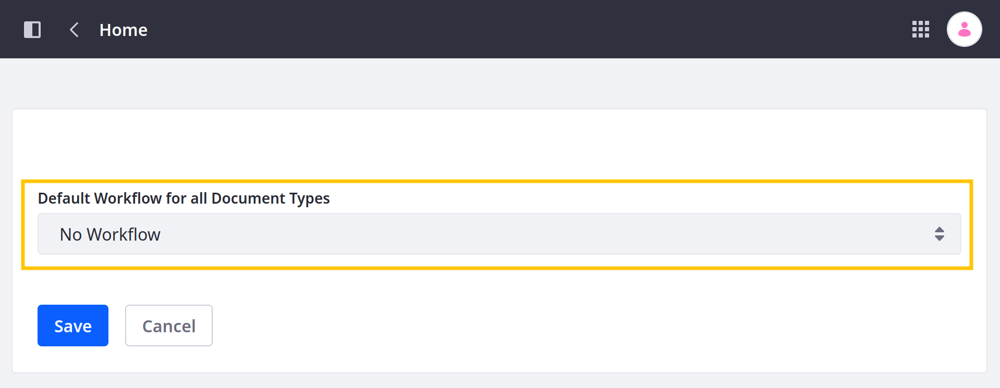
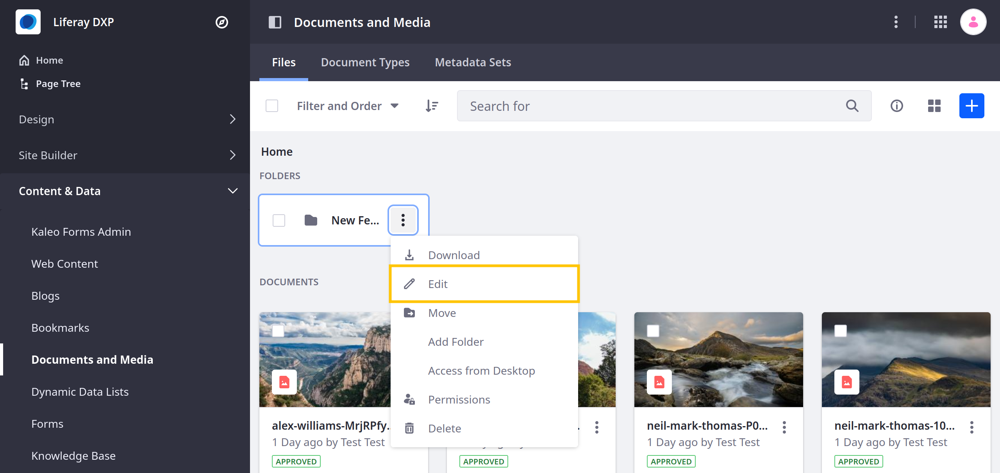

---
taxonomy-category-names:
- Digital Asset Management
- Documents and Media
- Workflow
- Liferay Self-Hosted
- Liferay PaaS
- Liferay SaaS
uuid: a164df22-46f5-4b1f-9ec5-ed18c3466897
---
# Using Workflow with Documents and Media

Documents and Media is fully integrated with Liferay's [workflow engine](../../../process-automation/workflow/introduction-to-workflow.md). This means you can define custom review and approval processes for your files. In addition to standard workflow capabilities, Documents and Media also supports using multiple workflows. You can set a default workflow for all document types and configure individual folders to use alternative workflows for specific document types.

Consider a scenario where you've defined different [document types](../uploading-and-managing/managing-metadata/defining-document-types.md) for marketing, legal, and accounting files. Due to their content, each document type must go through a specific review and approval process. To achieve this, you can [create a custom workflow](../../../process-automation/workflow/designing-and-managing-workflows/workflow-designer.md) for each type and then configure your Documents and Media folders to use the custom workflows. Also, if you need all other document types to go through the same review and approval process, you can set a default workflow for your Documents and Media root folder.

## Enabling a Default Workflow

Follow these steps to enable a default Workflow for all document types:

1. Open the *Documents and Media* application in the desired Site or Asset Library.

1. From the root folder (i.e., Home), click the *Actions* button () in the Application Bar and select *Edit*.

   

1. Select the desired *Workflow* from the dropdown menu.

   

1. Click *Save*.

This enables a default workflow for all document types in your Site or Asset Library. Now whenever users upload or edit files, the *Publish* button is replaced with a *Submit for Workflow* button. If needed, you can override this workflow for individual folders. See [Enabling Alternative Workflows for Folders and Document Types](#enabling-alternative-workflows-for-folders-and-document-types) for more information.

## Enabling Alternative Workflows for Folders and Document Types

Follow these steps to enable or disable a workflow for individual folders and document types:

1. Open the *Documents and Media* application in the desired Site or Asset Library.

1. Click the *Actions* button () for the desired folder and select *Edit*.

   

1. Under *Document Type Restrictions and Workflow*, select the desired configuration:

   **Use Document Type Restrictions and Workflow of the Parent Folder (parent-folder)**: Use the parent folder's configuration. This is the default value.

   **Define Specific Document Type Restrictions and Workflow for this Folder (current-folder)**: Select a *custom workflow* for individual document types, or select *No Workflow* to disable the default workflow for individual types.

   **Default Workflow for This Folder (current-folder)**: Select a default Workflow for the current folder. This applies the workflow for all files in the folder, regardless of document type.

   

1. Click *Save*.

This enables the chosen workflows for the selected folder and document types.

## Related Topics

* [Workflow Designer](../../../process-automation/workflow/designing-and-managing-workflows/workflow-designer.md)
* [Documents and Media UI Reference](../documents-and-media-ui-reference.md)
