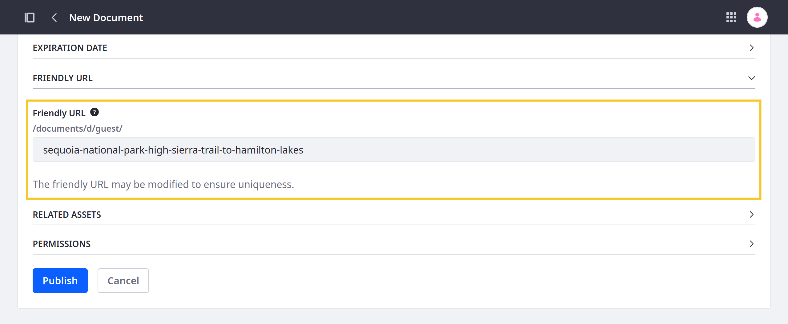
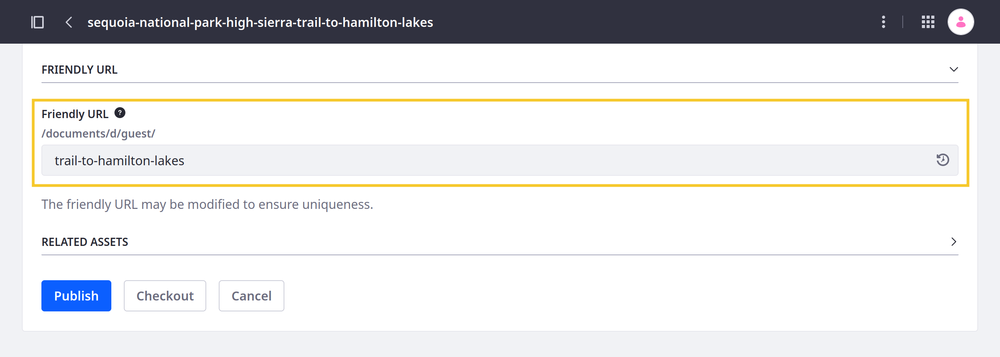
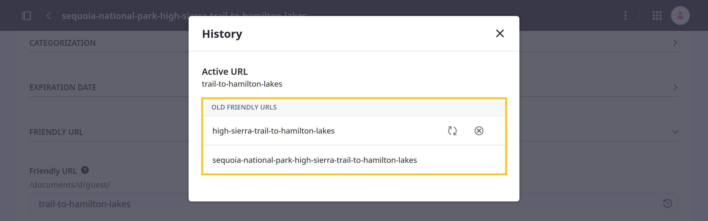
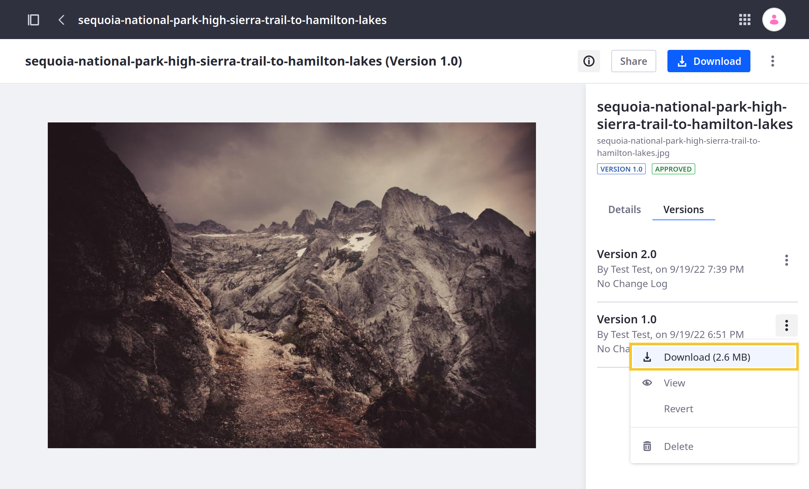

---
taxonomy-category-names:
    - Digital Asset Management
    - Documents and Media
    - Liferay Self-Hosted
    - Liferay PaaS
    - Liferay SaaS
uuid: a266c23a-5c23-4de6-a818-21e83f79cb1e
---

# Configuring Document URLs
{bdg-secondary}`Liferay 7.4 U27+/GA27+`

When a file is uploaded, Liferay automatically generates a friendly URL for accessing it. This URL uses the following structure: `[server-address]/documents/d/[site's friendly url]/[file-friendly-URL]`. Unless specified during upload, Liferay uses the file's name for the friendly URL, but you can change this value at any time. Once set, you can access the latest version of the file at its friendly URL.

!!! note
    For 7.4 U26/GA26 and earlier versions, Liferay generates file URLs using the following structure: `[server-address]/documents/[site-id]/[folder-id]/[file-name]/[UUID]`. If you're updating to U27+/GA27+, existing files continue to use their old URLs based on this pattern. If, however, a user updates an existing file, Liferay converts its URL to use the new structure. Until updated, you can continue to access your files using their old URLs.

## Setting Friendly URLs for Documents

You can configure a file's friendly URL manually during [file upload](./uploading-files.md) or whenever editing the file.

!!! note
    When uploading multiple files, each file's friendly URL is generated automatically using its name.

To set a file's friendly URL,

1. Open the *Site Menu* (), expand *Content & Data*, and go to *Documents and Media*.

1. Begin uploading or editing the desired file.

1. Edit the *Friendly URL* field.

   Each URL value must be unique per site. If a value is already in use, Liferay automatically resolves the conflict by adding a numeric value to the end of the URL (e.g., `my-file`, `my-file-1`, `my-file-2`).

   

1. Click *Publish*.

Once saved, you can access the file at the designated URL (e.g., `http://[server-address]/documents/d/[site-friendly-url]/[file-friendly-URL]`).

## Friendly URL History

When you change a file's friendly URL, Liferay automatically stores its previous values. As long as old URLs remain in the file's history, you can use them to access the latest version of the file, and other files in the same site cannot use them. To reuse an old URL for another file, you must remove it from the file's friendly URL history.

!!! note
    By default, friendly URL redirects are temporary (302), but you can set them to permanent (301) if needed. See [Configuring Friendly URL Redirects](../../../site-building/site-settings/managing-site-urls/configuring-friendly-url-redirects.md) for more information.

To view and manage retained URLs for a file,

1. Open the *Site Menu* (), expand *Content & Data*, and go to *Documents and Media*.

1. Click *Actions* () for the desired file and select *Edit*.

1. Click *History* () in the Friendly URL field.

   

1. Click *Restore* () to replace the current friendly URL with the selected URL.

1. Click *Forget URL* () to remove the selected URL from the file's history. Once removed, you can no longer use the URL to access the file.

   

Changes to the friendly URL history are saved automatically.

!!! note
    Beginning with Liferay 7.4 U34/GA34, the display page template framework takes into account each file's friendly URL history. This means users can continue to access a file's display page using old friendly URLs, provided those URLs remain in the file's friendly URL history. All URLs in the file's friendly URL history are redirected automatically to the file's current URL.

    When the file is on the same site as its display page template, the file's friendly URL is appended to the display page URL (i.e., `display-page-url/file-friendly-url`). However, to avoid duplicate URLs, if the file is in a different site or asset library from the template, the URL pattern also includes the friendly URL of the file's site or asset library (i.e., `display-page-url/site-friendly-url/document-friendly-url`).

## Document Version URLs

All file friendly URLs lead to the latest version of the file. If you want to access the URL for previous versions, navigate to the file's version history and copy the *download* URL for the desired version.

## Related Topics

- [Documents and Media](../../documents-and-media.md)
- [Uploading Files](./uploading-files.md)
- [Configuring Your Site's Friendly URL](../../../site-building/site-settings/managing-site-urls/configuring-your-sites-friendly-url.md)
- [Configuring Your Page's Friendly URL](../../../site-building/creating-pages/page-settings/configuring-your-pages-friendly-url.md)
