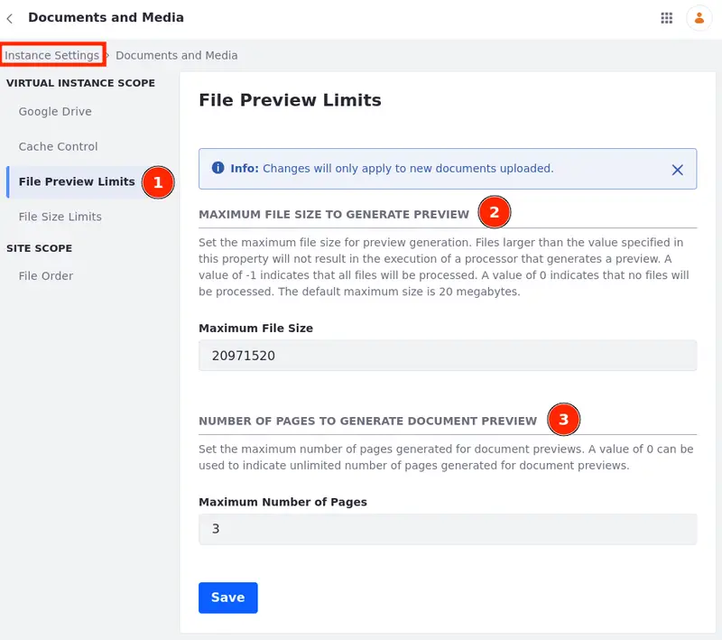

---
taxonomy-category-names:
    - Digital Asset Management
    - Documents and Media
    - Liferay Self-Hosted
    - Liferay PaaS
    - Liferay SaaS
uuid: 91bdb111-e5f0-4ac1-a1cf-5e3dd020a7e6
---
# Configuring Limits for File Previews
{bdg-secondary}`Liferay DXP 2024.Q1 U112`

You can preview certain documents (e.g. PDF or text files) in the Documents and Media application. In some cases, you might want to limit the number of pages a user can preview.

For instance, depending on the number of documents and the number of pages, the previews can take a large amount of storage. You can save a significant amount of storage, by applying a limit to the number of previewed pages.

Or a user may only need the front page of a document where there is a summary of a contract. In this case, you can set the number of previewed pages to 1 and show users only the front page.

!!! note
    Changes in the file preview limits only affect new files.

To configure the file preview and limit the number of previewed pages,

1. Open the *Global Menu* () and select the *Control Panel* tab.

1. Select *System Settings* or *Instance Settings*.

   You can apply global rules at the system level and apply more restrictive configurations at an instance level.

   For example, you can limit the maximum number of previewed pages to 10 at the system level, but you can set a value of 10 or fewer pages at an instance level.

1. Click *Documents and Media* under Content and Data.

1. On the left menu, select *File Preview Limits* (1).

1. Set the maximum file size for generating previews. Any file larger than the specified value does not have its preview generated.

   The size value is in bytes and the default maximum size is 20 megabytes.

   Use `-1` to enable previews to all files.

   Use `0` to disable previews to all files.

1. Set the number of pages shown in your preview.

   Use `0` to show all pages.

Once the file preview limits are set, users will see a message, while previewing a document, indicating that the preview may not show all pages.

## Related Topics

- [Documents and Media](../../documents-and-media.md)
- [Uploading and Managing](../uploading-and-managing.md)