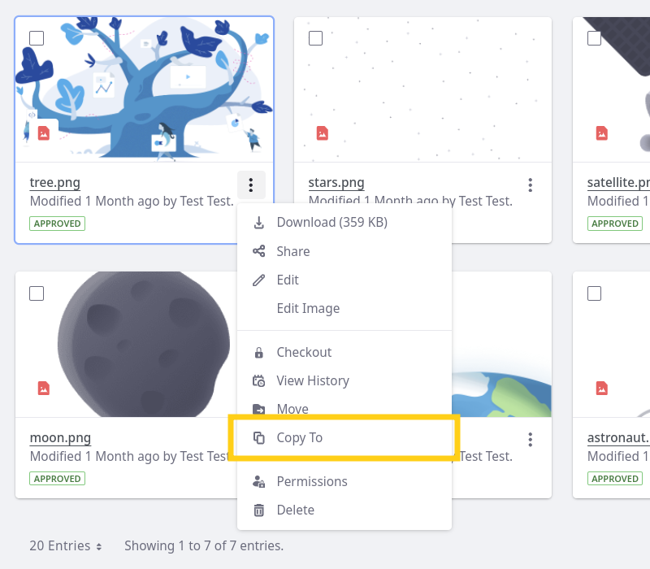
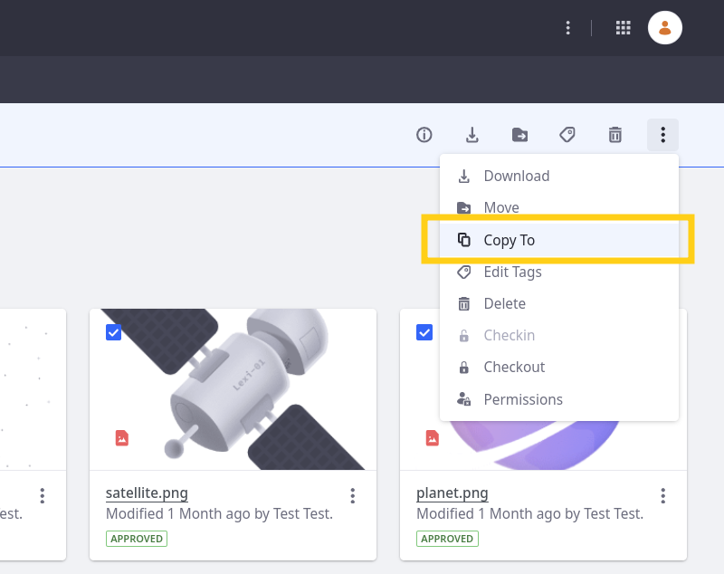
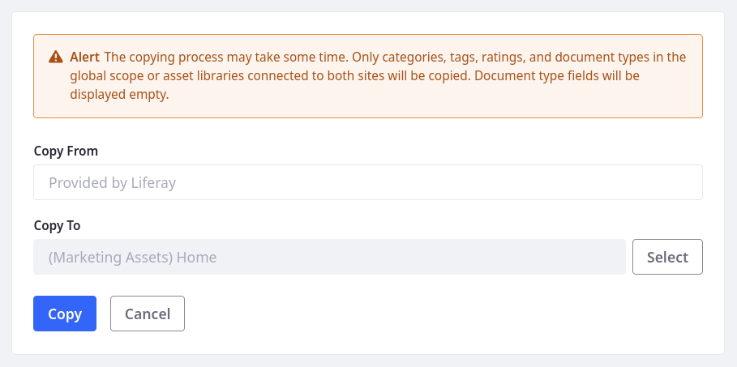
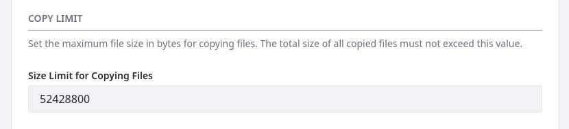

---
taxonomy-category-names:
  - Digital Asset Management
  - Documents and Media
  - Liferay Self-Hosted
  - Liferay PaaS
  - Liferay SaaS
uuid: b538b1f3-7797-4185-8260-116135c69df4
---

# Copying Folders and Documents

{bdg-secondary}`Liferay 7.4 2024.Q1`

With Documents and Media, you can copy folders, files, and shortcuts between [sites](../../../site-building/sites.md) and connected [asset libraries](../../asset-libraries.md). This can help accelerate projects by quickly duplicating structures across contexts.

Before copying your content, ensure the destination site or asset library has access to the copied files' tags, categories, or custom [document types](./managing-metadata/defining-document-types.md). Otherwise a file's tags and categories are removed, and Liferay uses the Basic Document type for it.

!!! note
    File metadata and related entities (e.g., comments, subscriptions) are not copied. To copy documents with their related entities, you must use the site's [export/import](../../../site-building/sites/exporting-importing-site-pages-and-content.md) feature.

Copying content within Documents and Media requires specific permissions: View permissions in the origin site or asset library and Add permissions in the destination.

See [Documents and Media Permissions Reference](../publishing-and-sharing/managing-document-access/documents-and-media-permissions-reference.md#documents) for more information.

## Copying Between Sites and Asset Libraries

1. Navigate to the desired folder in the Documents and Media application.

1. To copy a single folder, file, or shortcut, click its *Actions* () and select *Copy To*.

   

   To copy in bulk, select multiple items and click *Copy To* in the document management toolbar.

   

1. Determine a destination for the copied items. This destination can be any site or connected asset library that you can access.

   

1. Click *Copy* to execute the operation.

## Setting Copy Size Limit

Depending on the size of the files, copying can be resource intensive. You can reduce the impact on system resources by setting a size limit for copy operations.

1. Open the *Global Menu* (), go to the *Control Panel* tab, and click *System Settings* or *Instance Settings*.

1. Go to *Documents and Media* &rarr; *File Size Limits*.

1. Enter a size limit for copy operations. The default value is `52428800` bytes.

   

1. Click *Save*.

Now copy operations cannot exceed the set limit.

## Related Topics

- [Uploading Files](./uploading-files.md)
- [Managing Files](./managing-files.md)
- [Documents and Media Permissions Reference](../publishing-and-sharing/managing-document-access/documents-and-media-permissions-reference.md)
