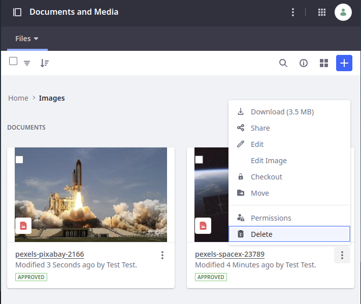
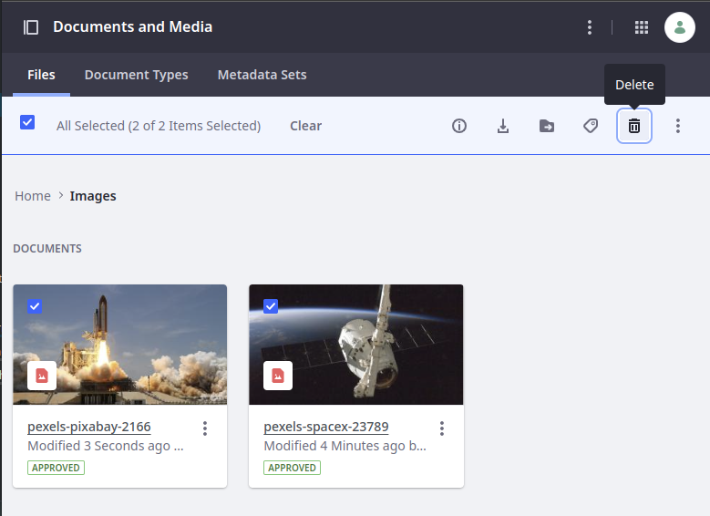

---
taxonomy-category-names:
- Digital Asset Management
- Documents and Media
- Liferay Self-Hosted
- Liferay PaaS
- Liferay SaaS
uuid: eaf4ad1a-53ef-47a1-aaad-049fd486675d
---

# Deleting Files

Delete files using the Documents and Media application.

## Deleting a Single File

1. Locate the file you wish to delete.

1. Click *Actions* () and select *Delete*.

## Deleting Multiple Files

1. Check the checkbox for every file you wish to delete.

1. Click *Trash* () at the top menu bar to Delete files.

## Related Topics

- [Managing Files](./managing-files.md)
