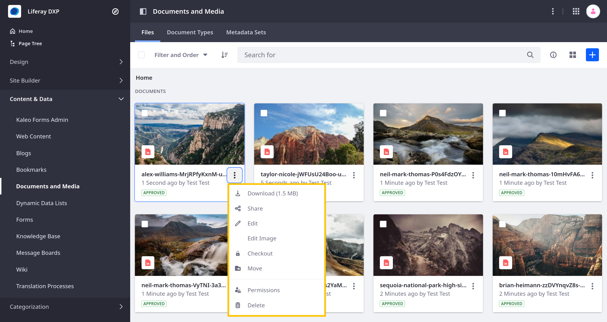

---
toc:
  - ./editing-images/editing-images-for-liferay-73-and-earlier-versions.md
taxonomy-category-names:
- Digital Asset Management
- Documents and Media
- Liferay Self-Hosted
- Liferay PaaS
- Liferay SaaS
uuid: 1ea4d152-3732-45a9-b3ca-bddf38ca983c
---

# Editing Images

Liferay's Documents and Media includes a built-in image editor for cropping and rotating images without switching contexts.

To use the image editor, open Documents and Media, click *Actions* () for the desired image, and select *Edit Image*.

When editing an image in Documents and Media, you have these options:

**Crop**: Manually adjust the cropping frame; click and drag the image to reposition it within the cropping frame.

**Ratio**: Select a fixed preset ratio for cropping the image (i.e., 16:10, 16:9, 4:3, 1:1, 2:3), or select *Free* to create a custom image ratio.

**Rotate**: Rotate image clockwise.

**Zoom**: Adjust image zoom without changing aspect ratio; maximum zoom is 200% and minimum is 12.5%.

**Cancel**: Undo all unsaved changes and exit image edit mode.

**Save**: Save all changes made to the image; this overwrites the existing image file.

## Related Topics

- [Documents and Media](../../documents-and-media.md)
- [Uploading Files](./uploading-files.md)
- [Managing Files](./managing-files.md)
