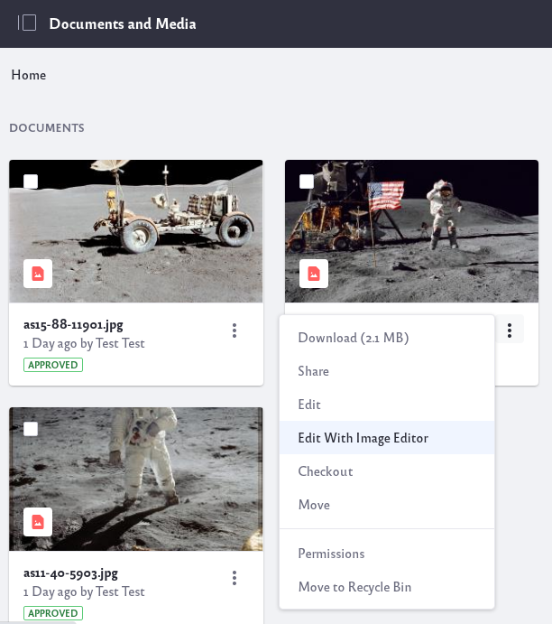
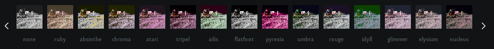
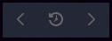

---
taxonomy-category-names:
- Digital Asset Management
- Documents and Media
- Liferay Self-Hosted
- Liferay PaaS
- Liferay SaaS
uuid: 7a2fa130-73d1-49b8-9dfd-17e5935c6d91
---

# For Liferay 7.3.x and Earlier

The Documents and Media application comes with a built-in image editor. Edit images right from your browser and apply filters, adjust contrast, or crop.

In the Documents and Media application, locate the image. Click the Options icon () and select *Edit With Image Editor*.

The image editor offers a minimal, user-friendly UI with the following tools.

## Effects Tool (Filters)

Select from and apply predefined filters to your image.

## Transform Tools (Transform Option)

**Rotate**: Rotates the image to the left or right, in 90 degree increments.

**Resize**: Resizes the image in pixels. If the lock is closed, the aspect ratio remains locked, and changing either width or height automatically adjust the other dimension to maintain the aspect ratio. When the lock is opened, the width and height can be changed individually, allowing the aspect ratio to be altered.

**Crop**: Reframes the image by removing the outer portions.

## Adjustment Tools (Color Adjustment)

**Saturation**: Adjusts the color saturation in the image. The default value of 50 is the current saturation. The slider values range from 0 (completely desaturated) to 100 (completely saturated).

**Contrast**: Adjusts the difference between highlights and shadows. The default value of 50 is the current contrast. The slider values range from 0 (no contrast) to 100 (full contrast).

**Brightness**: Adjusts the amount of light in the image. The default value of 50 is the current brightness. The slider ranges from 0 (completely black) to 100 (completely white).

Once you have made changes to the image in the editor, you can click *Apply* to make the changes to the image. Click the *Cancel* button to cancel the changes.

There is also a history bar at the top of the image:

The history bar can undo, redo, or reset changes that have been made to the image in the editor. Use the reset button with caution: once it has been pressed the image is reset to its original state, causing all changes made within the editor to be lost.

## Related Topics

- [Editing Images for Liferay 7.4](../editing-images.md)
- [Documents and Media](../../documents-and-media.md)
- [Uploading Files](./uploading-files.md)
- [Managing Files](./managing-files.md)
